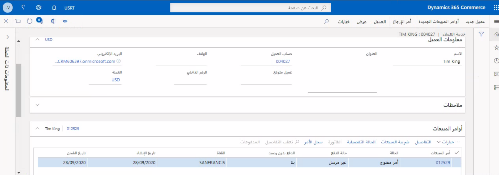

يعد مركز الاتصال إحدى قنوات Commerce التي تتيح للمستخدمين إنشاء أوامر مبيعات في المركز الرئيسي (HQ) في Dynamics 365 Commerce، والتي تستخدم ميزات متعلقة بخدمة Commerce.A call center is a Commerce channel that allows users to create sales orders in Dynamics 365 Commerce Headquarters (HQ) that use specific Commerce-related features. 

وبعد إنشاء قناة مركز الاتصال، يتعين توصيل المستخدمين بمركز الاتصال للاستفادة من ميزات معالجة الأوامر الإضافية، والتي تتاح حصرياً لمعالجة أوامر مركز الاتصال.After a call center channel has been created, users must be linked to that call center to take advantage of additional order processing features that are exclusively available for call center order processing. 

تتضمن هذه الميزات الإضافية:These added features include:
 
- إمكانيات المعالجة الكاملة لعمليات الدفعFull payment processing capabilities 
- استخدام معرفات كود مصدر الكتالوج لتعقب جهود التسويقUse of catalog source code IDs to track marketing efforts 
- القدرة على زيادة المبيعات/البيع العابر بمجرد إنشاء خطوط المبيعاتAbility for upsell/cross-sell prompts as sales lines are created 
- القدرة على إنشاء أوامر الاشتراك وإدارتها باستخدام ميزات برنامج الاستمراريةAbility to create and manage subscription orders by using continuity program features 
- استخدام ميزة تحديد السعر في Commerce وإعدادات التكوين المتعلقة بالترويجUse of Commerce pricing and promotion configurations 

ويمكن للمؤسسة تكوين قناة مركز الاتصال ليس فقط لاستخدام معالجة السداد في البيع بالتجزئة، ولكن للتمكن من مواصلة استخدام ميزة تحديد السعر في البيع بالتجزئة وجميه إمكانات Commerce الأخرى.An organization can configure the call center channel to not use retail payment processing but still use retail pricing and other Commerce capabilities. يمكن لأي مستخدم الاتصال بقناة مركز اتصال واحدة فقط في المرة الواحدة، وفي حالة عدم قيامك بإقران المستخدم بمركز اتصال، فلن يتمكن من تشغيل كل الميزات المتعلقة ببرنامج Commerce الموضحة سابقاً.A user can be linked to only one call center channel at a time and if you don’t associate the user to a call center, it will not trigger the Commerce-related features that are previously described. 

كما أن أوامر البيع التي تم إنشاؤها في مركز الاتصال تعد أيضاً جزءاً من جميع إمكانات القناة متعددة الاتجاهات في برنامج Commerce، ويمكن استخدامها بواسطة تطبيق نقطه البيع (POS) لدعم سيناريوهات استيفاء الأوامر عبر القنوات.Sales orders that are created in the call center are also part of all Commerce omnichannel capabilities and can be used by the point of sale (POS) application to support cross-channel order fulfillment scenarios. تتيح هذه الميزة لمستخدم مركز الاتصال إنشاء أمر يمكن استدعاؤه بواسطة العميل في موقع المتجر.This feature allows a call center user to create an order that can be picked up by the customer at a store location. بالإضافة إلى ذلك، يمكن لأمر العميل الذي يتم إنشاؤه في POS أو تطبيق التجارة الكترونية أن تتم مراجعته أو تحريره أو إداراته بشكل إضافي من خلال مستخدم مركز الاتصال في المركز الرئيسي في Commerce.Additionally, a customer order that is created in the POS or e-Commerce application can be further reviewed, edited, or managed by a call center user in Commerce HQ.

يمكن لمستخدمي مركز الاتصال الاستفادة من البرامج النصية التي تم إنشاؤها مسبقا، والتي يمكنهم استخدامها في تفاعلاتهم مع العملاء واثناء إدخال الأمر.Call center users can take advantage of pre-created scripts, which they can use in their interactions with customers and during order entry. يمكن ترجمة هذه البرامج النصية وتخزينها في إصدارات متعددة اللغات مزودة بوصول سريع لعمليات إقران مركز الاتصال.These scripts can be translated and stored in various language versions with quick access for the call center associates.

يتمثل الغرض من مركز الاتصال في تمكين قناة أخرى لبائع التجزئة من أجل الوصول إلى عملائه.The purpose of the call center is to enable another channel for the retailer to reach its customers. بالإضافة إلى ذلك، يوفر مركز الاتصال نظاماً أساسياً لتطبيق خدمة عملاء سهل الاستخدام في حالة تحديد موقع حسابات العميل وكانت مراجعة المعلومات المتعلقة بأمر العميل وسجله واضحة وصريحة.Additionally, the call center provides a platform for a user-friendly customer service application where locating customer accounts and reviewing the related customer order information and history is straightforward. 

تم تصميم صفحة **خدمة العملاء** لمساعدة بائع التجزئة في الاستجابة للأوامر الأكثر شيوعاً والأسئلة المتعلقة بالحساب التي تم تلقيها من العملاء.The **Customer service** page is designed to help the retailer answer the most common order and account-related questions that are received from customers.

 

