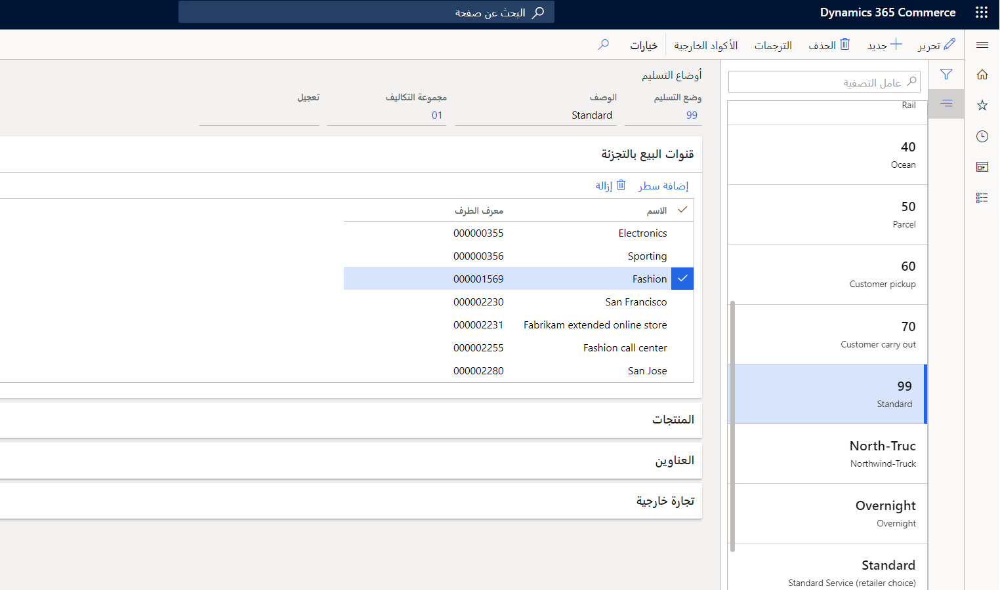
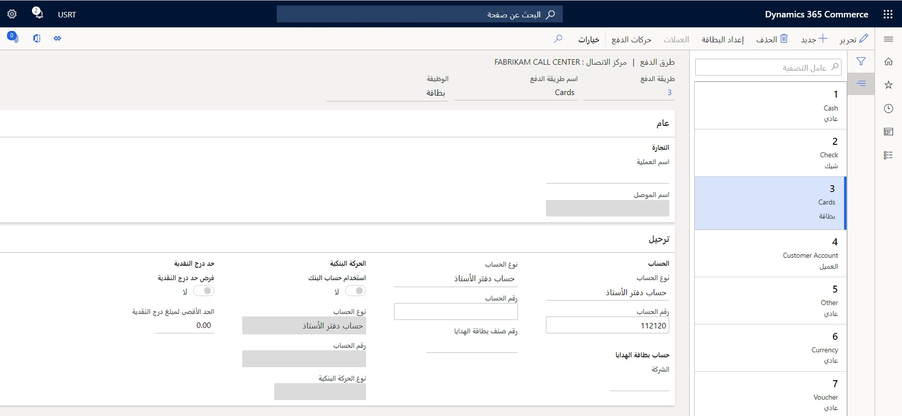

شاهد الفيديو التالي للتعرف على كيفية:

-   إنشاء قناة مركز اتصال.
-   إضافة مستخدمين إلى القناة.
-   تعيين مجموعة أسعار لمركز الاتصال.
-   تعيين القناة إلى تدرج هرمي مؤسسي.

 > [!VIDEO https://www.microsoft.com/videoplayer/embed/RE4yodg]

بعد ربط المستخدم بمركز الاتصال، سيتم تمييز أي أوامر مبيعات قام هذا المستخدم بإنشائها في Commerce Headquarters على أنه **أمر بيع بالتجزئة**، وسيتم ربطه تلقائياً بقناة مركز الاتصال الخاصة بالمستخدم. 

في حالة تكوين الخيار **تمكين إكمال الأمر** في مركز الاتصال، سيتم تحسين عملية إدخال أمر المبيعات في تدفق المستخدم من خلال إعدادات تكوين إضافية في صفحة **أمر المبيعات** لضمان أن الأمر سيتم الدفع مقابلة بطريقة مناسبة قبل أن يمكن إصداره للمعالجة. 

في حالة تشغيل **تمكين إكمال الأمر**، سيظل المستخدم مستمتعاً بإمكانية الوصول إلى تحديد سعر البيع بالتجزئة وميزات مركز اتصال التجارة الأخرى، لكن لن تكون معالجة الدفع غير ممكّنة ومن ثم غير نافذة. بالنسبة للمستخدمين الذين لم يتم ربطهم في قناة مركز اتصال، يمكنهم الوصول إلى نفس صفحة **أمر المبيعات**، لكن الأوامر التي قاموا بإنشائها لن يتم تمييزها كأوامر بيع بالتجزئة، وستستخدم فقط ميزات إدخال الأمر القياسي للحل Dynamics 365 Supply Chain Management. 

## أنماط التسليم 
يمكنك تحديد أي أنماط تسليم تكون متاحة في قناة مركز الاتصال. ولكن، تأكد من أن لديك نمط واحد على الأقل للتسليم يتم تحديدها لقناة مركز الاتصال لديك لتجنب الأخطاء في معالجة الأمر. تعمل مشغلات إنشاء أمر مركز اتصال التجارة المنطقية على فحص الترابط بين القناة والمنتجات المطلوبة وعنوان شحن تشكيلة المبيعات للتحقق مما إذا كان النمط المحدد للتسليم صالحاً لتشكيلة مبيعات محددة. 

وبالتالي، يعمل المكون الحيوي في تكوين وضع التسليم لمركز الاتصال على تحديد المنتجات والبلدان أو المناطق والولايات، وما إذا كان يمكن تضمينها أو استبعادها من استخدام نمط معين للتسليم. 

ولتعيين نمط التسليم لمركز الاتصال، اتبع الخطوات التالية:

1.  انتقل إلى صفحة **البيع بالتجزئة والتجارة> القنوات > مراكز الاتصال > جميع مراكز الاتصال**.
2.  حدد مركز الاتصال الذي تريد إضافة أنماط التسليم به.
3.  افتح علامة التبويب **إعداد** في لوحة الإجراء.
4.  حدد **أنماط التسليم** 
5.  حدد **إدارة أنماط التسليم**.
6.  حدد **جديد** لإنشاء نمط جديد للتسليم. 
7.  أدخل اسماً ووصفاً، وبعد ذلك في علامة التبويب السريعة **قنوات البيع بالتجزئة**، أضف قناة مركز الاتصال الخاصة بك. 
8.  يمكن أن يكون نمط التسليم شاملاً أو حصرياً لمنتجات معينة أو فئات منتجات معينة. يمكنك إضافة منتجات إلى نمط التسليم من خلال تحديد **إضافة تشكيلة** في علامة التبويب السريعة **المنتجات**. 
9.  قم بتكوين العناوين المسموح بها في علامة التبويب السريعة **العناوين**.
10. لجعل أنماط التسليم صالحة وتمكين الرابط إلى القنوات، يتعين تشغيل مهمة عمل بالانتقال إلى **البيع بالتجزئة والتجارة > البيع بالتجزئة والتجارة IT >أنماط تسليم العملية**. 
11. حدد **موافق**.

    
 

## طرق الدفع
يتطلب كل مركز اتصال طريقة دفع واحدة على الأقل ترتبط بها لضمان نجاح معالجة الأمر عند تكوين **تمكين إكمال الأمر**، لكن يمكن أن يكون لديك طرق دفع متعددة، إذا لزم الأمر. وبشكل طبيعي، ستقوم أي مؤسسة بتحديد طرق الدفع والتي تتحدد من خلال بطاقات الائتمان والشيكات وأنواع الدفع عبر حسابات العملاء.

لتكوين طرق الدفع لقناة مركز الاتصال، اتبع الخطوات التالية:

1.  انتقل إلى **البيع بالتجزئة وCommerce > القنوات > مراكز الاتصال > جميع مراكز الاتصال**.
2.  في علامة التبويب **الإعداد** في لوحة الإجراء، حدد الخيار **طرق الدفع**. 
3.  بتحديد الزر **جديد**، سيتم إنشاء طريق الدفع. 
4.  تأكد من قيامك بتكوين **الوظيفة** الصحيحة لعملية الدفع. تحدد الوظيفة كيفية معالجة عملية الدفع والبيانات التي تتطلبها للحصول عليها من جانب المستخدم لمعالجة عملية الدفع بشكل صحيح. 
    - يتعين تصنيف معالجة أنواع الدفع النقدي وغير المحدد على أنها **عادية**، بينما أنواع الدفع عن طريق **البطاقة** و **الشيك** و **حساب العميل** ستحظى بوظائف محددة ويتعين أن يتم تكوينها بشكل مناسب.
    - تعد الوظيفة **إزالة العطاء/التعويم** غير قابلة للتطبيق في قناة مركز الاتصال.
5.  في الحقل **رقم الحساب**، حدد حساب دفتر الأستاذ أو الحساب البنكي أو الحساب الرئيسي الدقيق. في حالة تخطي هذه الخطوة، سيتلقى المستخدمون رسائل أخطاء عند محاولتهم حفظ طريق الدفع. 
6.  هناك إعداد إضافي مطلوب لعمليات الدفع ببطاقة الائتمان. 
 
    
 
