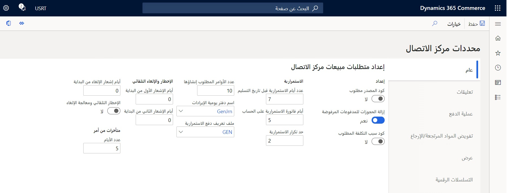

في برنامج الاستمرارية، المعروف أيضاً باسم برنامج الأمور المتكررة، يتلقى العملاء شحنات منتجات منتظمة وفقاً لجدول زمني محدد مسبقاً.In a continuity program, also known as a recurring order program, customers receive regular product shipments according to a predefined schedule. توفر برامج الاستمرارية القدرة على إنشاء جداول الاستمرارية التي ستحتوي على شحن ودفع مجدولين.Continuity programs provide the ability to create continuity schedules that will have a scheduled shipment and payment. 

عندما يقوم العميل بشراء برنامج استمرارية، فسوف يتلقى سلسلة من الأوامر التي يتم إرسالها على فترات زمنية محددة.When a customer purchases a continuity program, they will receive a series of orders that are sent at specified intervals. يتم إنشاء الأمور تلقائياً من جدول الاستمرارية، وتتم فوترة المدفوعات تلقائياً.Orders are generated automatically from the continuity schedule, and payments are billed automatically. في حالة عدم تحديد جدول دفع، وعدم تعريف برنامج الاستمرارية على أنه برنامج فاتورة مقدماً، فسوف يتم إصدار فاتورة للعميل بإجمالي الأمر الكلي عند شحن كل أمر.If no payment schedule is defined, and the continuity program has not been defined as a bill up-front program, the customer will be billed for the full order total when each order ships.

يوفر جدول الاستمرارية مرونة كاملة في تحديد البرامج التي تلبي احتياجات العمل المختلفة.The continuity schedule provides full flexibility in defining programs that meet different business needs. 

على سبيل المثال، يمكنك إعداد المعلومات التالية:For example, you can set up the following information:

- تاريخ بدء البرنامجStart date of the program
- فترات الشحن، مثل الشهرية والربع سنوية والسنويةShipment intervals, such as monthly, quarterly, and yearly
- دورات الدفع المقرر استخدامها مع كل فترة زمنيةPayment cycles to be used with each interval
- طريقة دفع العميل، سواء كان العميل سيدفع مقابل البرنامج مقدماً برسوم لمرة واحدة، أو إذا كان سيتم تحصيل رسوم لكل أمر عند شحنهCustomer payment method, whether the customer will pay for the program up-front with a one-time charge, or if they will be charged for each order as it ships

للتعامل مع برنامج استمرارية، اتبع هذا الإجراء:To work with a continuity program, follow this procedure: 

1.  قم بتعيين معلمات الاستمرارية على صفحة **معلمات مركز الاتصال**.Set the continuity parameters on the **Call center parameters** page.

    
 
2.  إنشاء برنامج استمرارية يقدم تفاصيل حول موعد إتمام المدفوعات (جدول الدفع)، وما إذا كان العميل قد اختار الدفع مقدماً، ومتى ستتم معالجة الشحنات.Create a continuity program that gives details on when the payments must be completed (payment schedule), whether the customer has opted for an up-front billing, and when shipments will be processed. يجب أيضاً إنشاء قائمة بالمنتجات المضمنة في البرنامج.A list of products that are included in the program must also be created. يجب إنشاء برنامج الاستمرارية قبل ربط أحد الأصناف به.The continuity program must be created before an item can be linked to it. يمكنك إعداد جداول دفع متعددة لمعرفة متى يمكنك توقع سداد المدفوعات.You can set up multiple payment schedules to know when you can expect payments to be made.
3.  إنشاء منتج أصلي لتمثيل برنامج الاستمرارية.Create a parent product to represent the continuity program. لا يحدد المنتج الأصلي المنتجات الفردية التي يتلقاها العميل في كل شحنة.The parent product doesn't specify the individual products that the customer receives in each shipment. 
4.  ربط برنامج الاستمرارية الخاص بك بصنف استمرارية أصلي.Link your continuity program to a continuity parent item. إذا قمت بإضافة المنتج الأصلي إلى أمر مبيعات، فسيم فتح صفحة **الاستمرارية** للسماح للمستخدم بتسجيل الدفع المتكرر وتعديل تواريخ الشحن، إذا لزم الأمر.If you add the parent product to a sales order, the **Continuity** page opens to allow the user to register a recurring payment and adjust shipment dates, if necessary. إذا كنت تستخدم خيار الدفع مقدماً، فتأكد من أن الصنف الأصلي له سعر مبيعات محدد.If you are using up-front billing, ensure that the parent item has a defined sales price. 
5.  بعد إعداد برنامج الاستمرارية كما هو موضح، يمكنك إنشاء أمر استمرارية للعميل.After you've set up a continuity program as described, you can create a continuity order for a customer.

عند إضافة صنف استمرارية إلى أمر مبيعات، ستتم مطالبتك بإدخال وتحديد المعلومات وعمليات الدفع لأوامر الاستمرارية الفرعية.When you add a continuity item to a sales order, you'll be prompted to enter and select the information and payment for the continuity children orders. نظراً لأن النظام سيقوم تلقائياً بفوترة الأوامر المستقبلية، لا يُقبل سوى حساب العميل أو أساليب الدفع باستخدام بطاقات الائتمان.Because the system will automatically bill for future orders, only customer account or credit card payment types are acceptable. من الممكن طلب أصناف استمرارية متعددة في نفس أمر المبيعات وطلب أصناف إضافية غير مرتبطة بالاستمرارية في نفس أمر المبيعات.It's possible to order multiple continuity items on the same sales order and to order additional noncontinuity-related items on the same sales order. ستحتاج بعد ذلك إلى تحديد ما إذا كنت ستستخدم خطة استمرارية الدفع مقدماً أو خطة استمرارية الدفع أولاً بأول.You'll then need to determine if you will use a bill up-front continuity plan or a pay-as-you-go continuity plan. ستحدد الخطة التي ستقوم باختيارها كيفية إجراء الدفع وكيفية إعداد الدفع.The plan that you select will determine how payment will be made and how payment should be set up. 

## معالجة الدُفعات الخاصة ببرنامج الاستمراريةBatch processing of a continuity program 
تتمتع جداول الاستمرارية بعلاقة مستمرة مع الأوامر على مدار دورات حياتها.Continuity schedules have a continuous relationship with orders throughout their life cycles. للحفاظ على تحديث جميع الحقول، نوصي بتشغيل العديد من الوظائف الدفعية على أساس منتظم:To keep all fields updated, we recommend that you run several batch jobs on a regular basis: 

- **تحديث فترة الأحداث الجارية المتعلقة بالاستمرارية** – تقوم بتحديث الحدث الجاري في جداول الاستمرارية على أساس الجدول الزمني للفترة.**Update continuity current events period** – Updates the current event on continuity schedules based on the period schedule.
- **زيادة خطوط الاستمرارية** – تقوم بتوسيع عدد المرات التي يمكن فيها تكرار حدث الاستمرارية.**Extend continuity lines** – Extends the number of times that a continuity event can be repeated. ويمكن بعد ذلك مد تكرار الشحنات ليتجاوز الحد الذي تم تعيينه في الحقل **حد تكرار الاستمرارية** في معلمات مركز الاتصال.The repetition of shipments can then extend beyond the limit that was set in the **Continuity repeat threshold** field in the call center parameters.
- **إنشاء أوامر استمرارية فرعية** – تُستخدم لإنشاء أوامر فرعية من أمر الاستمرارية بشروط معينة.**Create continuity children orders** – Used to create the children orders from the continuity order with certain conditions. 
- **معالجة مدفوعات الاستمرارية** – تُستخدم لمعالجة الفواتير والإخطارات للمدفوعات المرفقة بأوامر الاستمرارية.**Process continuity payments** – Used to process billing and notifications for payments that are attached to continuity orders. 
- **إغلاق البنود والأوامر الأصلية الخاصة بالاستمرارية** - تُستخدم لإغلاق البنود الأصلية للاستمرارية عند شحن جميع الأوامر الفرعية.**Close continuity parent lines and orders** – Used to close the continuity parent lines when all child orders have been shipped. لا يتم شحن البنود الأصلية الخاصة بالاستمرارية أبداً؛ يتم شحن البنود الفرعية فقط.The continuity parent lines never actually ship; only the child lines would ship. لمنع حدوث ارتباك للمستخدم، فمن المفيد تشغيل هذه المهمة بحيث لا يبدو أمر المبيعات الأصلي ويكأنه مفتوح للمعالجة.To prevent user confusion, it’s helpful to run this job so that the parent sales order does not look like it is still open for processing.
- **دُفعة تحديث الاستمرارية** - تُستخدم لمزامنة التغييرات التي تم إجراؤها على برنامج الاستمرارية الرئيسي مع أوامر المبيعات الأصلية للاستمرارية.**Continuity update batch** – Used to sync changes that are made to the master continuity program with the continuity parent sales orders.

