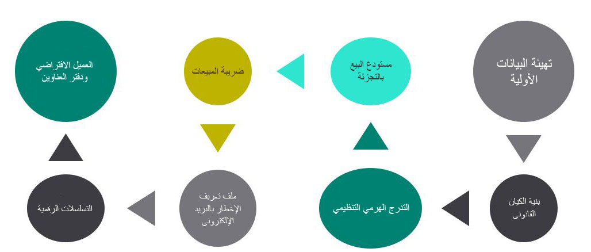

هناك حاجة لوجود تكوين أساسي وعناصر بيانات وإجراءات في كل عمليات التنفيذ التي تسبق إنشاء أي قنوات Commerce أو التوزيع في Dynamics 365 Commerce. 

تتضمن إعدادات التكوين المطلوبة:

-   إعدادات تكوين البيانات الأولية التي غير المخصصة للتنفيذ
-   المعلمات الشاملة للكيان القانوني
-   طرق الدفع المطلوب استخدامها في قنوات Commerce
-   البيانات الأولية المطلوبة لإنشاء قناة Commerce
-   أوضاع التسليم الصالحة التي يمكن استخدامها في قنوات مختلفة
-   أكواد المعلومات التي يمكن استخدامها للإجراءات الموجودة في نقطة البيع 

يوضح المخطط التالي التدفق الكلي لإعدادات التكوين عالية المستوى التي تعد متطلبات أساسية لإنشاء قناة Commerce. ستركز الأقسام التالية على بعض الخطوات الأساسية في إعدادات التكوين.
 

