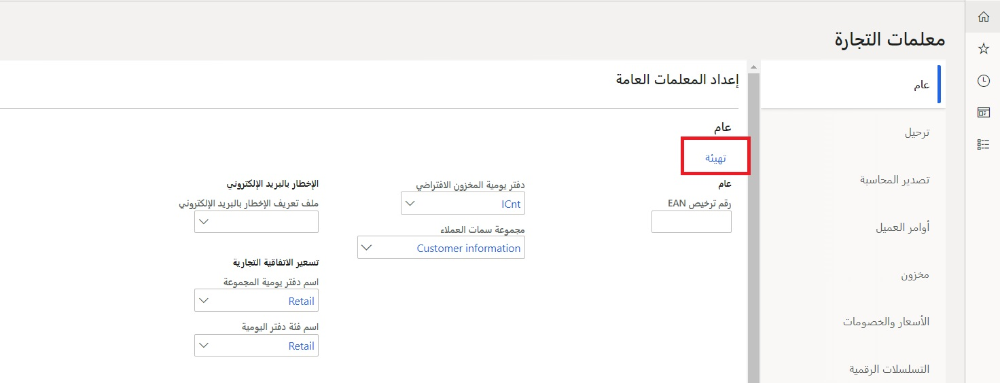

تعتبر مجموعة بيانات التكوين الافتراضية مطلوبة لكل عمليات التنفيذ كنقطه بداية. بدلاً من إعادة إنشاء هذه البيانات يدويا، يمكنك بدء البيانات الأولية في **البيع بالتجزئة وCommerce > إعداد المراكز الرئيسية > المعلمات > معلمات Commerce > عام**. عند تحديد الزر **تهيئة**، سيقوم الحل Commerce بتشغيل برنامج نصي يقوم بملء أي بيانات موجودة واستبدالها والتي قد يتم تكوينها في مجموعة من الجداول.  

عادةً ما يتم تشغيل هذه العملية في بداية أي عملية تنفيذ ولكن يمكن تشغيلها أيضا عند تطبيق التحديثات. وباستخدام هذه الميزة بعد تغيير البيانات وتكوينها لتنفيذ ما يجب القيام به بحذر نظراً لأنه يمكن أن تخاطر بتغيير البيانات الخاصة بالتطبيق التي تم تكوينها. 
 
 

تقوم التهيئة بإنشاء بيانات التكوين الافتراضية التالية:

-   المهام والمهام الفرعية في مجدول Commerce
-   مخطط قناة Commerce
-   جداول التوزيع في Commerce
-   تخطيطات الشاشة الافتراضية التي تتضمن شبكات الأزرار والصور والسمات
-   معلومات المنطقة الزمنية
-   عمليات Store Commerce
-   Store Commerce للأذونات
-   تقارير القناة
-   بيانات تعريف السمة
-   قوالب التحقق من صحة الكيان
-   مهمة الدفعات لإزالة سجل جلسة Commerce Data Exchange
-   تمكين تسجيل الدخول إلى صناعة بطاقة الدفع (PCI)

قبل تشغيل عملية **التهيئة**، يجب إعداد بيانات اللغة والعنوان البريدي للكيان القانوني لأن البيانات التي يتم تكوينها تعتمد على هذه المتغيرات للتكوين الصحيح للبيانات. 

