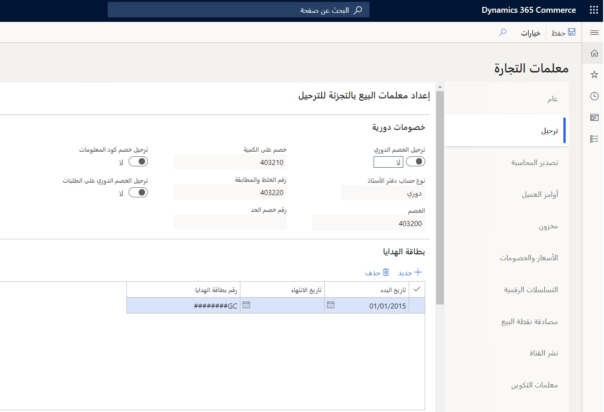
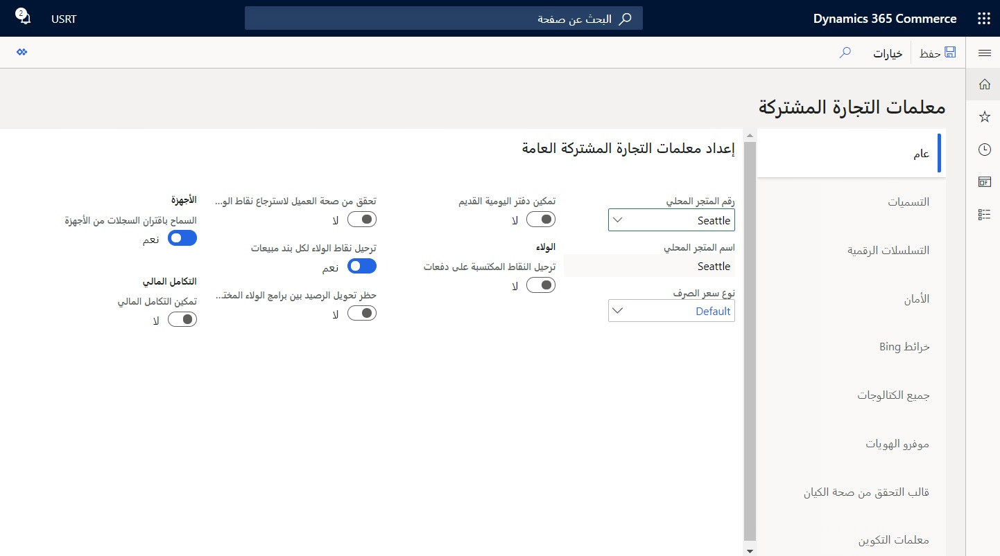
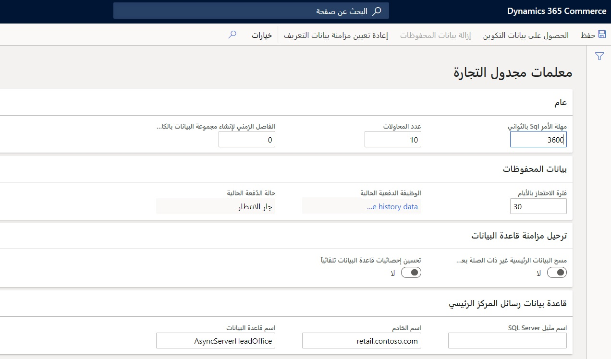

يحتوي Dynamics 365 Commerce على العديد من صفحات المعلمات: 

-   **معلمات Commerce**
-   **معلمات Commerce المشتركة**
-   **معلمات مجدول Commerce**. 

سيتم ملء العديد من المعلمات تلقائياً بالبيانات من عملية تهيئة البيانات الأولية، بينما سيحتاج البعض الآخر إلى التكوين يدوياً. لا يلزم تكوين جميع المعلمات لتنفيذ ما، ولا يلزم تكوينها كلها للحصول على توزيع عملي لحل Commerce. 

بينما يمكن تغيير بعض المعلمات وتحديثها خلال التنفيذ حسب الحاجة، يمكن للبعض الآخر (مثل التسلسل الرقمي ومعلمات الترحيل) تغيير شكل البيانات النهائية بشكل جذري في المركز الرئيسي (HQ) لـ Commerce، لذا يجب التعامل مع تكوينها في البداية باستخدام اهتمام كبير.  

## معلمات Commerce

يمكن العثور على صفحة **معلمات Commerce** ضمن **البيع بالتجزئة والتجارة > إعداد المركز الرئيسي > المعلمات> معلمات Commerce**. وهي تحتوي على المعلمات الخاصة بكل كيان قانوني:

-   **عام** (التهيئة الأولية للبيانات الاولية)
-   **ترحيل** (مثل حسابات دفتر الأستاذ الخاص بالفاتورة وإعدادات ترحيل كشف الحساب) 
-   **التزويد**
-   **الأسعار والخصومات** (مثل كيفية معالجة الخصومات المتداخلة والمتراكبة)
-   **مصادقة نقطة البيع**
-   **أوامر العميل**
-   **توزيع القناة**
-   **التحقق من صحة الحركة**
-   **إدارة القوى العاملة**
-   **التسلسلات الرقمية**
-   **معايير البحث عن نقطة البيع**
-   **إقامة العلاقات مع العملاء** وتفاصيل الاتصال في **Dynamics 365 Customer Insights**  
-   **Dynamics Fraud Protection**  

## معلمات Commerce المشتركة

يمكن العثور على صفحة **معلمات Commerce المشتركة** ضمن **البيع بالتجزئة والتجارة > إعداد المركز الرئيسي > المعلمات> معلمات Commerce المشتركة**. وهي تحتوي على المعلمات التي تمثل تكوينات عمومية عبر الكيانات القانونية:

-   **مدفوعات القناة متعددة الاتجاهات** (تمكين بطاقات الهدايا الخارجية ومدفوعات القناة متعددة الاتجاهات)
-   **خرائط Bing** (تمكين خرائط Bing في نقطة البيع، وحساب المسافات، وعمليات تكامل خرائط Bing للتجارة الإلكترونية للعملاء)
-   **توصيات المنتج** (تمكين الإعدادات مثل "الأكثر مبيعاً" و"‬‏‫الأشخاص يفضلون أيضاً..." و"المنتجات المتداولة" و"المنتجات الجديدة"، وغيرها)
-   **موفرو الهويات**
-   **قالب التحقق من صحة الكيان**
-   **الأمان**
-   **التسميات**
-   **التكامل المالي**
 

## معلمات مجدول Commerce

يمكن العثور على صفحة **معلمات مجدول Commerce** ضمن **البيع بالتجزئة والتجارة > إعداد المركز الرئيسي > المعلمات> معلمات مجدول Commerce**. وهي تحتوي على المعلمات الخاصة بكل كيان قانوني، كما تقوم بإدارة الاتصال بين المركز الرئيسي (HQ) لـ Commerce وقنوات Commerce من خلال إطار عمل توزيع البيانات. تحتوي الصفحة على تكوينات من أجل:

-   **اسم الخادم**
-   **اسم قاعدة البيانات**
-   **عدد المحاولات**
-   **مهلة أوامر SQL**
-   **فترة الاحتجاز بالأيام**
-   **الوظيفة الدفعية الحالية**
-   **حالة الدُفعة الحالية**
  

يتم تكوين معلمات إضافية خاصة بالكيان القانوني في صفحات محددة غير تابعة لـ Commerce في النظام. على الرغم من أن القائمة التالية ليست شاملة، إلا أنها توفر نقطة بداية للعديد من هذه المعلمات التي ستحتاج إليها في أثناء إعداد الحل Commerce:

-   معلمات البريد الإلكتروني
-   قوالب البريد الإلكتروني للمؤسسة
-   معلمات النظام
-   معلمات الحسابات المدينة
-   معلمات المخزن الرئيسي
-   معلمات إدارة المستندات
-   أنواع المستندات 

