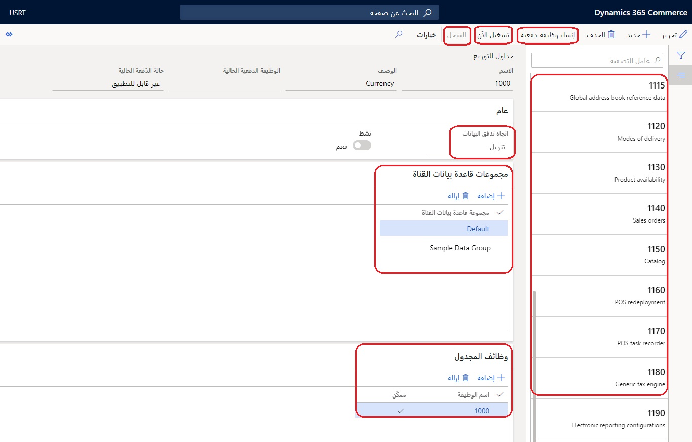
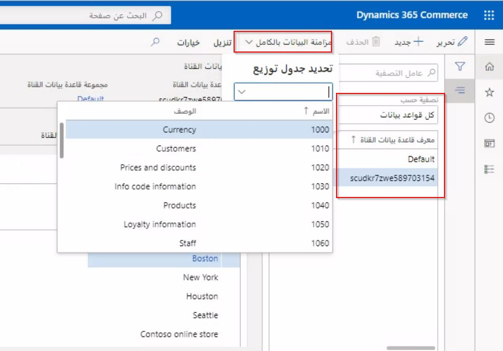

إطار عمل توزيع البيانات عبارة عن أداة للمقرات التجارية (HQ) تقوم بتعيين وتسهيل نقل مجموعات البيانات غير المتزامنة (في الوقت الفعلي) بين المقر التجاري (HQ) ومجموعات قواعد بيانات قنوات التجارة. يتم تكوين البيانات الرئيسية في Commerce HQ وتوزيعها على قنوات التجارة، وهو ما يسمى **تنزيل**. يتم إنشاء بيانات المعاملات في القنوات التجارية ثم يتم سحبها مرة أخرى إلى Commerce HQ، وهو ما يسمى **رفع**.

يعتمد إطار توزيع البيانات على جداول التوزيع. جداول التوزيع هي السجلات التي تربط المجموعات المنطقية للجداول والحقول، تسمى **وظائف المجدول**، التي يتم توزيعها على مجموعات منطقية من قواعد بيانات القناة، تسمى **قناة مجموعات قاعدة البيانات**. 

يحتوي كل جدول توزيع على اتجاه بيانات (**تحميل** أو **رفع**). يمكن إدراج جميع المخازن في مجموعة قاعدة بيانات القنوات **افتراضي**.  

عند تهيئة البيانات الأولية، يتم ملء جميع البيانات المطلوبة تلقائياً بأسماء وأرقام تعريف قياسية. ستكون هذه العملية متسقة لجميع التكوينات الأساسية عبر جميع عمليات التنفيذ على مستوى العالم. 

على سبيل المثال **1120 طرق التسليم** ستدفع وظيفة جدولة التوزيع جميع جداول Commerce HQ ذات الصلة بأنماط تكوين التسليم إلى قواعد بيانات القنوات المحددة في مجموعات قاعدة بيانات القنوات. افتراضياً، يتم إنشاء مجموعة واحدة فقط من كل مجموعة وظائف توزيع. يمكن إنشاء نسخ إضافية من جداول التوزيع لاحتياجات العمل، مثل دفع البيانات أو سحبها أكثر من المتاجر الأخرى.

**9999** تم أيضاً إنشاء وظيفة. تحتوي الوظيفة على جميع وظائف المجدول المتاحة، والتي يمكن أن تساعدك عندما تدفع جميع البيانات المطلوبة.

يمكن العثور على صفحة **جداول التوزيع** ضمن **البيع بالتجزئة والتجارة > تجارة التجزئة وتكنولوجيا المعلومات >جدول التوزيع**.

يجب تكوين جداول التوزيع للتشغيل في فترات زمنية محددة مسبقاً باستخدام وظيفة **إنشاء وظيفة دفعية** أو يدوياً من خلال **تشغيل الآن** زر. يتم تعقب محفوظات هذه السجلات من أجل رؤية المستخدم لتأكيد ما إذا كانت البيانات قد تم دفعها أو لم يتم دفعها بنجاح إلى المخازن. في حالة حدوث فشل، يمكن تشغيل العملية مرة أخرى من داخل صفحة **السجل**. 

تستخدم سجلات جدول التوزيع **تتبع تغيير SQL** في النظام لتحديد البيانات التي يجب إدراجها أو تحديثها أو حذفها في مجموعات قاعدة بيانات القنوات، والتي تسمى دلتا (أو التغييرات فقط). 

في المرة الأولى التي يتم فيها تشغيل الوظيفة، أو عندما تملي إعدادات **تتبع تغيير SQL** أن الدفع الكامل مطلوب (عادةً حوالي ثلاثة أيام)، يمكن إرسال دفعة كاملة لجميع البيانات إلى المتجر. سيتم اقتطاع البيانات الموجودة في هذه الجداول (يتم حذفها بالكامل) وسيتم إدراج البيانات الجديدة. **تتبع تغيير SQL** يتم مواءمته مع **جدولة التوزيع** سجلات، إلى الجداول، وليس وظائف المجدول فقط. يمكن أيضاً تشغيل عملية **مزامنة البيانات الكاملة** يدوياً من خلال صفحة **قناة قاعدة البيانات**. لا تستخدم هذه العملية محرك تعقب التغيير. 

يمكن العثور على الصفحة التالية ضمن **البيع بالتجزئة والتجارة> إعداد المقر> > جدولة التجارة> قاعدة بيانات القناة**.
 

تم تعريف كل مجموعة من **مجموعات قواعد بيانات القنوات** على أنها تحتوي على مخطط قناة تجارية. يتماشى المخطط مع إصدار قاعدة بيانات، مثل **AX2012R3** أو **AX7**. تسمح هذه المحاذاة لحالات الاستخدام لإصدارات مختلفة من Dynamics POS في الحقل وإنشاء المخططات والتعيينات لقواعد بيانات غير Dynamics POS. 

