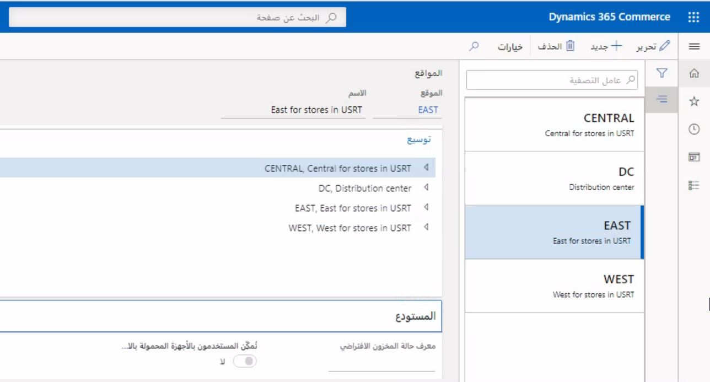
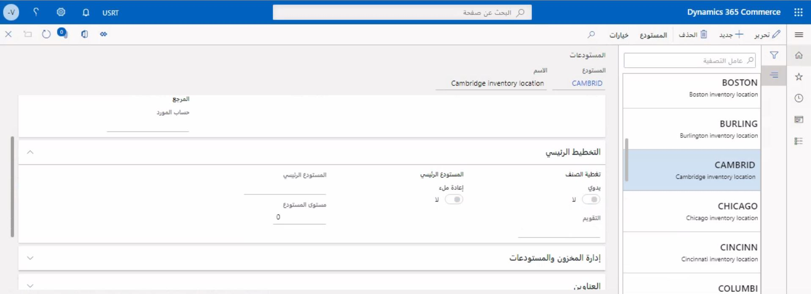

تتطلب كل قناة تجارية مخزوناً، ولكي يكون لها مخزون، يجب أن يكون لديها مستودع مرتبط بها. لإنشاء تكوين المستودع لقناة Commerce، يتعين عليك أيضاً إنشاء العديد من التبعيات. 

يجب إنشاء السجلات بالتسلسل التالي:

1.  إنشاء موقع.
2.  إنشاء مستودع.
3.  إنشاء ممر للمخزون.
4.  إنشاء موقع مخزون المستودع.
5.  تعيين مواقع الاستلام والإصدار الافتراضية إلى المستودع. 

إن الموقع هو تجميع منطقي للمستودعات. حتى إذا كان هناك مستودع واحد فقط في الموقع، فلا يزال من المفترض تعيين الموقع. يمكن العثور على صفحة **المواقع** من خلال الذهاب إلى **‬‏‫‬‏‫البيع بالتجزئة والتجارة > ‏‫إعداد القناة‬ > المواقع**.

 

المستودع هو الموقع الفعلي الذي يتم فيه تخزين المخزون. توجد بين المستودعات والقنوات التجارية علاقة واحد إلى واحد (1:1). يمكن العثور على صفحة **المتاجر** من خلال الذهاب إلى **‬‏‫‬‏‫البيع بالتجزئة والتجارة > القنوات‬ > المتاجر > جميع المتاجر**.

 

يجب تعيين موقع لكل مستودع. يجب تعيين مستودع لكل ممر مخزون وموقع مخزون. يمكن العثور على الصفحة التالية من خلال الذهاب إلى **‬‏‫‬‏‫البيع بالتجزئة والتجارة > ‏‫إعداد القناة‬ > المستودعات**.

 

بعد قيامك بإنشاء المكونات الأربعة، سوف تحتاج إلى إعداد عدة تكوينات للمستودع في **البيع بالتجزئة والتجارة > ‏‫إعداد القناة > المستودعات**. يجب تعيين **موقع الاستلام الافتراضي** **وموقع الإصدار الافتراضي** للسجلات التي تم إنشاؤها كسجلات افتراضية. ويمكن تغييرها إلى تطبيق أكثر تعقيداً، إذا لزم الأمر. يجب أيضاً تكوين أبعاد **الإرجاع** **والتخزين** بشكل مناسب. 

بالنسبة لإعداد **المخزون السالب** يتعين عليك تحديد ما إذا كان المخزون السالب مسموحاً به. 

