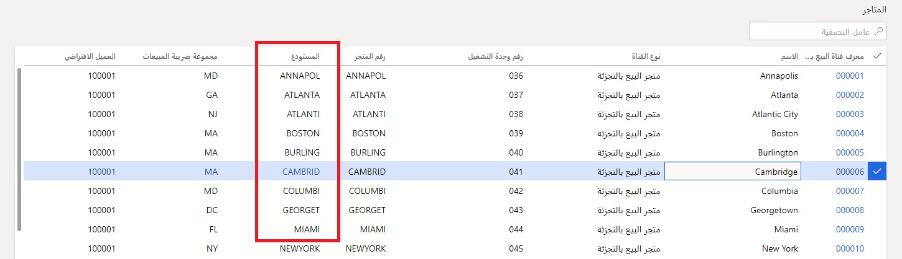

تتطلب كل قناة تجارية مخزوناً، ولكي يكون لها مخزون، يجب أن يكون لديها مستودع مرتبط بها.Each commerce channel requires inventory, and to have inventory, it must have a warehouse associated with it. لإنشاء تكوين المستودع لقناة Commerce، يتعين عليك أيضاً إنشاء العديد من التبعيات.To create the warehouse configuration for a Commerce channel, you must also create several dependencies. 

يجب إنشاء السجلات بالتسلسل التالي:The records must be created in the following sequence:

1.  إنشاء موقع.Create a site.
2.  إنشاء مستودع.Create a warehouse.
3.  إنشاء ممر للمخزون.Create an inventory aisle.
4.  إنشاء موقع مخزون المستودع.Create a warehouse inventory location.
5.  تعيين مواقع الاستلام والإصدار الافتراضية إلى المستودع.Assign the default receipt and issue locations to the warehouse. 

إن الموقع هو تجميع منطقي للمستودعات.A site is a logical grouping of warehouses. حتى إذا كان هناك مستودع واحد فقط في الموقع، فلا يزال من المفترض تعيين الموقع.Even if only one warehouse is in a site, a site must still be assigned. يمكن العثور على صفحة **المواقع** من خلال الذهاب إلى **‬‏‫‬‏‫البيع بالتجزئة والتجارة > ‏‫إعداد القناة‬ > المواقع**.The **Sites** page can be found under **Retail and Commerce > Channel setup > Sites**.

 

المستودع هو الموقع الفعلي الذي يتم فيه تخزين المخزون.A warehouse is a physical location in which inventory is stored. توجد بين المستودعات والقنوات التجارية علاقة واحد إلى واحد (1:1).Warehouses and commerce channels have a 1:1 relationship. يمكن العثور على صفحة **المتاجر** من خلال الذهاب إلى **‬‏‫‬‏‫البيع بالتجزئة والتجارة > القنوات‬ > المتاجر > جميع المتاجر**.The **Stores** page can be found under **Retail and Commerce > Channels > Stores > All stores**.

 

يجب تعيين موقع لكل مستودع.Each warehouse must be assigned a site. يجب تعيين مستودع لكل ممر مخزون وموقع مخزون.Each inventory aisle and inventory location must be assigned a warehouse. يمكن العثور على الصفحة التالية من خلال الذهاب إلى **‬‏‫‬‏‫البيع بالتجزئة والتجارة > ‏‫إعداد القناة‬ > المستودعات**.The following page can be found under **Retail and Commerce > Channel setup > Warehouses**.

 

بعد قيامك بإنشاء المكونات الأربعة، سوف تحتاج إلى إعداد عدة تكوينات للمستودع في **البيع بالتجزئة والتجارة > ‏‫إعداد القناة > المستودعات**.After you have created the four components, you will need to set up several configurations for the warehouse in **Retail and Commerce > Channel setup > Warehouses**. يجب تعيين **موقع الاستلام الافتراضي** **وموقع الإصدار الافتراضي** للسجلات التي تم إنشاؤها كسجلات افتراضية.The **Default receipt location** and **Default issue location** need to be set for the records that were created as a default. ويمكن تغييرها إلى تطبيق أكثر تعقيداً، إذا لزم الأمر.They can be changed in a more complex implementation, if needed. يجب أيضاً تكوين أبعاد **الإرجاع** **والتخزين** بشكل مناسب.The **Return** and **Storage** dimensions should also be configured appropriately. 

بالنسبة لإعداد **المخزون السالب** يتعين عليك تحديد ما إذا كان المخزون السالب مسموحاً به.For the **Negative inventory** setting on the warehouse, you need to decide if negative inventory is allowed. 

