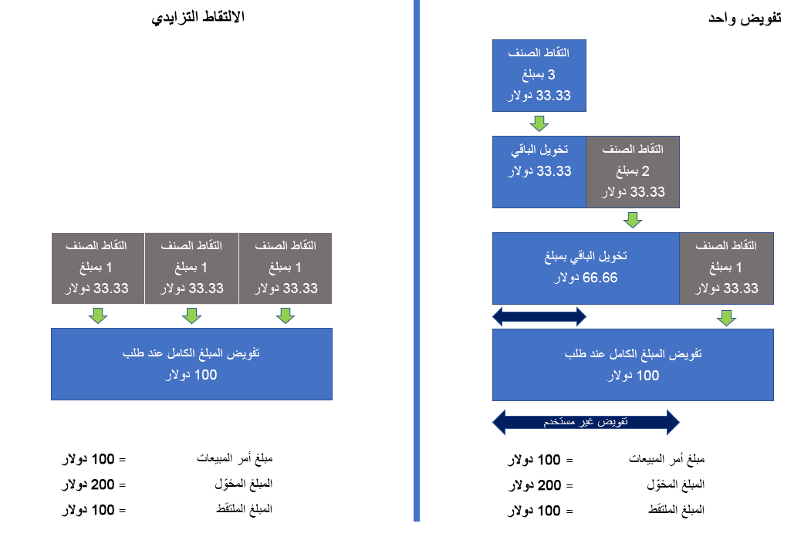

إن القدرة على تنفيذ أمر ما بمرور الوقت باستخدام إذن دفع واحد ممكنة مع الالتقاط المتزايد. على سبيل المثال، قد يتم تنفيذ أمر العميل في ثلاث شحنات. 

دون الاستعانة بهذه الميزة، سيتم تسجيل الدفع للمبلغ الذي تم تحرير فاتورة به في كل مرة يتم فيها إصدار فاتورة بالشحنة، وسيتم إنشاء تفويض جديد للمبلغ المتبقي. على مدار تنفيذ الأمر، توجد ثلاثة تفويضات مطلوبة في هذا السيناريو. يمكن أن يؤدي هذا إلى تفويضات تتجاوز المبلغ الإجمالي للطلب أو قد يؤدي إلى الرفض، لأن التفويضات تتجاوز مبلغ الائتمان المفتوح المتاح لحاملي البطاقات.

ستشير مدفوعات الأوامر التي تم إكمالها من مراكز التوزيع أو المتاجر إلى التفويض الأصلي إذا كان صالحاً عند السماح بهذه الوظيفة. وتتمثل بعض الفوائد في نسبة رفض أقل، وإحباط أقل للمستهلكين، وتسريع عملية الدفع وتسوية الفواتير. 

يسلط الرسم البياني التالي الضوء على الاختلافات بين أطر عمل التقاط الدفع عندما يتم السماح بالتقاطات متعددة، مقابل عندما يتم تمكين تفويض واحد باستخدام دعم القناة متعددة الاتجاهات لالتقاط المدفوعات المتزايدة.

> [!NOTE]
> عند تنفيذ الأوامر من Store Commerce وCommerce headquarters، يدعم Dynamics 365 Payment Connector لـ Adyen الالتقاط المتزايد بشكل جاهز.

يمكنك العثور على موارد إضافية حول الالتقاط المتزايد هنا:

- [الالتقاط المتزايد لفواتير الأوامر](/dynamics365/commerce/dev-itpro/incremental-capture/?azure-portal=true).
- [Dynamics 365 Payment Connector for Adyen](/dynamics365/commerce/dev-itpro/adyen-connector?azure-portal=true&tabs=8-1-3).
- [مدفوعات أوامر القناة متعددة الاتجاهات لـ Commerce](/dynamics365/commerce/dev-itpro/commerce-payments/?azure-portal=true).
