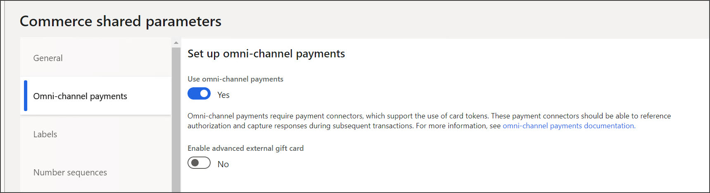

يجب تكوين طرق الدفع للبضائع التي سيتم بيعها في قنوات Commerce المختلفة. يمكن لقنوات Commerce المختلفة فقط قبول أنواع دفع معينة بشكل افتراضي. على سبيل المثال، لا يمكن لطلبات التجارة الإلكترونية قبول النقد. 

الخطوات الأربع المطلوبة لإنشاء طرق الدفع هي:

-   إنشاء طرق دفع أساسية سيتم استخدامها بواسطة أي قناة بيع بالتجزئة.
-   إعداد أنواع البطاقات وأرقامها، إذا كنت تستخدم بطاقات دائنة أو مدينة. 
-   تعيين طرق الدفع المناسبة التي يمكن استخدامها لكل قناة Commerce. 
-   إعداد طرق الدفع بالبطاقة التي ستقبلها قناة Commerce.  

تشمل الأنواع الصالحة لطرق الدفع التي يمكنك إعدادها في النظام ما يلي: 

-   **النقد** – النقود بمعنى العملة المادية، مثل الأوراق النقدية والعملات المعدنية. يمكن أن تكون هذه العملة هي عملة الشركة أو العملة المحلية للمتجر.
-   **شيك** – مستند قابل للتداول يتطلب دفع مبلغ محدد من عملة معينة يتم سحبها من بنك معين. 
-   **عملة** – نوع الدفع الأساسي بخلاف العملة الافتراضية للشركة. العملات المعدنية والأوراق النقدية هي عبارة عن نماذج للعملة. تمثل طريقة الدفع بالعملة جميع العملات المستخدمة. قبل استخدام طريقة الدفع هذه، يجب عليك إعداد العملات وتحديد معلومات الصرف للعملات.
-   **بطاقة** – جميع أنواع البطاقات المختلفة التي يتم استخدامها مثل البطاقات الدائنة والبطاقات المدينة. نوصي بإعداد طريقة دفع بطاقة واحدة على مستوى المؤسسة لتمثيل كل نوع من البطاقات. ثم، على مستوى المتجر، قم بإعداد طريقة دفع لكل بطاقة أو مجموعة بطاقات تتم معالجتها باستخدام نفس الإعدادات. يجب عليك إعداد البطاقات المتوفرة في السوق، مثل البطاقات الدائنة والبطاقات المدينة، قبل أن تتمكن من قبول البطاقات كوسيلة للدفع في المتجر.
-   **مذكرة الدائن** - المذكرات الدائنة التي يتم إصدارها أو استردادها في نقطة البيع. يمكن أن تكون مذكرة الدائن دائناً أو مذكرة دائنة مرتجعة تم إصدارها مقابل بيع مرتجعات. إذا تم استرداد المذكرات الدائنة جزئياً فقط، يقوم البرنامج بإصدار مذكرة دائن جديدة للرصيد الجديد. يكون لدى مذكرة الدائن الجديدة رقم جديد. يمكن استخدام مذكرة الدائن مرة واحدة فقط، ويحتفظ النظام بسجل لجميع الأرقام المستخدمة. يمكن عرض السجل على صفحة **جدول مذكرة الدائن**. لا يمكن للعميل استرداد أكثر من قيمة مذكرة الدائن.
-   **بطاقة الهدايا** - بطاقات الهدايا التي يتم إصدارها واسترجاعها في نقطة البيع. غير مسموح بالدفع بالزيادة في بطاقات الهدايا.
-   **حساب العميل** – المدفوعات التي يمكن إضافتها لحساب العميل في الخزينة وقت البيع. يمكنك أيضاً استخدام طريقة الدفع هذه لجمع معلومات المبيعات أو الخصومات الخاصة بالعميل عندما يقوم العميل بالدفع باستخدام طريقة دفع أخرى. في هذه الحالة، يتعين عليك إعداد معلومات خاصة بالعميل.
-   **نقاط الولاء** – النقاط التي تتراكم العملاء من خلال برامج الولاء. إذا قمت بإنشاء برامج ولاء، فيمكن للعملاء ربح النقاط ثم استردادها بطرق مختلفة. على سبيل المثال، في بعض برامج الولاء، يمكن للعملاء استرداد نقاط الولاء في شكل خصم أو حتى استخدامها كشكل من أشكال الدفع.

تتضمن بعض التكوينات الإضافية الخاصة بقنوات البيع بالتجزئة ما يلي: 

-   في قناة مركز الاتصال، يعد تحديد **تمكين إكمال الأمر** أمراً مهماً لأنه يضمن عدم قيام الشركات بإصدار أوامر المبيعات التي وضعها العميل إلا في حالات الدفع المسبق أو المصرح به مسبقاً. 
-   بالنسبة لاسترداد الأموال، يجب تحديد طريقة استرداد في مركز الاتصال لمعالجة المبالغ المستردة. يجب أيضاً تكوين طريقة الدفع لحقل الدفع في معلمات مركز اتصال تفويض إرجاع البضائع (RMA)/استرداد الأموال. 

تحتوي صفحة **معلمات Commerce المشتركة**، ضمن **Retail وCommerce > إعداد المركز الرئيسي > المعلمات**، على تكوينات لمدفوعات القناة متعددة الاتجاهات التي ستمكن ترميز البطاقة. الترميز هو مفهوم أخذ رقم بطاقة مدينة وتحويله إلى سلسلة مرجعية يتم تخزينها للتأكد من أن الشركة لا تخزن أي معلومات عن البطاقة المدينة. 

يمكن استخدام هذا الرمز المميز في القدرة الإنتاجية للبطاقة المسجلة بالملف. عندما يتم التعرف على رمز ما كمخزن، يمكن استخدامه للإشارة إلى البطاقة المدينة الفعلية المخزنة بواسطة معالج الدفع، وهو الكيان الوحيد الذي يمكنه ترجمة معنى رقم الترميز. يسمح هذا الأسلوب للعملاء بإدخال تفاصيل البطاقة المدينة الخاصة بهم مرة واحدة ثم استخدام هذه البطاقة المدينة عبر جميع القنوات لأن بطاقتهم مسجلة. 

بالنسبة للمتاجر التقليدية، يجب إعداد الفئات النقدية لكل عملة. يجب تكوين العملات المناسبة للكيان القانوني. 

يمكن العثور على الصفحات التالية ضمن زر **Retail وCommerce > القنوات > المتاجر > جميع المتاجر > ‬‏‫إقرار النقدية**.
 

يعد تكوين خدمة الدفع للبطاقات المدينة ضرورياً لمعالجة المدفوعات. يمكن تكوين أكثر من خدمة دفع واحدة، ويمكن تخصيص كل منها لقنوات Commerce مختلفة. تتوفر العديد من خدمات معالجة الدفع، ولكن خدمة الدفع الوحيدة المتوفرة بصورة جاهزة هي Adyen. من المهم مراعاة سيناريوهات وجود البطاقة مقابل عدم وجود البطاقة والأجهزة المعتمدة.

شاهد الفيديو التالي للتعرف على كيفية إنشاء طرق الدفع. 

 > [!VIDEO https://www.microsoft.com/videoplayer/embed/RE4AvVh]
 
 
يمكن إدارة بطاقات الهدايا داخل Commerce أو إدارتها من خلال مصدر آخر باستخدام موصل الدفع. تحتوي مدفوعات Adyen على خيارات بطاقة هدايا أخرى متاحة أيضاً. 
