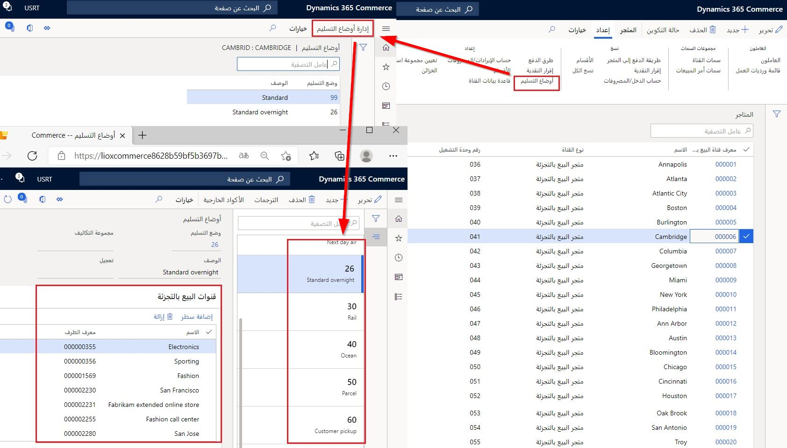
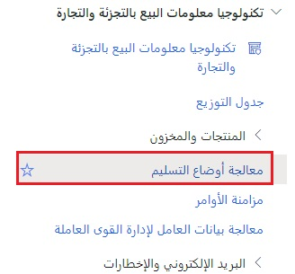
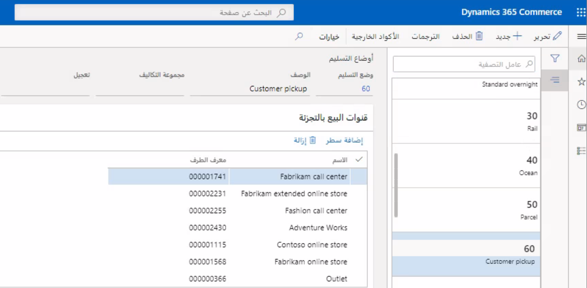

يتم تعيين أوضاع التسليم لقنوات Commerce، أو عُقد المؤسسة، كما هو محدد بواسطة التدرجات الهرمية للمؤسسة المختلفة التي تم إعدادها للشركة. 

يمكن العثور على الصفحات التالية ضمن الزر **البيع بالتجزئة والتجارة> القنوات > المتاجر > جميع المتاجر > أوضاع التسليم** والزر **إدارة أوضاع التسليم**. 

 

بعد تكوين أوضاع التسليم لقنوات Commerce، قم بتشغيل وظيفة **معالجة أوضاع التسليم** بحيث تصبح البيانات متاحة للقنوات. ويمكن العثور على العملية الموضحة في الشكل التالي ضمن **البيع بالتجزئة والتجارة > تكنولوجيا معلومات البيع بالتجزئة والتجارة > معالجة أوضاع التسليم**.

 

شاهد مقطع الفيديو التالي لمعرفة كيفية تكوين أوضاع التسليم.

 > [!VIDEO https://www.microsoft.com/videoplayer/embed/RE4AvVi]

## أوضاع التسليم الخاصة باستلام العميل للمنتج

يمكنك تحديد أوضاع تسليم متعددة كخيارات استلام في معلمات Dynamics 365 Commerce. إذا تم تكوين هذه الميزة، يمكنك أن تقدم لعملائك خيارات استلام أخرى عند السداد والخروج، مثل الاستلام على الرصيف أو الاستلام من المتجر. يمكن الوصول إلى أوضاع التسليم الأخرى الخاصة بالاستلام عبر الإنترنت ومركز الاتصال وقنوات المتجر من خلال تطبيقات التجارة الإلكترونية ومركز الاتصال ونقطة البيع في Dynamics 365.

عندما يقوم عميلك بالسداد عبر الإنترنت، يمكنه اختيار وضع التسليم المفضل للاستلام، وسيتم تطبيق ذلك على خط المبيعات. في نقطة البيع، عندما يستخدم المستخدمون عمليات استدعاء الأمر أو تنفيذه ويختارون طريقة عرض مُصفاة مسبقاً تُظهر جميع أوامر الاستلام لمتجرهم، سيعرض عامل التصفية الأوامر المرتبطة بأي من أوضاع التسليم التي تم تكوينها للاستلام. 

يمكنك تكوين أوضاع التسليم المختلفة في صفحة معلمات Commerce في علامة التبويب "أوامر العميل". 

كما يمكن إعداد الإخطارات لكل وضع من أوضاع التسليم التي قمت بتكوينها في التطبيق لإرسال رسائل البريد الإلكتروني الخاصة بالحركات إلى عملائك. هذه الوظيفة مهمة لسيناريوهات التسوق دون تلامس عندما يحتاج تجار التجزئة إلى تقديم تعليمات وإرشادات محددة لعملائهم حول عملية الاستلام أو أوضاع التسليم المختلفة. 

يمكن إعداد ذلك عن طريق إنشاء قالب بريد إلكتروني فريد لكل مجموعة تتكون من نوع الإخطار بالإضافة إلى وضع التسليم. عند استخدام وضع تسليم واحد لجميع السطور في أمر التجارة الإلكترونية، فسيتم استخدام قالب البريد الإلكتروني الذي تم تعيينه لنوع الإخطار بالإضافة إلى وضع التسليم لإرسال البريد الإلكتروني. إذا حددت السطور في أمر ما أوضاع تسليم مختلفة، فسيتم استخدام النموذج الافتراضي الذي تم تعيينه لنوع الإخطار. 

لاستخدام هذه الأداة، انتقل إلى المركز الرئيسي لـ Commerce وقم بتشغيل ميزة تخصيص رسائل البريد الإلكتروني للحركات حسب وضع التسليم. سيتيح لك ملف تعريف إخطارات البريد الإلكتروني في Commerce، بمجرد تنشيطه، إنشاء تعيينات بين أنواع الإخطارات وأوضاع التسليم، بالإضافة إلى تعيين قوالب فريدة لكل تعيين. 

لمعرفة المزيد، تفضل بزيارة [إنشاء قالب بريد إلكتروني لأحداث الحركات](https://docs.microsoft.com/dynamics365/commerce/email-templates-transactions/?azure-portal=true).
