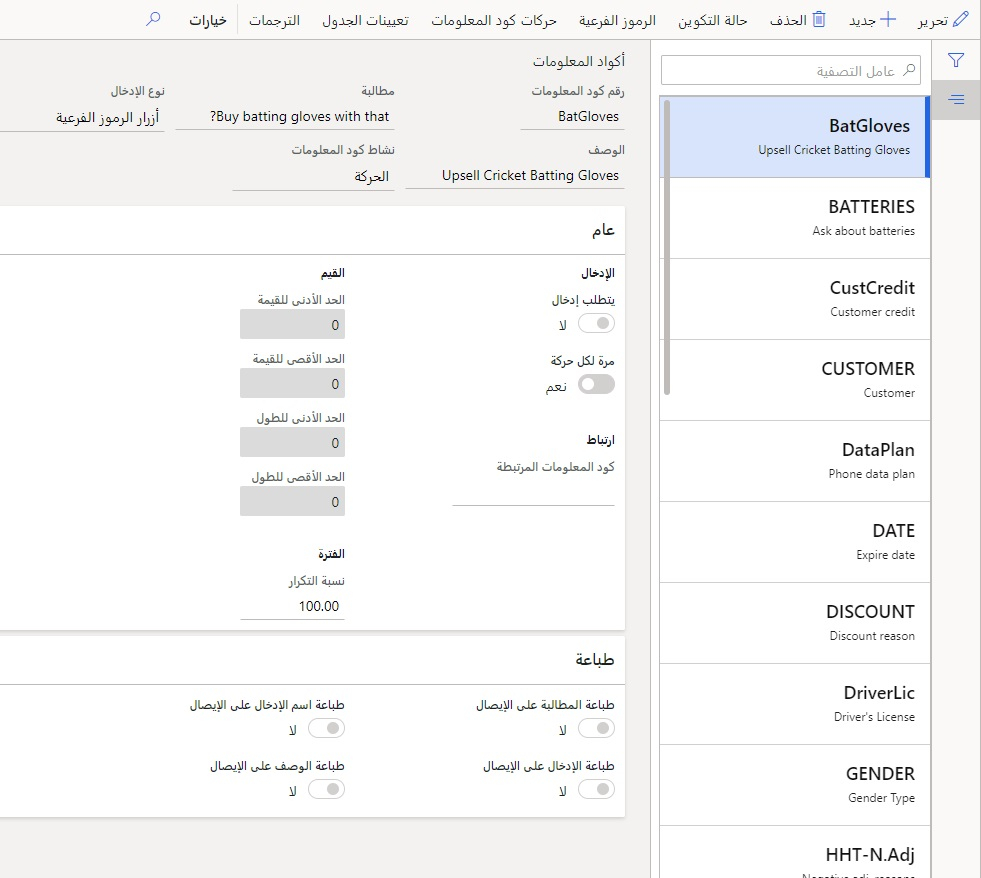
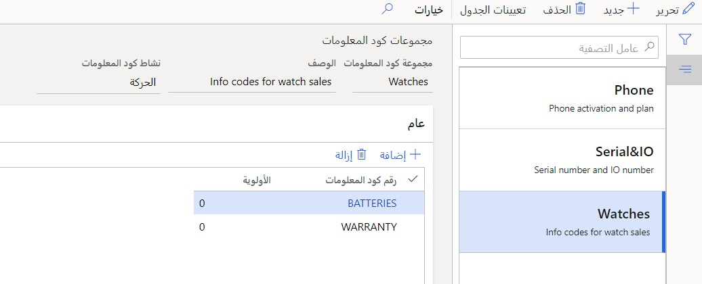
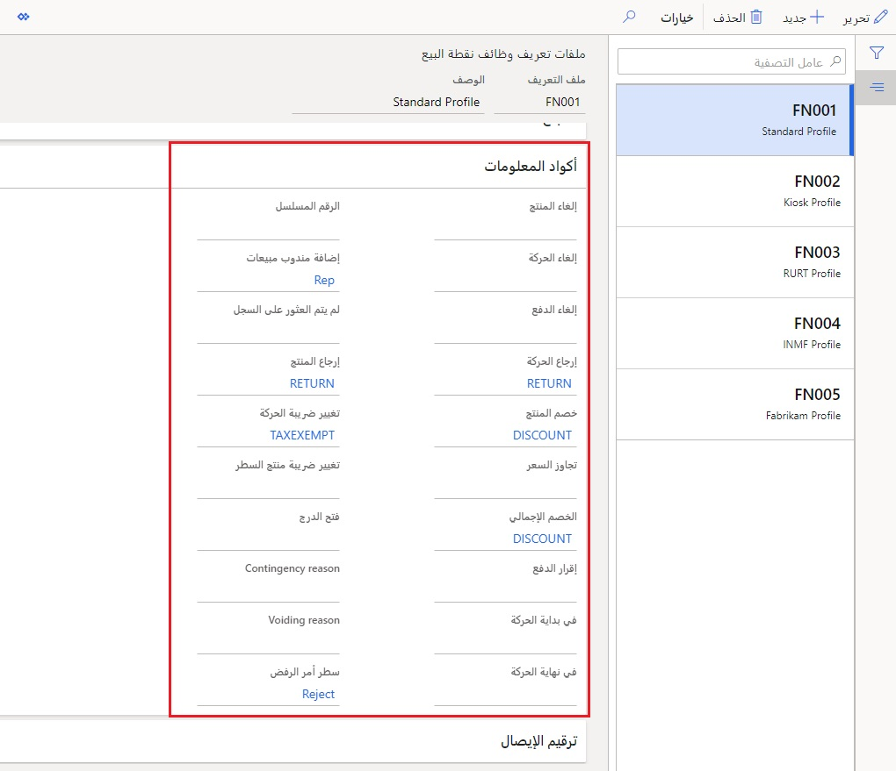
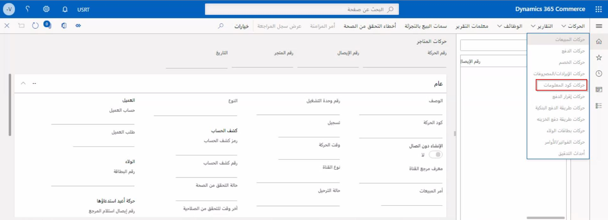

تُستخدم أكواد المعلومات للحصول على معلومات إضافية وراء الإجراءات التي تحدث في قنوات Commerce في Store Commerce ومركز الاتصال. يمكن إعداد أكواد المعلومات في **البيع بالتجزئة والتجارة> إعداد القناة> أكواد المعلومات**.

يمكن أن تكون البيانات الملتقطة أحد أنواع الإدخالات التالية:

-   **بلا**
-   **قائمة الرموز الفرعية** (قائمة نصية محددة مسبقاً)
-   **تاريخ‬**
-   **رقمي**
-   **منتج** (من قائمة المنتجات)
-   **عميل** (من قائمة العملاء)
-   **معرف العامل** (من معرف العامل)
-   **نص** 
-   **أزرار الرموز الفرعية**
-   **الحد العمري**

اعتماداً على نوع الإدخال، يمكن للمستخدمين تعيين العديد من الحدود والقيود لأنواع معينة من أكواد المعلومات. يمكن أن تتطلب بعض أكواد المعلومات إدخالاً، والتشغيل مرة واحدة فقط لكل حركة (بغض النظر عن المنتجات)، وربط أكواد معلومات متعددة معاً، وغير ذلك الكثير. 
 

 

مجموعات أكواد المعلومات هي تجميعات منطقية لأكواد المعلومات المكونة. تتيح مجموعات أكواد المعلومات إعادة الاستخدام المتسق لأكواد المعلومات المتعددة لمنتجات متعددة. يمكن العثور على الصفحة التالية ضمن **البيع بالتجزئة والتجارة> إعداد القناة> مجموعات أكواد المعلومات**
 

يتم بعد ذلك تكوين أكواد المعلومات التي تم إنشاؤها في ملفات تعريف الوظائف ضمن القسم **ملفات تعريف وظائف نقطة البيع > أكواد المعلومات** في **البيع بالتجزئة والتجارة> إعداد القناة> إعداد نقطة البيع> ملفات تعريف نقطة البيع> ملفات تعريف الوظائف**. يمكن أن يكون للعديد من الإجراءات المحددة مسبقاً أكواد معلومات مختلفة مخصصة لها. يتم تعيين ملفات تعريف الوظائف للقنوات مباشرةً، بحيث يمكنك الحصول على تكوينات أكواد المعلومات المعينة لجميع القنوات كمجموعة أو لمجموعات قنوات قليلة أو لكل قناة على حدة لجعلها فريدة.  

يمكن الوصول إلى أكواد المعلومات التي تم إدخالها من خلال الكشوف مباشرةً من خلال صفحة **حركات أكواد المعلومات** في **البيع بالتجزئة والتجارة> الاستعلامات والتقارير> حركات المتجر**.
 

