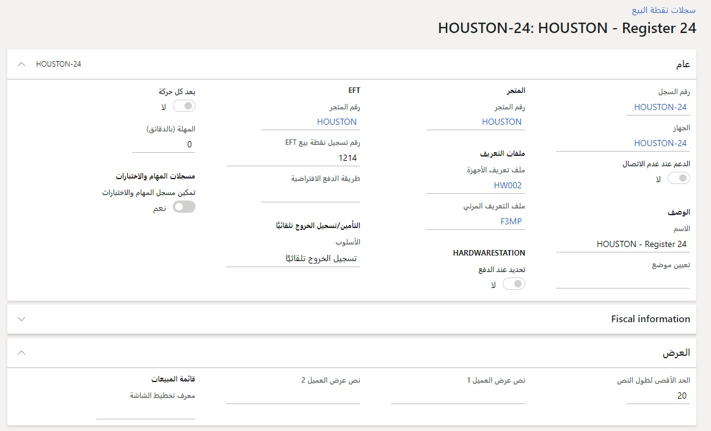
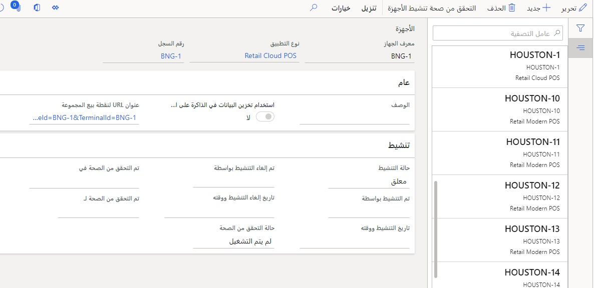
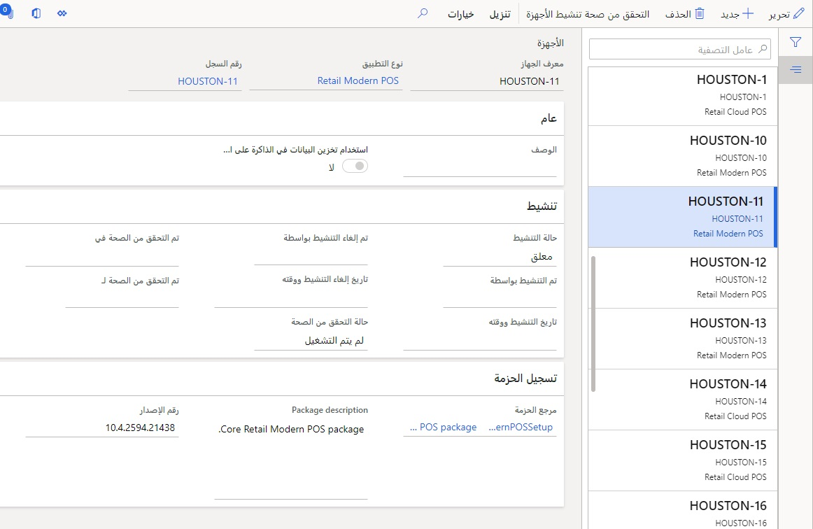
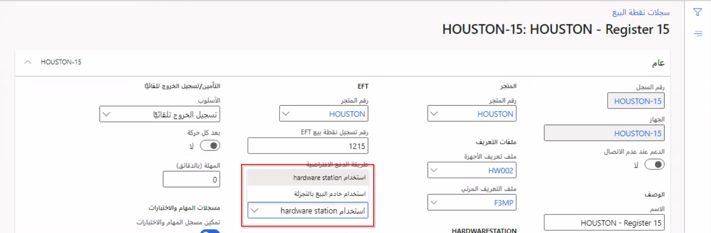

عند إنشاء متجر بائع تجزئة، يتعين أن يكون للمتجر موضعاً تتم فيه حركات البيع. يعد هذا المكان سجل Store Commerce. 

يدعم الحل Commerce نوعين من عمليات توزيع Store Commerce. 

- **Store Commerce لـ Windows** – عملية توزيع يتم تثبيتها محلياً في أنظمة Windows OS أو iOS أو جهاز Android ودعم الوضع غير متصل.
- **Store Commerce للمتصفحات** - تطبيق ويب مع عدم تثبيته محلياً. 

تحتوي كلا عمليات النشر على نفس الميزات لكن لديهما بعض الميزات والعيوب، والتي ستتم مناقشتها لاحقاً في هذه الوحدة.

السجل هو آلية لقبول المبيعات في المتجر. ولكن، قد تظهر السجلات بشكل مختلف حتى في نفس المتجر. بعض السجلات يمكن تثبيتها بشكا دائم في ممرات المتاجر لمسح الحركات الكبيرة، بينما قد يكون البعض الآخر أجهزة لوحية والتي يتم استخدامها كنقاط سداد فرعية. قد تتيح الممرات استخدام أجهزة مسح لطاولة العمل قوية ومضمنة وقبول العمليات النقدية والشيكات وبطاقات الائتمان، بينما تستخدم نقاط السداد الفرعية أجهزة مسح منخفضة القوة تعمل باتصال Bluetooth ويمكنها قبول بطاقات الائتمان فقط. قد تكون الأجهزة التي يستخدمها السجل جهاز لوحي سطحي يعمل بنظام Windows OS أو جهاز iPad يعمل بنظام iOS.  

شاهد الفيديو التالي للتعرف على كيفية إنشاء السجلات والأجهزة.

 > [!VIDEO https://www.microsoft.com/videoplayer/embed/RE4AkGg]

عندما تتأمل في كيفية تكوين الإعدادات لسجل نقطة بيع المتجر، تأكد من أنك فكرت في مثل هذه العوامل ما الأجهزة التي يتعين أن تستخدمها (ماسح الكود الشريطي وجهاز بطاقات الائتمان والمزيد) أو كيف سيبدو المخطط الأمثل لهذا الجهاز. سل نفسك الأسئلة التالية للمساعدة في تقرير الإعدادات:

- هل هي شاشة كبيرة أو شاشة هاتف؟ 
- ما عملية الدفع الافتراضية؟ يمكنها فقط قبول بطاقات الائتمان، يتعين أن يتم تكوين السجل للإعدادات الافتراضية لهذا الجهاز. 
- إذا كان سجل دفع نقدي فقط في موقع منبثق في المتجر، فهل يجب استخدام الدفع النقدي فقط كطريقة دفع افتراضية؟ 

يمتلك السجل إعدادات تكوين للرد على هذه الأسئلة. 

في صفحة **سجلات نقطة البيع** في **البيع بالتجزئة وCommerce > إعداد القناة > إعداد نقطة البيع > السجلات**، يمكنك تكوين هل سيدعم السجل وضع عدم الاتصال وما **الملف الشخصي المرئي** الموجود به وما الأزرار والشاشات الذي يتعين أن يمتلكهما عند تنقل المستخدمين في التطبيق وما الجهاز الذي يستخدمه، سواء كان يستخدم جهاز بطاقات ائتمان يكون مشتركاً بين عدة أجهزة والمزيد. 

 

يحدد تكوين الجهاز ما هو الجهاز وما التكوينات التي يتعين العمل بها. 

على سبيل المثال، إذا كان الجهاز يعمل بنظام iOS أو Android، فيتعين أن يكون تكوين Store Commerce للمتصفحات (نقاط سداد فرعية). وإذا كان يعمل بنظام Windows OS ويحتاج ليكون به وضع عدم اتصال ولديه القدرة على التواصل باستخدام جهاز أصلي، فيجب أن يكون Store Commerce لتكوين Windows. 

يتم إعداد هذه التكوينات في صفحة **الأجهزة** في **البيع بالتجزئة وCommerce > إعداد القناة > إعداد نقطة البيع > الأجهزة**.  

إذا كانت تكوين Store Commerce للمتصفحات، فسيحتوي على عنوان URL للتطبيق. 

إذا كان تكوين Store Commerce لـ Windows، فسيحتوي على إصدار التطبيق والحزمة المثبت على الأجهزة.

## معالجة الدفع بدون محطة الأجهزة 
يمكنك تكوين Store Commerce لمعالجة معاملات "البطاقة غير موجودة" في عملاء Store Commerce الذين لا يتضمنون محطة أجهزة. تستهدف هذا الميزة خصيصاً السيناريوهات الطارئة مثل رصيف الاستلام. 

عند تشغيل هذه الميزة، يمكن للعملاء مثل Store Commerce للمتصفحات وStore Commerce لنظام iOS إجراء مكالمات معالجة بطاقات مدينة من خلال Commerce Scale Unit. لن يكون عليهم الاعتماد على محطة أجهزة يتم نشرها في الشبكة المحلية. لذلك، أي عميل Store Commerce يمكنه دعم رصيف الاستلام وتكون هناك بضع خطوات إعداد مطلوبة.

> [!NOTE]
> يتعين عدم تشغيل هذه الميزة للسجلات التي تدعم وضع عدم الاتصال. تعمل الميزة على توجيه كل طلبات دفع "البطاقة غير موجودة" خلال وحدة Commerce Scale Unit، لكن لن تكون وحدة Commerce Scale Unit متاحة عندما يكون السجل غير متصل.

عند إيقاف تشغيل هذه الميزة، يتعذر على Store Commerce للمتصفحات وStore Commerce لنظام iOS معالجة طلبات البطاقة المدينة "البطاقة غير موجودة" من تلقاء نفسها، لأنهم لا يمتلكون محطة أجهزة مضمنة. عند تشغيل هذه الميزة، يمكن استخدام وحدة Commerce Scale Unit لتسهيل الطلبات لهؤلاء العملاء.

على الرغم من إمكانية استخدام هذه الميزة أيضاً في Store Commerce لنظام Windows وStore Commerce لنظام Android، بالإضافة إلى Store Commerce للمتصفحات وStore Commerce لنظام iOS، إلا أنها غير مدعومة في وضع غير متصل. لذلك، يتعين عدم استخدام هذه الميزة في سيناريوهات يقوم فيها عميل باستخدام وضع عدم الاتصال.

راجع [معالجة بطاقات الائتمان بدون محطة أجهزة](/dynamics365/commerce/dev-itpro/cnp-pos/?azure-portal=true) للحصول على قائمة بالسيناريوهات المدعومة لعملاء نقطة البيع الذين لا يمتلكون محطة أجهزة مضمنة وسيناريوهات غير مدعومة.

### قم بإعداد Store Commerce لمعالجة حركات "البطاقة غير موجودة" بدون محطة أجهزة.

التكوين الخاص بتشغيل هذه الميزة يتم إكماله على مستوى السجل.

1.  في المكتب الخلفي، انتقل إلى **البيع بالتجزئة وCommerce > إعداد القناة > إعداد نقطة البيع > السجلات**.
2.  حدد السجل ذي الصلة، ثم حدد **تحرير**.
3.  في علامة التبويب السريعة **عام** في الحقل **معالجة البطاقة غير موجودة**، ثم حدد **استخدام Retail Server**. (افتراضياً، يتم إعداد هذا الحقل لاستخدام محطة الأجهزة.) 
 
    

4.  حدد **حفظ**.
5.  بعد حفظ التغيير، قم بتشغيل جدولة التوزيع **1090** لمزامنة التغييرات على Store Commerce. 
