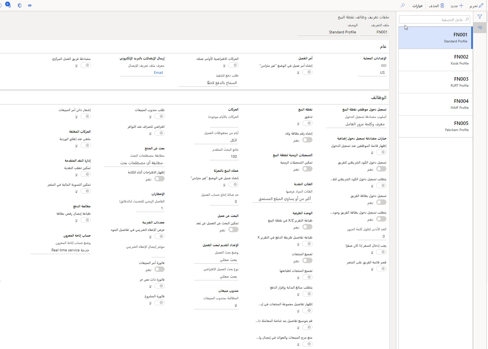
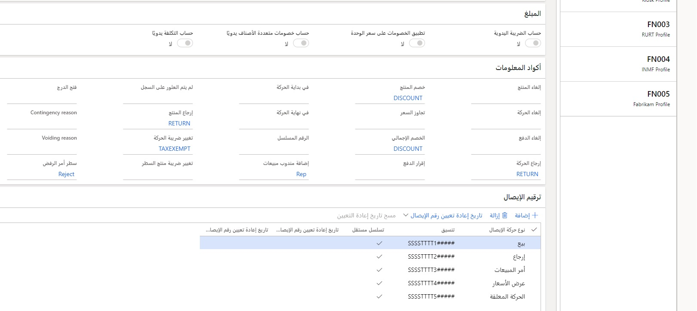

يختلف ملف التعريف الوظيفي عن تكوينات الجهاز والتسجيل حيث يحدد الوظائف غير المرتبطة بالمكونات المادية للأجهزة أو المعدات.A functionality profile differs from register and device configurations in that it specifies functionalities that aren’t tied to hardware or devices. في معظم الحالات، يمكن ـ بل ينبغي ـ أن يعمل الجهازان بنفس الطريقة للحصول على خبرة متسقة للعملاء والموظفين في جميع أنحاء المتجر.In most cases, both devices can and should operate in the same way for a consistent experience for customers and employees across the entire store. يتم تحديد ملفات التعريف الوظيفي على مستوى المتجر.The functionality profiles are defined at the store level. 

على سبيل المثال، يتحكم ملف التعريف الوظيفي في خيارات الموافقة على تسجيل الدخول إلى التطبيق.For example, the functionality profile controls the sign-in authentication options to the application. وبالإضافة إلى ذلك، فإنه يتحكم في وظيفة ممثل المبيعات، مثل إذا لزم إدخال معاون المبيعات للحصول على أمر مبيعات أو استدعاء رموز المعلومات على اتخاذ إجراءات معينة في نقطة البيع.Additionally, it controls sales representative functionality, such as whether the sales associate needs to be entered for a sales order or if info codes will be prompted for certain actions in the POS. 

الشائع عن ملفات التعريف الوظيفي أنها تكوينات تنطبق على المتجر بأكمله، وليس سجلات محددة.The common theme is that functionality profiles are configurations that apply to the entire store, not specific registers. إعداد ملفات التعريف الوظيفي **البيع بالتجزئة والتجارة > إعداد القناة > إعداد نقطة البيع > ملفات تعريف نقطة البيع > ملفات التعريف الوظيفي لنقطة البيع**.Functionality profiles are set up in **Retail and Commerce > Channel setup > POS Setup > POS profiles > POS functionality profiles**.

 
 
 

 

سيوضح ملف التعريف المرئي الوسم العام للسجل وموضوعه.A visual profile will define the overall branding and theme for a register. يتم تحديده على مستوى التسجيل في **البيع بالتجزئة والتجارة > عداد القناة > إعداد نقطة البيع > ملفات تعريف نقاط البيع > ملفات التعريف المرئية لنقاط البيع**.It is defined at the register level in **Retail and Commerce > Channel setup > POS Setup > POS profiles > POS visual profiles**. يحتوي ملف التعريف المرئي على تكوينات مخصصة المكونات المرئية فقط.A visual profile contains configurations that specify visual-only components. 

على سبيل المثال، قد يتطلب تسجيل الدخول على خلفية شاشة كبيرة شاشة تسجيل دخول أو قفل مختلفين عما قد يتطلبه الهاتف أو الكمبيوتر اللوحي.For example, the sign-in background for a large monitor would require a different sign-in or lock screen than a phone or tablet would require. وقد يكون الموضوع مهما أيضاً.The theme might also be important. إذا كانت شاشة مواجهة العميل، فقد تتطلب المزيد من العلامات التجارية أكثر من تلك التي تواجه الموظف فقط.If it’s a customer-facing monitor, it might require more branding than one that is employee-facing only. يمكن أن يساعد ملف التعريف المرئي في حساب هذه المتطلبات.The visual profile can help account for these requirements. 
 

 
