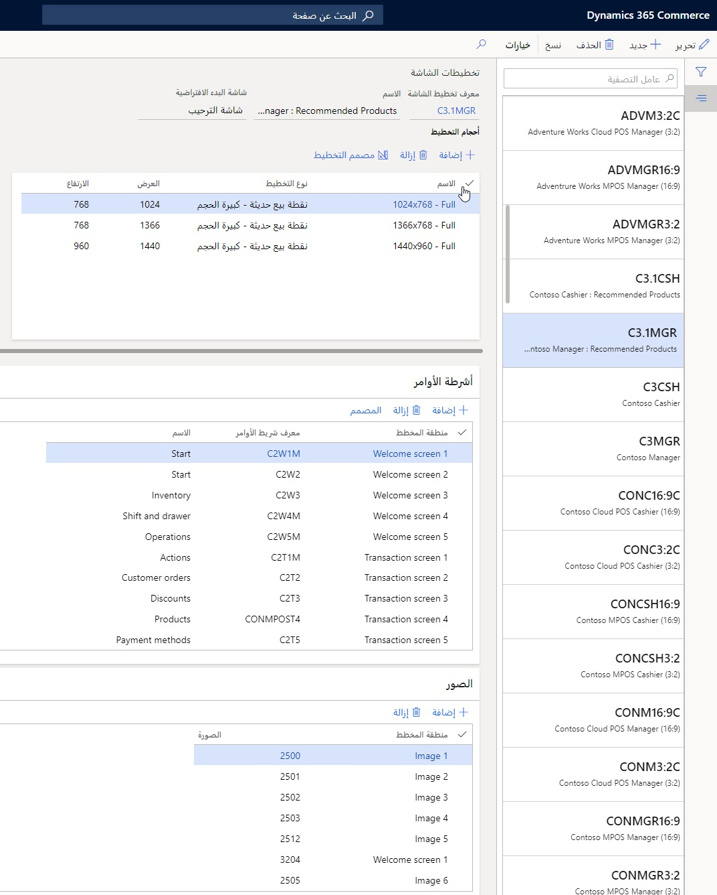
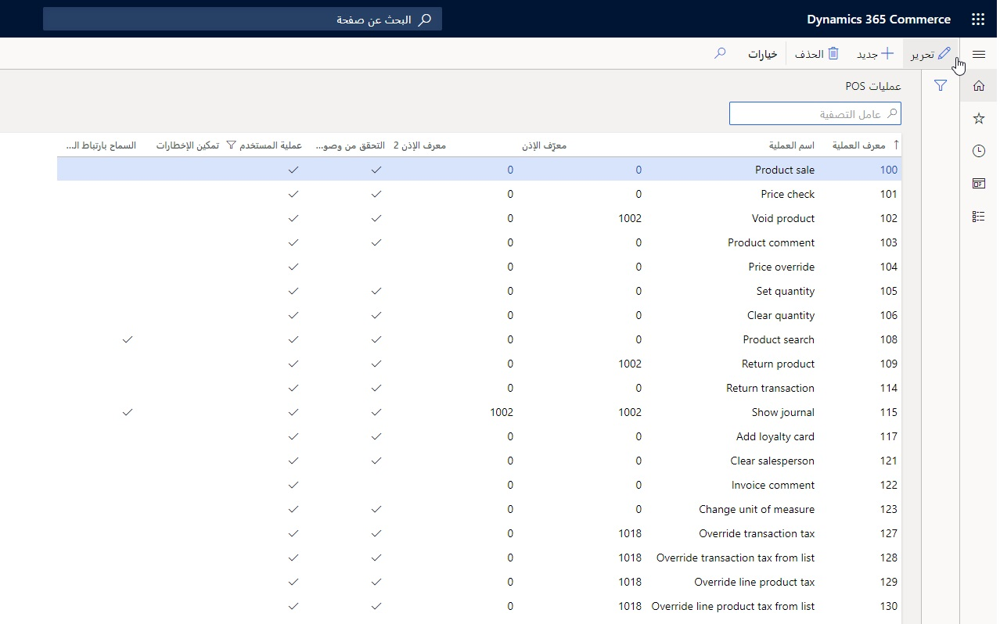
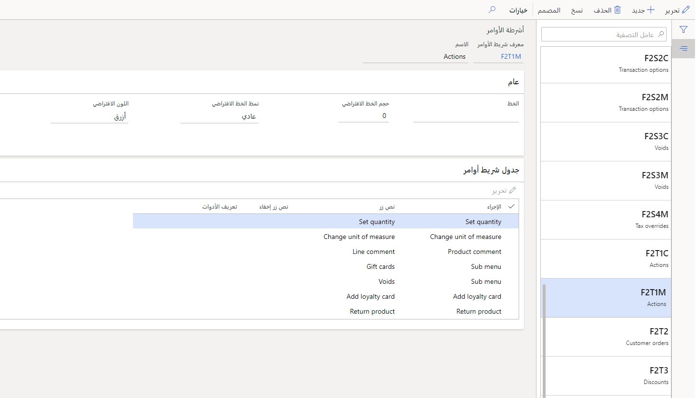
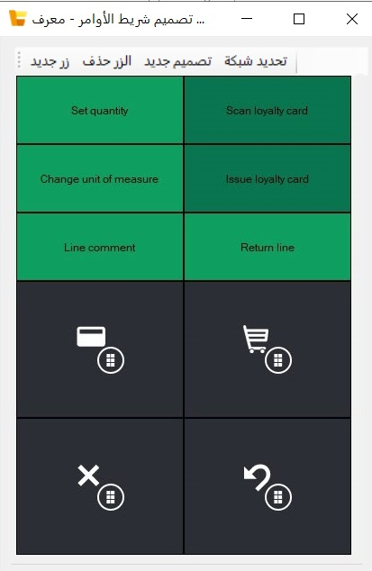
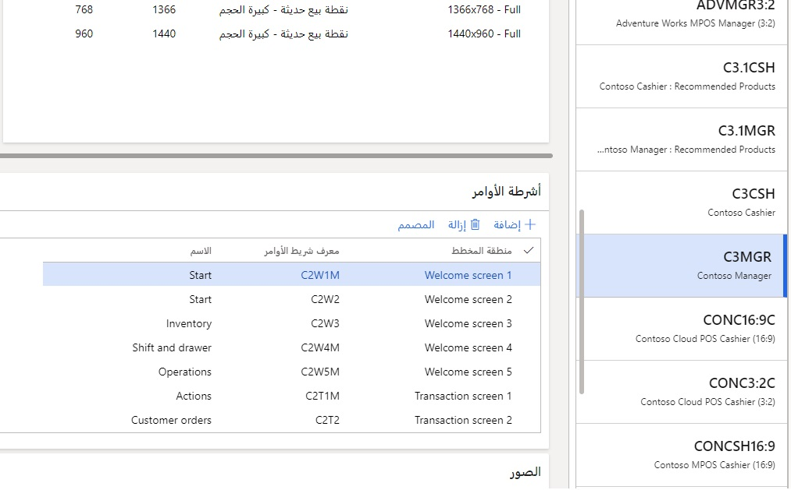
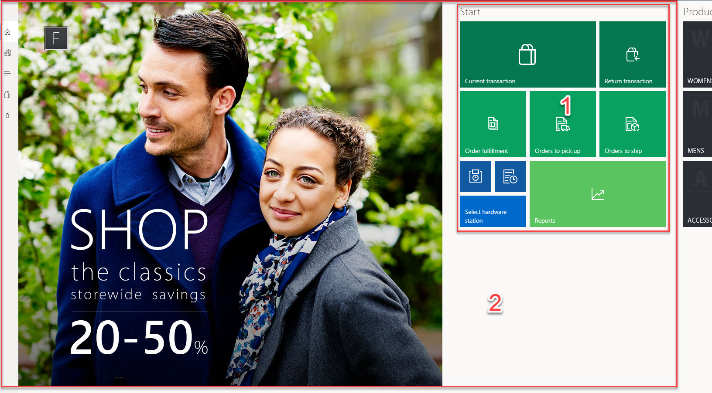
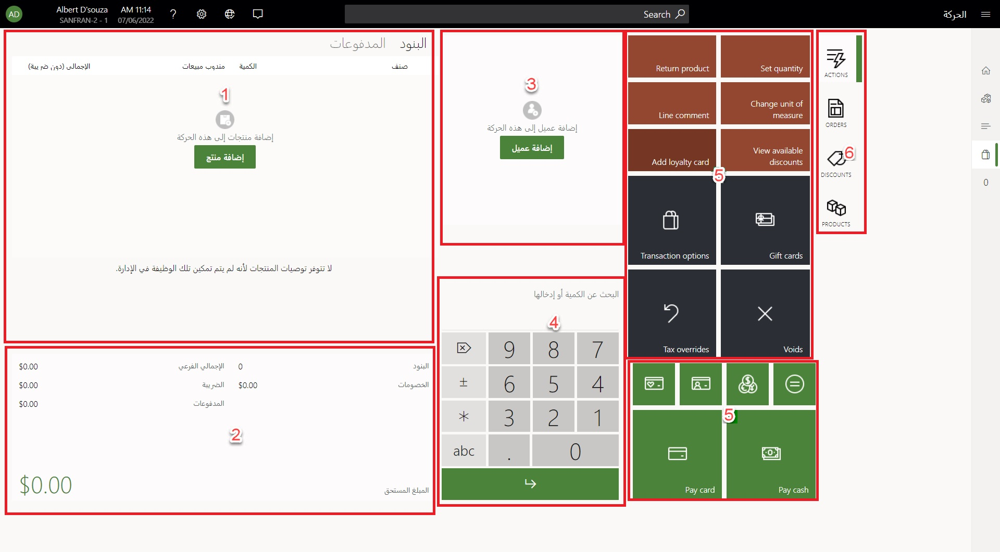
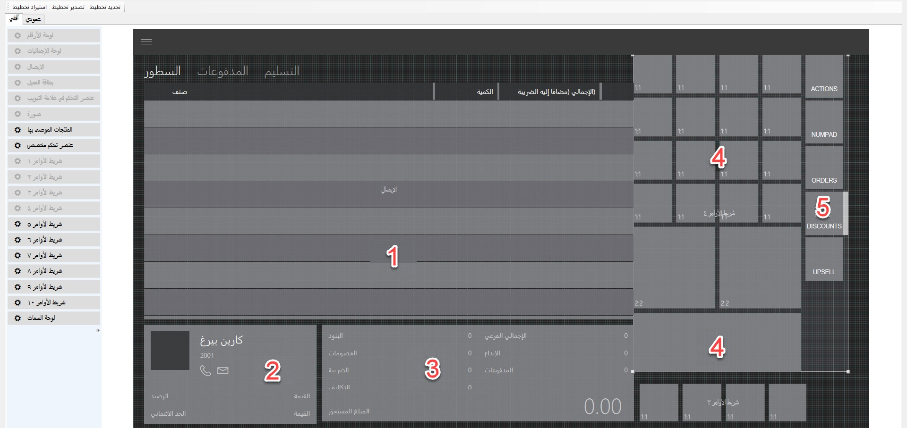
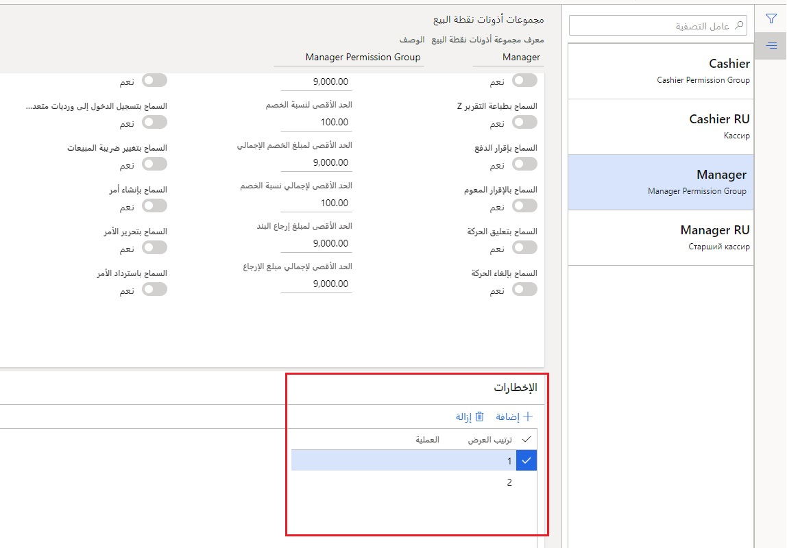
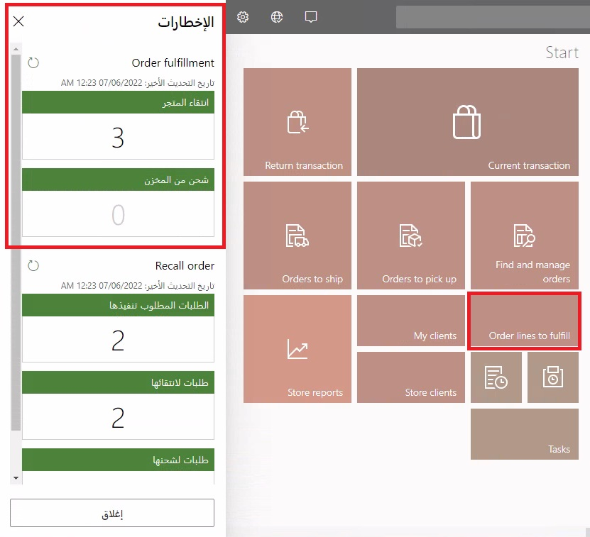

تخطيطات شاشة Store Commerce لـ Windows وStore Commerce للمتصفحات في Store Commerce قابلة للتكوين للعديد من المتطلبات. ويتم تكوين تخطيطات الشاشة على مستوى المخزن ولكن يمكن تجاوزها على مستوى السجل والمستخدمين، إذا لزم الأمر. تتيح لك هذه الميزة تكوين السجلات مرة واحدة، ولكنها لا تزال تسمح بتخطيط جديد لتخطيط خط محدد أو لمدير أو مستخدم متمرس يطوف بين المتاجر. 

المكونات الرئيسية لتخطيطات شاشة Store Commerce في **‬‏‫Retail وCommerce > إعداد القناة > إعداد نقطة البيع >نقطة البيع > تخطيطات الشاشة** هي:

- **أحجام التخطيط**
- **أشرطة الأوامر**
- **الصور**

تحتوي مكون **تخطيطات الشاشة** على السجلات الرئيسية المرفقة بالمخازن والسجلات والمستخدمين. تحدد هذه التخطيطات دقة شاشات الأجهزة المختلفة، لكل منها أشرطة الأوامر الخاصة بها. كل دقة شاشة لها تخطيط يتم تعريفه من خلال **مصمم التخطيط** ويمكن تعيينها إما بحجم كامل أو تخطيط مدمج. تسمح لك التخطيطات الكاملة بتصميم شاشة عرض للشاشات الكبيرة أو الكمبيوتر اللوحي، في حين أن التخطيط المدمج هو للأجهزة الصغيرة مثل الهواتف وله خيارات تكوين محدودة. يتم دعم التخطيطات الأفقية أو العمودية. 

## أشرطة الأوامر
المكون **أشرطة الأوامر** هو مجموعة من عمليات Store Commerce التي يتم تعيينها لزر يمكن أن يحتوي على صور متراكبة. اعتماداً على المهمة، مثل تحديد فئة منتج أو صورة، يمكن للزر تنفيذ إجراء ما مباشرة. 

على سبيل المثال، يمكن لزر في شريط أوامر توجيه المستخدم إلى فئة من الأصناف، أو السماح للمستخدم بإضافة صنف إلى الحركة دون الحاجة إلى التنقل من خلال الطرق التقليدية لإضافة الصنف. 

تعرض لقطة الشاشة التالية صفحة **عمليات نقطة البيع**، الموجودة في **البيع بالتجزئة والتجارة > إعداد القناة > إعداد نقطة البيع > نقطة البيع**، والتي تسرد العمليات التي يمكن تخصيصها للأزرار.  
 

يتم تصميم أشرطه الأوامر كمكونات منفصلة، بحيث يمكن إنشاؤها مرة واحدة ثم استخدامها عبر تخطيطات متعددة. يمكن تكوين الأزرار الموجودة في شريط الأوامر للحصول على أحجام وألوان متنوعة لتوفير التركيز وتمييز الوظائف بين الأزرار (على سبيل المثال، الأزرق = بطاقات الوقت، والأخضر = المدفوعات، وهكذا). تكون أشرطة الأوامر قابلة للتكوين من قبل المستخدمين دون الحاجة إلى مطور. 

توضح صفحة **أشرطة الأوامر** في **البيع بالتجزئة والتجارة > إعداد القناة > إعداد نقطة البيع >نقطة البيع** خيار **المصمم** وإجراءات **جدول شريط الأوامر**. 
  

تعرض لقطة الشاشة التالية من **مصمم أشرطة الأوامر**، الموجود في **البيع بالتجزئة والتجارة > إعداد القناة > إعداد نقطة البيع > نقطة البيع > أشرطة الأوامر** مثالاً على كيفية وضع الأزرار لشريط الأوامر السابق، بما في ذلك النص والصور بدلاً من النص.

 

## مناطق التخطيط
لكل تخطيط شاشة منطقتان للتخطيط يجب تصميمهما: 

- شاشة **الترحيب**
- شاشة **الحركة** 

في مصمم التخطيط، يجب تعريف أشرطه الأوامر التي سيتم استخدامها في كل شاشة كما هو مبين في صفحة **تخطيطات الشاشة** التالية في **البيع بالتجزئة والتجارة > إعداد القناة > إعداد نقطة البيع >نقطة البيع**.

 

### شاشة الترحيب
تعرض لقطة الشاشة التالية مثالاً على شاشة **الترحيب**، والتي تم تكوينها في مصمم التخطيط، وأشرطه الأوامر. يمكنك الحصول على أكبر عدد من مجموعات شريط الأوامر حسب الحاجة وعادة ما تكون مصممة حسب المنطقة الوظيفي، مثل **بداية اليوم**، و **نهاية اليوم**، و **المخزون**، و **الوردية والدرج**، والمزيد. 

تُظهر لقطة الشاشة التالية شاشة **الترحيب** من Store Commerce الخاص بتخزين متصفح **HOUSTON** لسجل **HOUSTON-14**. تتوافق الأرقام التالية مع الأرقام الموجودة في لقطة الشاشة التي تعرض هذه المكونات: 
 
1.  أشرطة الأوامر
2.  صور شاشة الترحيب 

### شاشة الحركة
المثال التالي هو شاشة **الحركة** لـ Store Commerce مع العناصر المرقمة التالية الموضحة في الارتباط بمصمم تخطيط Store Commerce: 

1.  الإيصال
2.  لوحة الإجماليات
3.  بطاقة العميل
4.  لوحة الأرقام
5.  أشرطة الأوامر
6.  عنصر التحكم في علامة التبويب

 

## مصمم التخطيط
يتطلب مصمم تخطيط Microsoft Dynamics Commerce Designer لتثبيته على الجهاز. لقطة الشاشة التالية هي مثال على تخطيط شاشة حركة Store Commerce كما هو موضح في مصمم التخطيط في **Retail وCommerce > إعداد القناة > إعداد نقطة البيع > نقطة البيع > تخطيطات الشاشة >مصمم التخطيط**. 

الأرقام الواردة في لقطة الشاشة ترتبط بالأقسام التالية:

1.  الإيصال
2.  بطاقة العميل
3.  لوحة الإجماليات
4.  أشرطة الأوامر
5.  عنصر التحكم في علامة التبويب

عندما تقوم بتطوير تخطيطات الشاشة وشبكات الأزرار، يمكن استخدام أمثلة Contoso الموجودة في مجموعة بيانات العرض التوضيحي لـ Commerce كقالب ولمساعدتك في الحصول على الإلهام. 

## الدعم اللغوي
تدعم Commerce التوزيعات الدولية، وبالتالي تدعم لغات متعددة. يتم تكوين اللغات على المتجر والعامل. 

ويتم استخدام لغة المتجر التي تم تكوينها لجميع عناصر البيانات، مثل أسماء العملاء والمنتجات والسمات وطرق الدفع والإيصالات، والمزيد. 

سيتم استخدام لغة العامل بشكل افتراضي من المتجر، ولكن إذا تم تجاوزها في تكوين العامل، فسيتم استخدامها لترجمة العناصر غير التابعة للبيانات، مثل التسميات والقوائم واللوائح. يعتبر النص الموجود على أشرطة الأوامر بمثابة بيانات، لذلك إذا كان النص موجوداً على الأزرار، فقد يحتاج شريط الأوامر إلى أن يتم نسخه لكل لغة مدعومة. 

## الإعلامات

قد تكون المواقف التي قد تحدث عند إرسال إخطار إلى عامل في متجر مفيدة. 

على سبيل المثال، المتجر "أ" لديه بضع عمليات استلام اليوم. فإذا كانت Store Commerce تشير إلى عدد مرات عمليات الاستلام المجدولة لليوم في المتجر، يمكن للعامل جمعها قبل افتتاح المتجر. وبدلاً من الاضطرار إلى الانتقال إلى صفحة لتحديد ما إذا كانت عمليات الاستلام قد تمت جدولتها، فإن العامل يتلقى بدلاً من ذلك إخطاراً على زر **نقطة البيع** يشير إلى الحاجة إلى اتخاذ إجراءات، الأمر الذي من شأنه أن يؤدي إلى تسهيل هذه الإجراءات بسرعة. 

يساعد إطار عمل الإخطارات في Store Commerce عن طريق السماح لتجار التجزئة بتكوين الإخطارات المستندة إلى الأدوار. 

على سبيل المثال، قد لا تحتاج تحويلات الانتقاء سوى أن يتم إكمالها من قبل مديري المتاجر. لتجنب تكوين كل مدير متجر بهذه الوظيفة، من الأسهل تكوينه مرة واحدة ومن ثم تطبيقه على جميع المديرين. 

يتم تكوين **الإخطارات** على صفحة **مجموعات أذونات نقطة البيع** ضمن **البيع بالتجزئة والتجارة > الموظفون**، كما هو موضح في لقطة الشاشة التالية. 
 
 

لتكوين إجراءات الإخطارات، يكون لدى صفحة **عمليات نقطة البيع** حقل **تمكين الإخطارات**. في ملف التعريف الوظيفي، يمكن تعيين **فترة الإخطار** لإملاء عدد مرات إرسال الإخطار إلى المخازن. يمكن أن تسمح الأزرار التي تم تكوينها في أحد أشرطة الأوامر بمؤشرات مباشرة عند تلقي إعلاماً، مثل الحاجة إلى سحب الأصناف من الدور الأرضي للمتجر ليتم شحنها. 

تعرض لقطة الشاشة التالية مثالاً لإخطار خاص بعملية **تنفيذ الأمر** كما هو موضح في Store Commerce. 

 
  

