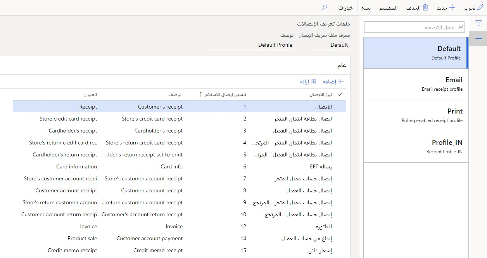
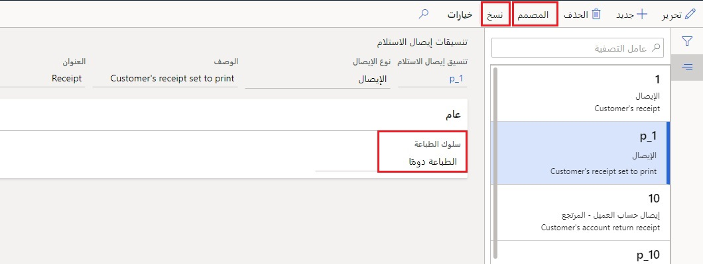
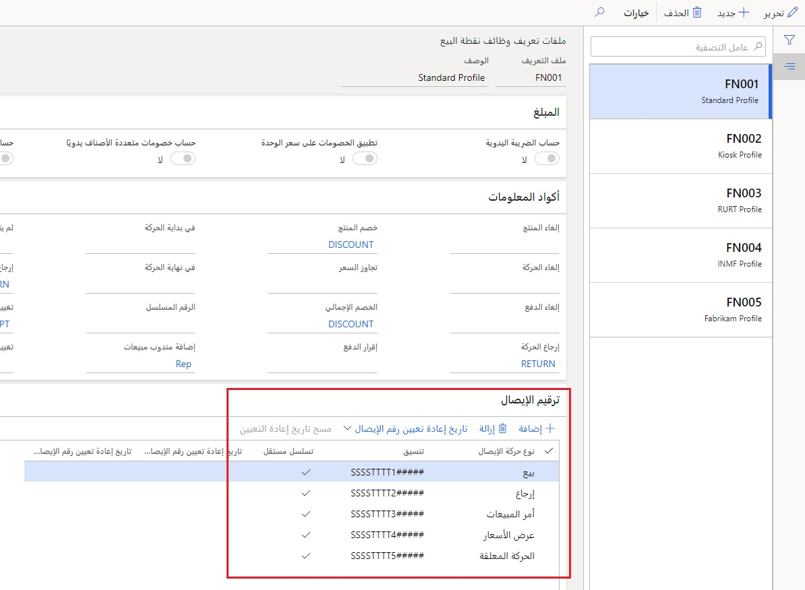
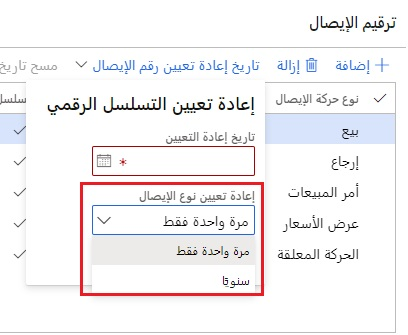

يجب على ‏‫المتاجر التقليدية المادية‬ تقديم إيصالات للعملاء لكل حركة تحدث كدليل على الشراء.  
باستخدام الإيصالات، يمكن للعملاء إثبات مكان ووقت شراء الأصناف لدعاوي المرتجعات أو الاستبدال والضمانات. 

يمكن طباعة الإيصالات أو توفيرها عبر البريد الإلكتروني. في بعض الأحيان، قد يرغب العملاء في الحصول على إيصال ثانٍ مع حذف الأسعار، كما هو الحال بالنسبة لإيصال الهدايا. 

ملف تعريف الإيصال عبارة عن مجموعة من الإيصالات المستخدمة في نقطة البيع. انتقل إلى **Retail وCommerce > ‏‫إعداد القناة > نقطة البيع > ملفات تعريف نقطة البيع > ملفات تعريف الإيصالات**، حيث يمكنك العثور على قائمة بملفات تعريف الإيصالات الافتراضية والإيصالات التي يتم إنشاؤها بواسطة عملية [‏‫تهيئة بيانات أولية](https://docs.microsoft.com/learn/modules/configure-omnichannel-prerequisites/02-initialize-seed-data/?azure-portal=true). 

يدعم Commerce الإيصالات لعمليات المتجر باستخدام ملفي تعريف للإيصالات: 

- الإيصالات عبر البريد الإلكتروني
- الإيصالات المطبوعة 

## الإيصالات المطبوعة
تستند الإيصالات المطبوعة إلى الطابعات الفعلية، والتي قد تكون خاصة بوحدات طرفية معينة لنقاط البيع. لذلك، يجب تعيين ملفات تعريف الإيصالات على مستوى التسجيل من خلال سجل ملف تعريف الأجهزة المستخدم في السجل. 

## مصمم الإيصال
يحتوي كل تصميم إيصال على رأس وبنود والتذييل‬. يجوز وجود رأس وتذييل واحد فقط، ويتم استخدام تكوين البنود لكل بند حركة في الأمر. يمكن نقل الحقول والأعمدة لتلائم المعلومات المطلوبة في الإيصال باستخدام **مصمم الإيصال**. ستعمل عملية تكوين عملية ‏‫تهيئة بيانات أولية على تكوين عدة إيصالات مسبقاً لاستخدامها كخط أساس. يمكن لبائع التجزئة البدء بهذه الإيصالات عن طريق تحديد الزر **نسخ** ثم إنشاء تنسيق جديد للتعديل. 

ليس ضرورياً الاستعانة بمطور لهذا الجهد لأنه واجهة سحب وإفلات في المصمم. 

## تنسيقات الإيصالات
يتم تكوين تنسيقات الإيصالات في **Retail وCommerce > إعداد القناة > نقطة البيع > تنسيقات الإيصالات** باستخدام عمليات الطباعة التالية:

- **الطباعة دائماً** - تتم طباعة الإيصال تلقائياً حسب الاقتضاء.
- **عدم الطباعة** - لا تتم طباعة الإيصال.
- **مطالبة المستخدم** - يُطلب من المستخدم طباعة الإيصال.
- **حسب الحاجة** - يُستخدم هذا الخيار فقط لإيصالات الهدايا. عند تحديد هذا الخيار، يمكن للمستخدم طباعة إيصال هدايا من صفحة **تغيير** في حالة كون إيصال الهدايا مطلوباً.

## الإيصالات عبر البريد الإلكتروني‬
ستتطلب الإيصالات المرسلة عبر البريد الإلكتروني تنسيقاً وتخطيطاً مختلفين عن الإيصالات المطبوعة. يتم تكوين **ملف تعريف إيصال البريد الإلكتروني** في سجل المتجر التجاري بحيث تكون تكوينات البريد الإلكتروني متسقة لجميع السجلات في المتجر لأن الإيصالات المرسلة عبر البريد الإلكتروني لا تتطلب الاستعانة بالأجهزة. ستعمل إيصالات البريد الإلكتروني التي تم تكوينها على خط الهاتف الخلوي بنفس الطريقة التي تعمل بها في حارة نقطة البيع الفعلية مع طابعات مخصصة وأدراج نقدية. 

يمكنك تحديد وقت إرسال رسائل البريد الإلكتروني في **معلمات Commerce** لجميع قنوات Commerce. ومع ذلك، يمكن تجاوز هذا الإعداد للعميل بناءً على تفضيل الإيصال. 

- **إيصال قياسي** - طباعة الإيصالات من سجل نقطة البيع.
- **البريد الإلكتروني** - إرسال الإيصالات للعملاء في رسائل البريد الإلكتروني.
- **كلاهما** - طباعة الإيصالات من سجل نقطة البيع وإرسال الإيصالات للعملاء في رسائل البريد الإلكتروني.

يتم إرسال الإيصالات عبر البريد الإلكتروني بواسطة خدمة الوقت الفعلي عند الانتهاء من الحركة، لذلك قد يكون إيصال العميل عبر البريد الإلكتروني في صندوق الوارد الخاص به قبل مغادرته المتجر. 

تشمل بعض ميزات وفوائد الإيصالات عبر البريد الإلكتروني ما يلي:

- **القدرة على إرسال أنواع الإيصالات الشائعة عبر البريد الإلكتروني** - يمكن الآن إرسال أنواع الإيصالات التي يتلقاها العملاء عادةً أثناء الخروج، كجزء من استفسارات رصيد بطاقة الهدايا، أو من خلال دفتر اليومية، عبر البريد الإلكتروني.
- **إقران نوع الإيصال بقالب بريد إلكتروني مخصص** - يمكن تعيين كافة أنواع الإيصالات إلى قالب بريد إلكتروني محدد.
- **التكوين الدقيق للإيصالات المرسلة بالبريد الإلكتروني** - يمكن تكوين أنواع الإيصالات بشكل فردي ليتم إرسالها بالبريد الإلكتروني. سيوفر تنسيق الإيصال الخيارات التالية: **إرسال عبر البريد الإلكتروني دائماً**، **عدم الإرسال عبر البريد الإلكتروني**، و **مطالبة المستخدم**.
- **خيارات إيصالات الهدايا المرسلة عبر البريد الإلكتروني** - لدى الصرافين خيار تحديد منتجات مختلفة لإدراجها في إيصال الهدايا المرسل عبر البريد الإلكتروني مقارنةً بإيصال الهدايا المطبوع.
- **كتابة الإيصال المرسل عبر البريد الإلكتروني المحسن** - يمكن تحميل HTML لإيصالات البريد الإلكتروني دون الحاجة إلى إزالة الأسطر الجديدة وتغذية الأسطر. 

## ترقيم الإيصال
سيتم تعيين رقم إيصال فريد لكل إيصال استلام. ويمكن من خلال هذه المواصفات ربط الحركات المختلفة بالظروف التي حدثت فيها، مثل المتجر، والمحطة الطرفية، ونوع الحركة، والمزيد. 

يتم تعيين ترقيم الإيصال من صفحة **Retail وCommerce > إعداد القناة > إعداد نقطة البيع > ملفات تعريف نقطة البيع > ملفات تعريف الوظائف** على مستوى المتجر.‬ 

ويمكن أن تستخدم أرقام الإيصالات مفهوم الترقيم الذكي *الترقيم الذكي*، مما يعني أن المعرف يمكنه دمج القيم الديناميكية والثابتة في الرقم. يمكن للعامل بعد ذلك الاطلاع على الإيصال ومعرفة البيانات المتعلقة بالحركة. 

يوفر الجدول التالي قائمة بالمتغيرات التي يمكن استخدامها لإنشاء تنسيق إيصال. 

| **الأحرف** | **الوصف** |
 | ------------- | ------------- |
 | **S** | يتم استخدام الحرف **S** للإشارة إلى رقم المتجر. على سبيل المثال، إذا كان رقم المتجرHOUSTON1، فإن التنسيق **SSS** يُظهر "ON1" في الإيصال. التنسيق **SSSSS** يُظهر "STON1" في الإيصال.|
 | **T** | يتم استخدام الحرف **T** للإشارة إلى رقم الوحدة الطرفية. على سبيل المثال، إذا كان رقم المحطة الطرفية 0001، فإن التنسيق **TTTT** يُظهر "0001" في الإيصال.|
| **C** | يتم استخدام الحرف **C** للإشارة إلى رقم معرف الموظف. على سبيل المثال، إذا كان لدى أحد الموظفين المعرف 000160، فإن التنسيق **CCCC** يُظهر "0160" في الإيصال.|
 | **ddd** | تتوافق الأحرف **ddd** مع أيام السنة، من 1 إلى 366. علي سبيل المثال، في يوم 15 يناير، فإن التنسيق **ddd** يُظهر "015" في الإيصال. |
| **MM** | يتم استخدام الأحرف **MM** للإشارة إلى الشهور المكونة من رقمين. علي سبيل المثال، في شهر يناير، فإن التنسيق **MM** يُظهر "01" في الإيصال.|
 | **DD** | يتم استخدام الأحرف **DD** للإشارة إلى أيام الشهور المكونة من رقمين. علي سبيل المثال، في يوم 15 يناير، فإن التنسيق **DD** يُظهر "15" في الإيصال.|
| **‏‏YY** | يتم استخدام الأحرف **YY** للإشارة إلى السنة المكونة من رقمين. على سبيل المثال، في أي شهر خلال عام 2020، فإن التنسيق **YY** يُظهر "20" في الإيصال.|
 | **#**| ‎يتم استخدام علامة الرقم (**#**) للترقيم التسلسلي. على سبيل المثال، يُظهر التنسيق **####** "0001" و"0002" و"0003" وما إلى ذلك في الإيصال.|

قد تحتاج إلى إعادة ترقيم الإيصالات. في صفحة **‏‫ملف تعريف الوظائف‬** الموجودة في **Retail وCommerce > إعداد القناة > إعداد نقطة البيع > ملفات تعريف نقطة البيع**، سوف تجد التكوين **تاريخ إعادة تعيين رقم الإيصال** الذي سيتيح لك إعادة تعيين الأرقام في تاريخ محدد أو بصورة سنوية.  

بالنسبة للإيصالات المطبوعة للبطاقات المدينة، من المهم أن تكون معلومات تحويل الأموال الإلكتروني (ETF) للبطاقة المدينة مضمنة في الإيصال للامتثال لمعالجة الدفع. ستختلف المعلومات المطلوبة لهذه المعلمة وفقاً للمتطلبات القانونية المعمول بها محلياً.‬
