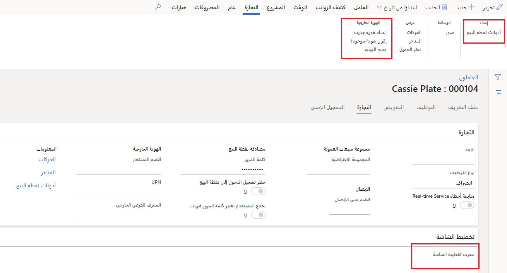

يتم إنشاء عمال المتجر في صفحة **العمال**. عند إنشاء عامل جديد، تأكد من تعيين القيم التالية له:

- **تاريخ بدء التوظيف** - تاريخ البدء المطلوب للنظام.
- **اللغة** (في علامة التبويب **Commerce**) - اللغة المفضلة للمستخدم.
- **دفتر العناوين** – دفتر عناوين الموظف. ستكون المخازن التي تم تعيين قيم دفتر العناوين للموظف فيها هي المتاجر التي يُسمح للموظف بتسجيل الدخول فيها إلى السجلات. 
- **معرف تخطيط الشاشة‬‏‫** - تخطيط نقطة البيع الخاصة بالعمال. يتم استخدام هذا التخطيط بدلاً من أي مخطط تخزين أو تسجيل تم تعيينه.
- **الاسم الموجود على الإيصال** – اسم العامل كما يظهر في الإيصال.

عند إنشاء عامل لأول مرة، يمكنك تعيين كلمة مرور افتراضية للعامل وتحديد إعداد يتطلب من العامل تغيير كلمة المرور في المرة الأولى التي يقوم فيها بتسجيل الدخول إلى نقطة البيع. 

في علامة التبويب **عامل** ‏‫في جزء الإجراء، في مجموعة **التعيين‬**، يمكنك إضافة **‬‏‫تعيين منصب العامل** إلى العامل. السبب الرئيسي لهذا الإجراء هو تعيين منصب إلى العامل يحتوي على وظيفة مصحوبة بأذونات نقطة البيع المرتبطة.

## أذونات نقطة البيع
تُستخدم مجموعات أذونات موضع نقطة البيع لتجميع سلسلة من تكوينات الأمان لمجموعة من مستخدمي نقطة البيع. 

توجد طريقتان لتكوين أذونات نقطة البيع للعامل: 

- تعيين وظائف أو مناصب للعامل
- تجاوز العامل 

### تعيين وظائف أو مناصب للعامل
يعد إنشاء وظائف لوظيفة ما وتعيينها للمستخدم هو الطريقة الأساسية التي يجب أن يتم بها تعيين أذونات نقطة البيع للعامل. يتم تعيين **مجموعة أذونات نقطة البيع** إلى **وظيفة**، والتي بدورها يتم تعيينها إلى **منصب**. 

يتم تعيين **منصب** إلى العامل الذي يقوم بتعيين أذونات نقطة البيع للمستخدم. بعد ذلك، إذا احتاج هذا المستخدم إلى امتيازات أكثر لفترة زمنية محددة، فيمكن تجاوز الأذونات في نقطة البيع. تظل الأذونات الأصلية كما هي في الوظيفة (الوظائف) المعينة للعامل. 

### تجاوز العامل 
يتم تكوين تنفيذ عمليات معينة تتطلب تجاوز المدير باستخدام وظيفة **عمليات نقطة البيع**. يتم استخدام إعداد الأمان **امتيازات المدير** لهذا الإجراء. مطلوب أيضاً أن يقوم المستخدم بتنشيط جهاز MPOS أو CPOS. 

### الهوية الخارجية
إذا احتاج الموظف إلى تنشيط نقطة بيع، فيلزم وجود **هوية خارجية** مقترنة. الهوية الخارجية عبارة عن سحابة Azure Active Directory Microsoft (Azure AD) أو Azure AD حساب محلي في مستأجر الشركة. سيؤدي استخدام وظيفة **‬‏‫إقران الهوية الموجودة** على العامل ثم إقرانها بالهوية الخارجية المناسبة إلى السماح بتنشيط نقطة البيع. 

يمكن العثور على هذه الوظيفة ضمن **Retail وCommerce > الموظفين > العمال**.

### العمولات
يمكن تكوين العمال كمندوبي مبيعات مؤهلين للحصول على عمولة على المبيعات في نقطة البيع. يتم تعيين العمال إلى مجموعة مبيعات افتراضية لتحديد كيفية حساب العمولات. يمكن تعيين **المجموعة الافتراضية** للعامل بشكل افتراضي إلى بند حركات المبيعات في نقطة البيع، إذا تم تكوينها للقيام بذلك في ملف تعريف الوظائف. يمكن أن تطالب الوظيفة أيضاً مجموعة المبيعات باستخدامها في وقت الحركة. 

