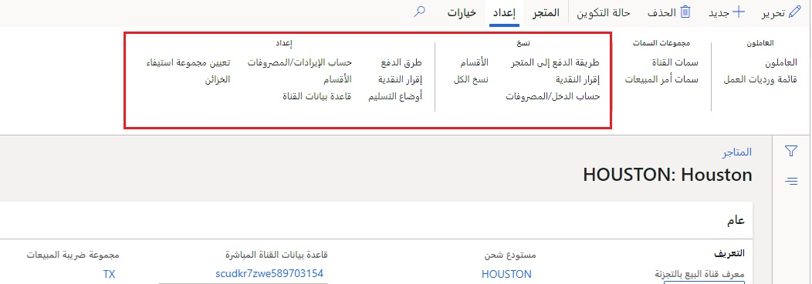
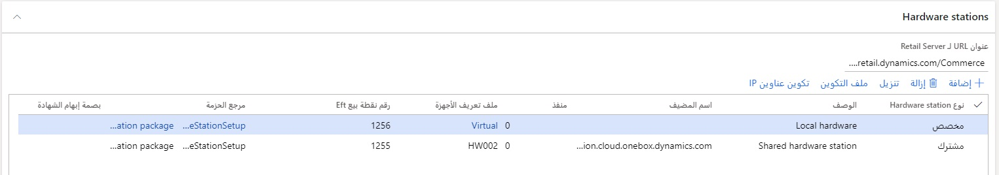

يتم إنشاء متجر البيع بالتجزئة كسجل قناة في Commerce في الصفحة **جميع المتاجر**. يتطلب متجر البيع بالتجزئة علاقة واحد إلى واحد (1:1) مع مستودع ووحدة تشغيل. يجب تكوين المستودع قبل إنشاء المتجر. يتم إنشاء وحدة التشغيل تلقائياً عند إنشاء سجل المتجر. 

شاهد مقطع الفيديو التالي لمعرفة كيفية إنشاء متجر بيع بالتجزئة.

 > [!VIDEO https://www.microsoft.com/videoplayer/embed/RE4ApCH]

يحتوي كل متجر على بعض تكوينات المتجر الهامة التي يجب أخذها بعين الاعتبار:

- **الكيان القانوني** - الكيان القانوني الذي سيتم ترحيل حركات المتجر فيه.
- **المنطقة الزمنية** – المنطقة الزمنية التي يعمل بها المتجر.
- **اللغة** – اللغة المستخدمة لبيانات المتجر.
- **العملة** – العملة الافتراضية للمتجر.
- **المستودع** – المستودع المستخدم لمخزون المتجر. لا يمكن لـ Store Commerce أن تبيع إلا خارج موقع مستودع واحد. 
- **ملف تعريف الوظائف** - يحتوي على تكوينات لكيفية عمل السجلات. 
- **تكوينات ملفات التعريف** – التكوينات المستخدمة لتحديد تفاصيل البنية التقنية، مثل Retail Server وعناوين URL لـ Store Commerce لـ Browsers المجموعة ومخطط قاعدة البيانات دون اتصال وغير ذلك الكثير. 
- **تكوينات ضريبة المبيعات** – عبارة عن مجموعة من التكوينات المستخدمة لتحديد تكوينات ضريبة المبيعات، مثل مجموعة ضرائب المتجر، وما إذا كان يجب على المتجر استخدام الضرائب المستندة إلى الوجهة أو العميل.
- **معرف العميل الافتراضي** - يتم تعيينه للحركات التي لم يتم تحديد عملاء لها. سيتم تجميع جميع الحركات في أمر مبيعات باستخدام معرف العميل الافتراضي هذا.
- **معرف تخطيط الشاشة** – معرف تخطيط الشاشة الافتراضي المستخدم لجميع السجلات والمستخدمين، ما لم يتم استبداله. 
- **الترحيل كيوم العمل** – لإزاحة وقت نهاية اليوم. على سبيل المثال، قد يُغلق أحد المتاجر بعد منتصف الليل ويريد أن يتم ترحيل الحركات التي تحدث حتى الساعة 2:00 صباحاً كمبيعات اليوم السابق. 

## دفاتر العناوين
يتم أيضاً تكوين دفتريّ عناوين في المتجر:

- دفتر عناوين العملاء
- دفتر عناوين الموظفين 

### دفتر عناوين العملاء
يتم استخدام **دفتر عناوين العملاء** لتحديد نطاق العملاء الذين jجب مزامنتهم مع المتجر لرؤية المتجر. يُعد هذا الاعتبار مهماً عندما لا يلزم رؤية أعداد كبيرة من العملاء في Store Commerce. يعمل **دفتر عناوين العملاء** على تقليل حجم جدول **العميل** لتحسين الأداء داخل المتجر وتقليل عدد العملاء الذين يجب على العاملين في المتجر فرزهم عند محاولة العثور على عميل. 

إذا لم يتم تضمين عميل ما في **دفتر عناوين العملاء** الخاص بالمتجر، يمكن لمنظم المبيعات البحث عن معلومات العميل في Store Commerce باستخدام اتصال في الوقت الحقيقي، ثم يمكنه سحب المعلومات إلى المتجر لاستخدامها حسب الحاجة. يتم تعيين **دفتر عناوين عملاء** لكل عميل يكون مرتبطاً بالسجلات الموجودة في **دفتر/دفاتر عناوين العملاء** الخاصة بالمتجر. 

### دفتر عناوين الموظفين
يتم استخدام **دفتر عناوين الموظفين** للتحكم في أمان عمليات تسجيل دخول العاملين إلى سجلات المتجر. التكوين الخاص به هو نفسه الخاص **بدفتر عناوين العملاء**، ولكنه يقوم بتعيين السجلات للعاملين وليس للعملاء.  

يتم تعيين عاملي المتجر **لدفتر عناوين موظفين** واحد أو أكثر تم تكوينه. يتم بعد ذلك تعيين دفتر واحد أو أكثر من دفتر العناوين هذه للمتاجر. تتمثل إحدى طرق منع الموظف من الوصول إلى أي متاجر في إزالة سجل/سجلات **دفتر عناوين الموظفين** من سجل الموظف. 

## علامة التبويب "إعداد" 
توفر علامة التبويب **إعداد** في "جزء الإجراءات" معلمات إضافية للقناة:

- **طرق الدفع** - طرق الدفع التي يقبلها المتجر. 
- **إقرار النقدية** – للتصريح بالعملة والفئات النقدية لأنواع النقد المختلفة (العملات المعدنية مقابل الأوراق النقدية).
- **أوضاع التسليم** – أوضاع التسليم الصالحة لأوامر العميل في المتجر. 
- **حساب الإيرادات/المصروفات** - لتحديد حسابات الترحيل لحركات الإيرادات والمصروفات.
- **مهام مجموعات التنفيذ** – مجموعة من المتاجر والمستودعات التي تسمح بعرض مخزونها بواسطة المتجر. 
- **الخزائن** – الخزائن المستخدمة لتخزين النقد والسجلات غير المستخدمة. 

إذا تم إعداد هذه التكوينات بالفعل لمتجر مشابه، يمكن نسخها إلى المتجر الحالي من خلال وظيفة **النسخ** في الصفحة **البيع بالتجزئة والتجارة> القنوات > المتاجر > جميع المتاجر > المتاجر**. 

 

يتم إعداد تكوينات ترحيل كشف الحساب التي لم يتم إعدادها على معلمات Commerce على مستوى المتجر. 

## محطات الأجهزة
يحتوي المتجر على سجلات وأجهزة مقترنة به. ويتم ربط المتاجر بالسجلات من خلال سجلات التسجيل. 

يتم تعيين محطات الأجهزة للمتاجر، ويمكن للسجلات استخدامها. محطة الأجهزة هي آلية تسمح للسجلات المتعددة باستخدام مجموعة واحدة من الأجهزة المشتركة. 

على سبيل المثال، يتم استخدام ثلاثة أجهزة كمبيوتر لوحية من أجهزة Store Commerce المحمولة، ولكن لا يتوفر سوى طابعة واحدة وجهاز بطاقة مدينة واحد، وتتشاركهما أجهزة الكمبيوتر اللوحية لـ Store Commerce المحمولة عند الحاجة إلى إجراء السداد والخروج. وهي الطريقة الوحيدة أيضاً التي يمكن من خلالها لـ Store Commerce لـ Browsers المجموعة استخدام الأجهزة المادية في المتجر. 

يمكن أن تحتوي المتاجر على أي عدد من محطات الأجهزة التي يتم تكوينها من أجلها، ولكن يجب تثبيتها على جهاز يعمل بنظام تشغيل Windows متصل بالأجهزة المادية. 

يمكن العثور على صفحة **محطات الأجهزة**، التي تظهر في لقطة الشاشة التالية، تحت **‬‏‫البيع بالتجزئة والتجارة> القنوات > المتاجر > جميع المتاجر**.

