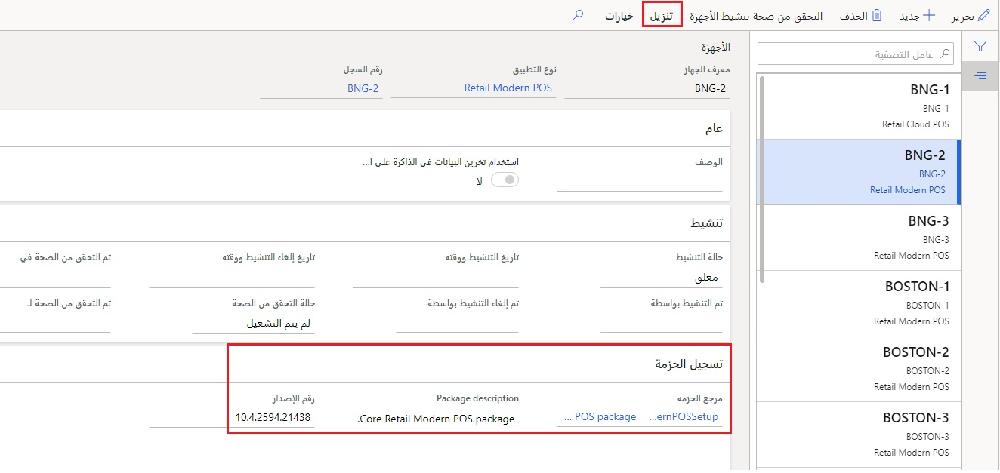

تحتوي نقطة البيع الحديثة (MPOS) على إطار عمل ذاتي الخدمة يسمح للموارد غير الفنية بتثبيت السجلات جديدة وتنشيطها. 

يحدد تسجيل الجهاز للسجل، الموجود ضمن **البيع بالتجزئة والتجارة > إعداد القنوات> إعداد نقطة البيع > الأجهزة**، ما إذا كان السجل هو جهاز MPOS أو CPOS. إذا كان نوع التطبيق هو **Retail Modern POS**، يعرض جزء الإجراءات الزر **تنزيل** الذي يمكنك تحديده لتنزيل **حزمة السجل** المحددة في التسجيل.  
  

عند تنزيل تطبيق MPOS، يتطلب التطبيق وصولاً إدارياً لتثبيته على الجهاز. سيحتاج العامل حينئذ إلى التحقق من إمكانية الوصول إلى Commerce Scale Unit من الوحدة الطرفية لنقطة البيع. 

قد تكون هناك حاجة إلى مهام إضافية، مثل تمكين التحميل الجانبي للتطبيقات التي قد تتطلب مساعدة فنية، إذا لم يتم تمكينها بالفعل في إعداد سياسة عمومية على مستوى الشركة. 

ويشبه تثبيت برنامج MPOS أي برنامج آخر بالامتداد ‎.exe على Microsoft Windows. بالنسبة إلى الأنظمة الأساسية للأجهزة المحمولة، فهي التجربة ذاتها لتثبيت أي جهاز محمول آخر لهذا النظام الأساسي دون استخدام تطبيق متجر التطبيق. 

عند تثبيت MPOS، يمكن للمستخدم تحديد **تنشيط** في التطبيق MPOS. سيُطلب من المستخدم معلومات تسجيل الدخول Azure AD (المجموعة أو المحلية) التي تم تعيينها للمستخدم لهويته الخارجية.  

إذا كانت **حالة التنشيط** الخاصة بالجهاز معلقة، وكان لدى العامل هوية خارجية مرتبطة بالمستخدم وتم تعيين أمان **أذونات المدير** على **نعم** في **مجموعات أذونات نقطة البيع**، يمكن تنشيط الجهاز. 

سيسمح تطبيق المركز الرئيسي (HQ) لـ Commerce أيضاً بإيقاف تشغيل السجلات من موقع مركزي. 

