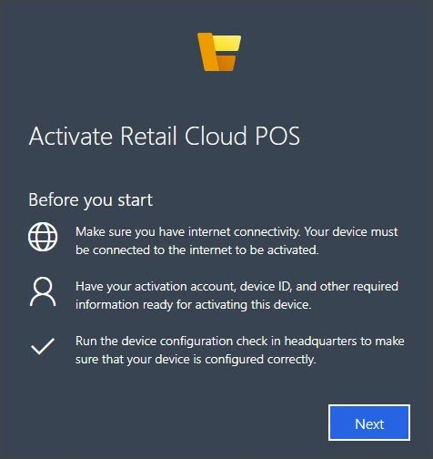

لا يتطلب تنشيط نقطة بيع المجموعة (CPOS) سوى إدخال عنوان URL في مستعرض مدعوم على جهاز نقطة البيع.CPOS activation only requires that a URL is entered into a supported browser on the POS device. ويتم العثور على عنوان URL هذا في الحقل **عنوان URL لنقطة بيع المجموعة** في صفحة **البيع بالتجزئة والتجارة > إعداد القناة > إعداد نقطة البيع > الأجهزة**.This URL is found in the **Cloud POS URL** field on the **Retail and Commerce > Channel setup > POS setup > Devices** page. يتم ملء هذا الحقل تلقائياً عندما تقوم بتعيين الجهاز على أنه **نوع التطبيق** من **Retail Cloud POS**.This field is automatically populated when you designate the device as an **Application type** of **Retail Cloud POS**.
 
يتوفر تطبيق موجه.A guided application is available.

شاهد مقطع الفيديو التالي لتتعلم كيفية تنشيط نقطة بيع المجموعة.Watch the following video to learn how to activate CPOS.

 > [!VIDEO https://www.microsoft.com/videoplayer/embed/RE4AmL7]

يجب إدخال **عنوان URL للخادم** و **معرف الجهاز** و **رقم السجل** في صفحة **التنشيط**.The **Server URL**, **Device ID**, and **Register number** must be entered on the **Activation** page. تُظهر لقطة الشاشة التالية مثالاً من صفحة **البيع بالتجزئة والتجارة > إعداد القناة> إعداد نقطة البيع > الأجهزة** ومن **عنوان URL لـ HOUSTON CPOS** لسجل **HOUSTON-14**.The following screenshot shows an example from the **Retail and Commerce > Channel setup > POS setup > Devices** page and from the **HOUSTON CPOS URL** for **HOUSTON-14** register.
 

بعد إدخال هذه المعلومات، ستتم مطالبة العامل مرة أخرى ببيانات اعتماد Azure AD (المجموعة أو المحلية) الخاصة بالهوية الخارجية المقترنة بها.After this information is entered, the worker will again be prompted for their Azure AD (cloud or on-premises) credentials of the external identity that is associated to them. 

ربما تم تنشيط السجل بالفعل على جهاز آخر ثم تم إلغاء تنشيطه.The register might have already been activated on another device and then deactivated. في هذه الحالة، ستظهر الشاشة التالية التي تفيد بأن الجهاز الآخر لن يعود صالحاً لهذا التسجيل.In that case, the following screen will appear, stating that the other device will no longer be valid for this register. تم إقران المعلومات المتعلقة بالجهاز مع السجل، وسيؤدي تحديد **متابعة** إلى تجاوز المعلومات القديمة.The information about the device is paired with the register and selecting **Continue** will override the old information. 

ستمر نقطة البيع بعد ذلك خلال خطوات التنشيط مرة أخرى.The POS will then go through the activation steps again. عند اكتمال التنشيط، سيتم إحضار المستخدم إلى شاشة **تسجيل الدخول** الخاصة بنقطة البيع.When the activation is complete, the user will be brought to the **Sign-in** screen of the POS.
 

