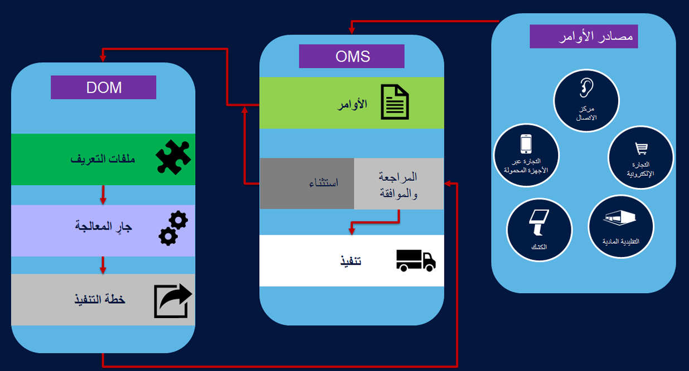

الغرض من إمكانات إدارة الأوامر الموزعة (DOM) في Commerce هو مساعدة بائعي التجزئة على تلبية توقعات العملاء من خلال تحقيق الكفاءة في عملية سلسلة التوريد الخاصة بهم. يمكن أن يساعد هذا الإنجاز بائعي التجزئة في إدارة الأوامر بشكل ذكي من خلال تنفيذها بدقة، وفي الوقت المناسب، وبتكلفة فعالة. 

توضح الصورة التالية دورة حياة أمر المبيعات في نظام DOM. 

تتضمن مصادر الأوامر كل قنوات Commerce المختلفة التي يمكن إنشاء أوامر البيع بالتجزئة منها في المتاجر التقليدية والمتاجر على الإنترنت ومراكز الاتصال. ومن خلال حل Commerce بدون عنوان، يمكن وضع الأوامر من قنوات متعددة مثل التجارة عبر الأجهزة المحمولة والتجارة عبر وسائل التواصل الاجتماعي والمزيد. 

يحتوي DOM على مفهوم يسمى **ملفات تعريف التنفيذ**، وهي قواعد عمل وقيود يقوم بائعو التجزئة بتكوينها في DOM المراد مراعاتها. عندما تكون الأوامر موجودة في النظام وتم تنشيط DOM، فإن ملفات التعريف هذه ستتحقق من الأوامر، وبناءً على تعريف القواعد والقيود، يقوم DOM بمعالجة الأمر وتحديد خطة تنفيذ موصى بها. تعد خطة التنفيذ قائمة من الأوامر التي تعتبر جزءا من تطبيق DOM، وتوفر عمليات تنفيذ موصى بها لكل بند من أوامر المبيعات.  

يمكن أن يتم تطبيق خطة التنفيذ، في حالة إنشائها، على أوامر المبيعات بشكل مباشر، مما يعني أن التوصيات يمكن قبولها افتراضياً. وبدلاً من ذلك، يمكنك استخدام عملية أخرى حيث ستقوم علمية الإقران بمراجعة التوصيات يدوياً ثم تقوم باعتمادها قبل تفعيلها في أمر المبيعات. يمكن تشغيل خطة التنفيذ التي لم يتم تطبيقها من أجل أن يتم تطبيقها بواسطة تغيير المستخدم في إعدادات ملف تعريف التنفيذ وإعادة تشغيل عملية DOM. بعد أن يتم تفعيل هذه التوصيات على الأمر، ستبدأ عملية التنفيذ بخطوات مثل الانتقاء والتعبئة والشحن. 

ويحدد ملف تعريف DOM الأوامر وبنود الأوامر التي يتعين وضعها في توصيات التنفيذ عند تمكين وظيفة DOM والقيام بتشغيلها. تعتمد الأوامر المطلوب مراعاتها في الحساب على عوامل مثل نمط التسليم وأصل أمر المبيعات والكيان القانوني. يعمل DOM لحساب كيان قانوني واحد فقط. وبالتالي، يتم تطبيق قواعد معينة استناداً إلى القواعد المقترنة بملف التعريف. تتعلق كل عملية تشغيل DOM بملف تعريف تنفيذ محدد. وبهذه الطريقة، بإمكان المؤسسات تحديد وتشغيل مجموعة قواعد للأوامر التي لديها أصول وأنماط تسليم معينة لأوامر المبيعات. 

يعد ملف تعريف "تنفيذ DOM" بمثابة مجموعة من المعلمات التالية:

-   **نطاق المؤسسة** – يتم تصميم DOM ليكون حلاً لكيانات قانونية متعددة. يساعد تحديد نطاق المؤسسة في تحديد الكيانات القانونية المرتبطة بملف تعريف. عدد الكيانات القانونية المرتبطة بملف تعريف تنفيذ محدد حالياً بحقل واحد. 
-   **نمط التسليم** - يمكن تحديد أوضاع تسليم مختلفة في النظام ويجب ربط القيم ذات الصلة بالحل DOM مع ملف التعريف. 
-   **أصل الأمر** – في عنوان أمر المبيعات هناك سمة يطلق عليها أصل الأمر، والتي يمكن استخدامها للحصول على مصدر الأمر، سواءً تم إنشاء الأمر في موقع التجارة الإلكترونية وفي نقطة البيع وفي استخدام المصادر الأخرى والمزيد. 
-   **قواعد DOM** – يمكن لبائعي التجزئة تحديد مجموعة مختلفة من القواعد التي يمكن تعيينها إلى ملف تعريف. 
-   **عوامل التكلفة** – تتيح إمكانية ربط تكوينات التكاليف المختلفة التي يتعين مراعاتها في ملف تعريف التنفيذ عندما تقوم بحساب توصيات التنفيذ.  
