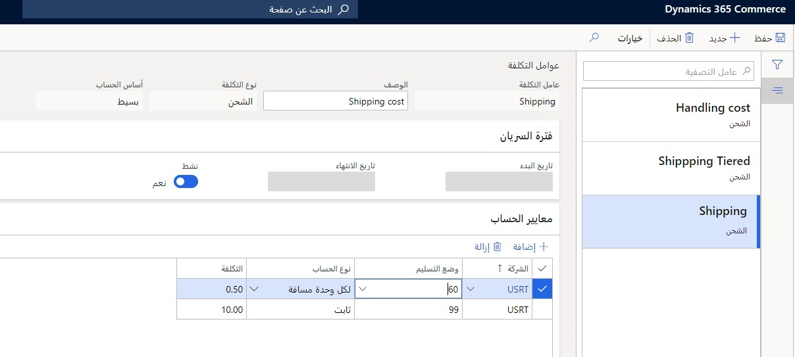
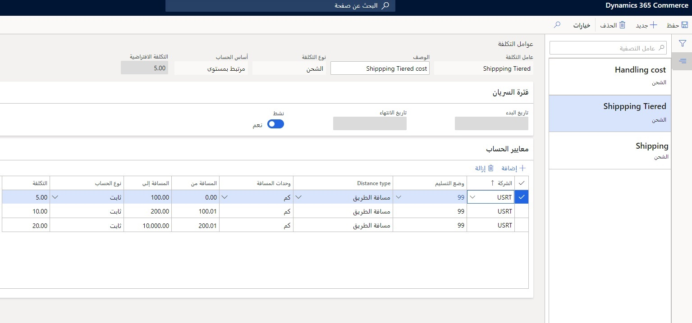
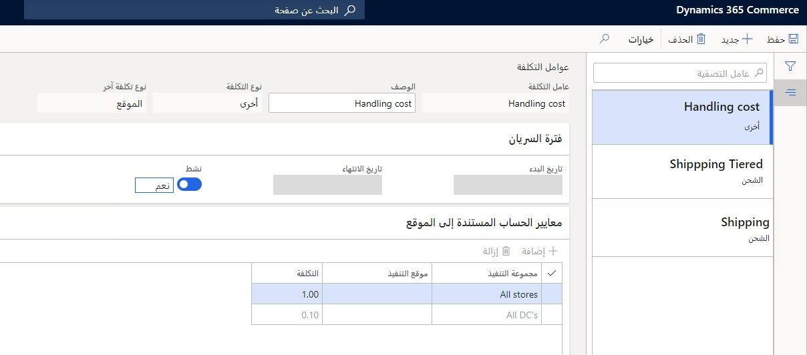

تتيح ميزة ضبط التكلفة لبائعي التجزئة تحديد مكونات تكلفة إضافية وتكوينها والتي سيتم حسابها وأخذها في الاعتبار لتحديد الموقع الأمثل لتلبية بنود الطلب منه.
يحدد DOM الموقع الأمثل لتنفيذ الطلب بطريقتين: تهيئة المسافة أو التكلفة. 

يساعدك ضبط التكلفة على تحديد التكلفة التي يجب أن يأخذها النظام في الاعتبار من حيث تقييم المواقع. هذا الضبط اختياري. إذا لم تحدد ضبط التكلفة، فسوف يأخذ النظام في الاعتبار تعريف المسافة فقط. ستعتبر أقصر مسافة إلى عنوان العميل بمثابة الموقع الأمثل للوفاء بتنفيذ الطلب. 

ولكن، إذا حددت التكاليف في النظام، فلن يأخذ في الاعتبار المسافة كمعيار، ولكن مكونات التكلفة التي كونتها ستوفر أساساً لحساب التكلفة وستكون معياراً للوفاء. 

تدعم التجارة نوعين من أنواع التكلفة لضبط التكلفة:

-   **تكلفة الشحن** - يمكن تحديدها على مستويين، ويمكن تحديد تكلفة ثابتة أو تكلفة لكل مسافة لكلا المستويين:

    -   **عند مستوى بسيط** – يمكنك تحديد تكلفة الشحن حسب أوضاع التسليم. 
    -   **عند مستوى متدرج** - يمكنك تحديد مستويات متعددة لنفس طريقة التسليم. 
    على سبيل المثال، في نموذج بسيط، يمكنك تحديد وضع التسليم على أنه عن طريق البر أو بالشاحنة. بالنسبة إلى وضع التسليم هذا، يمكنك تحديد إما 10.00 دولارات أمريكية كتكلفة أو 0.50 سنتاً لكل كيلومتر / ميل مغطى، بينما في تعريف الفئة لنفس طريقة التسليم، يمكنك تحديد التكلفة بدءاً من 0 إلى 100 كيلومتر / ميل هو 10.00 دولاراً أمريكياً، ومن 101 إلى 200 دولاراً أمريكياً 20.00 دولاراً أمريكياً، وهكذا. 

-   **تكلفة أخرى** – لالتقاط أي تكاليف أخرى لديك في عملية الشحن، مثل تكاليف التعبئة والتغليف وتكاليف المناولة وتكاليف البنية التحتية من حيث المعدات وغير ذلك. يمكن تحديد هذه التكلفة إما على مستوى أمر المبيعات أو على مستوى بند أمر المبيعات، أو يمكن تحديدها في موقع ما، سواء كان موقعاً فردياً أو مجموعة مواقع. 

توضح الإجراءات التالية كيفية إعداد كل مجموعة من أنواع المكونات **تكلفة الشحن** أو **تكلفة أخرى**.

## ضبط تكلفة الشحن - مستوى بسيط ومتدرج
اتبع هذا الإجراء لإنشاء مستوى بسيط ضبط تكلفة على مستوى متدرج.

1.  انتقل إلى **البيع بالتجزئة والتجارة > إدارة الطلبات الموزعة > الإعداد > ضبط التكلفة**.
2.  حدد **جديد**.
3.  في الحقل **عامل التكلفة** أدخل اسماً فريداً لعامل التكلفة.
4.  في الحقل **الوصف** أدخل اسم ووصف عامل التكلفة.
5.  في الحقل **نوع التكلفة**، حدد **شحن**.  
6.  في الحقل **أساس الحساب** حدد ما إذا كان نوع تكلفة الشحن يستخدم **بسيط** أو أساس حساب **متدرج**. إذا تم تحديد **متدرج**، فاتبع الخطوة 7. إذا تم تحديد **بسيط**، فاتبع الخطوة 8.
7.  في الحقل **التكلفة الافتراضية** أدخل التكلفة التي يجب استخدامها لوضع التسليم إذا كانت المسافة بين عنوان التسليم والموقع لا تقع في أي من مسافات متدرجة.
8.  في الحقلين **تاريخ البدء** و **تاريخ الانتهاء** يمكنك تحديد عامل التكلفة لنطاق زمني محدد. إذا تركت هذه الحقول فارغة، فسيكون عامل التكلفة صالحاً لفترة غير محددة.
9.  عيّن الحقل **نشط** على **نعم**. يأخذ DOM بعين الاعتبار عوامل التكلفة النشطة فقط المرتبطة بملف تعريف الاستيفاء.
10. في علامة التبويب السريعة **معايير الحساب** حدد **إضافة**.
11. في الحقل **الشركة** حدد الكيان القانوني الذي تم تكوين عامل التكلفة من أجله. يجب أن تكون كافة بنود معايير الحساب لنفس الكيان القانوني.
12. في الحقل **طريقة التسليم** حدد أوضاع التسليم التي تم تكوين التكلفة لها.

بالنسبة إلى أساس حساب المستوى البسيط، اتبع هذه الخطوات في علامة التبويب السريعة **معايير الحساب**.

1. في الحقل **نوع الحساب** حدد كيفية حساب التكلفة لطريقة معينة للتسليم. 
1. في الحقل **التكلفة** حدد قيمة التكلفة المستخدمة مع حقل **نوع الحساب** الحساب التكلفة لطريقة التسليم.

    

بالنسبة إلى أساس حساب المستوى المتدرج، اتبع هذه الخطوات في علامة التبويب السريعة **معايير الحساب**. 

1.  في الحقل **نوع المسافة** حدد ما إذا كان تعريف المسافة المتدرجة عبارة عن مسافة جوية أو مسافة طريق.
16. في الحقل **وحدات المسافة** حدد الوحدة التي تُقاس بها المسافة المتدرجة.
17. في الحقل **المسافة من** حدد نطاق البدء للمسافة المتدرجة.
18. في الحقل **المسافة إلى** حدد النطاق النهائي للمسافة المتدرجة.
19. في الحقل **نوع الحساب** حدد كيفية حساب التكلفة لطريقة معينة للتسليم والمسافة المتدرجة. 
    - **ثابت** – يتم استخدام تكلفة ثابتة لطريقة التسليم. إذا حددت نوع الحساب هذا، فإن الحقل **التكلفة** يحدد التكلفة الثابتة.
    - **لكل وحدة مسافة** – يتم احتساب تكلفة طريقة التسليم والمسافة المتدرجة كقيمة التكلفة المحددة في **التكلفة** حقل مضروب في المسافة بين عنوان التسليم والمواقع.
20. في الحقل **التكلفة** حدد قيمة التكلفة المستخدمة جنباً إلى جنب مع حقل **نوع الحساب** لحساب تكلفة طريقة التسليم.

    

> [!NOTE] 
> عند تحديد المسافات المتدرجة، يتحقق النظام من عدم وجود مسافات مفقودة أو متداخلة. يجب أن يكون نوع المسافة المستخدم لوضع التسليم هو نفسه عبر جميع المسافات المتدرجة.

 
## تكوين التكلفة الأخرى
اتبع هذا الإجراء لإنشاء تكوين تكلفة يختلف عن تكاليف الشحن.

1.  انتقل إلى **البيع بالتجزئة والتجارة > إدارة الطلبات الموزعة > الإعداد > ضبط التكلفة**.
2.  حدد **جديد**.
3.  في الحقل **عامل التكلفة** أدخل اسماً فريداً لعامل التكلفة.
4.  في الحقل **الوصف** أدخل اسم ووصف عامل التكلفة.
5.  في الحقل **نوع التكلفة** حدد **أخرى**.  
6.  في الحقل **نوع تكلفة أخرى** حدد نوع التكلفة المرتبط به تكوين التكلفة هذا. 
7.  استخدم الحقلين **تاريخ البدء** و **تاريخ الانتهاء** للحد من عامل التكلفة لنطاق زمني محدد. إذا تركت هذه الحقول فارغة، فسيكون عامل التكلفة صالحاً لفترة غير محددة.
8.  في الحقل **نشط** حدد ما إذا كان عامل التكلفة نشطاً أم لا. يأخذ DOM بعين الاعتبار عوامل التكلفة النشطة فقط المرتبطة بملف تعريف الاستيفاء.

إذا حددت **أمر مبيعات** أو **سطر أمر مبيعات** كَ **نوع تكلفة أخرى** في الخطوة السادسة، ثم حدد قيمة التكلفة للتكلفة غير المتعلقة بالشحن على مستوى بند أمر المبيعات في الحقل **التكلفة** لإكمال التهيئة.

إذا حددت **الموقع** في **نوع التكلفة الأخرى** في الخطوة السادسة، فاتبع هذه الخطوات لإكمال التكوين الخاص بك. 

1.  في علامة التبويب السريعة **معايير الحساب القائمة على الموقع** في حقل **مجموعة الاستيفاء** حدد مجموعة المواقع التي ليست لها تكلفة شحن محددة. بدلاً من ذلك، في الحقل **موقع الاستيفاء** حدد الموقع الذي تم تحديد تكلفة غير الشحن له. لا يمكنك تحديد مجموعة استيفاء وموقع تنفيذ على نفس السطر لمعايير الحساب المستندة إلى الموقع.
11. في الحقل **التكلفة** حدد قيمة التكلفة لتكلفة غير الشحن على مستوى مجموعة الاستيفاء أو مستوى موقع الاستيفاء.

    
 

