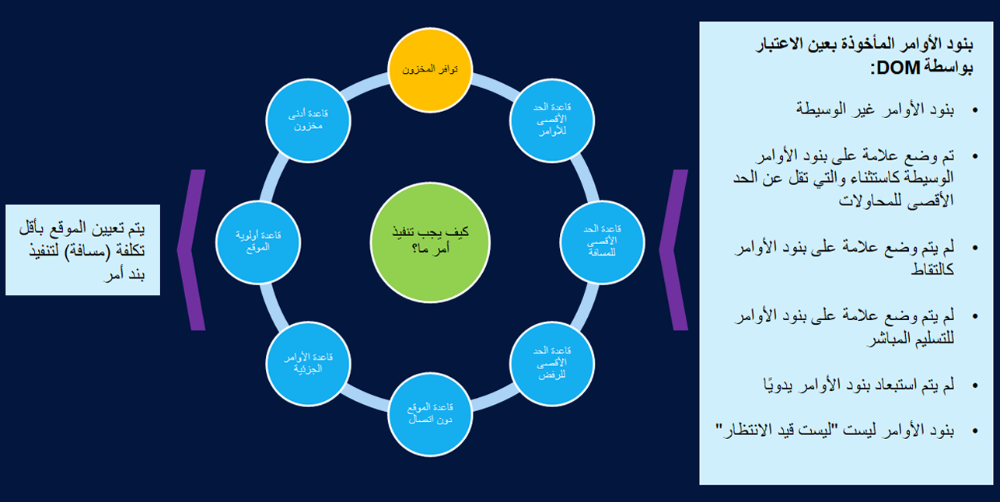

في وقت المعالجة، لا يأخذ DOM في الاعتبار جميع الأوامر وبنود الأوامر في النظام ولكن فقط القليل منها: 

- بنود الأمر التي تلبي معايير أصول المبيعات وأوضاع التسليم والكيان القانوني (كما هو محدد في ملف تعريف استيفاء DOM)، والتي تلبي أيضاً أي واحد من المعايير التالية:
    - يتم إنشاؤها في قنوات Commerce. يتم تحديد الأوامر كأوامر مبيعات عندما يتم تعيين الخيار **بيع Commerce** إلى **نعم** في رأس أمر المبيعات.
    - لم يتم بوساطة DOM.
    - أجرت DOM الوساطة من قبل، ولكن تم وضع علامة عليها كاستثناءات وهي لم تصل إلى الحد الأقصى للمحاولات.
    - لم يتم تمييزها على أنها تستخدم طريقة الاستلام أو التسليم الإلكتروني؛ اختار العميل استلام الأمر الخاص به، لذلك لا احتاج DOM إلى النظر في هذا الأمر للوفاء به.
    - لم يتم تمييزها للتسليم المباشر؛ سيتم تنفيذ هذه الأوامر مباشرة من البائع للعميل.
    - غير مستثناة يدوياً.
- الأوامر التي ليست قيد الانتظار

يقوم نظام DOM، بعد تطبيق القواعد وقيود المخزون والتحسين، بانتقاء الموقع الأقرب إلى عنوان التسليم الخاص بالعميل.
 

إن DOM غير متوافقة تماماً مع وظائف المستودعات المتقدمة، على الرغم من أنها قد تعمل بشكل كافٍ لسيناريوهات أعمال معينة في مثل هذه البيئات. تتوفر وظيفة DOM في إصدار Commerce على السحابة.
