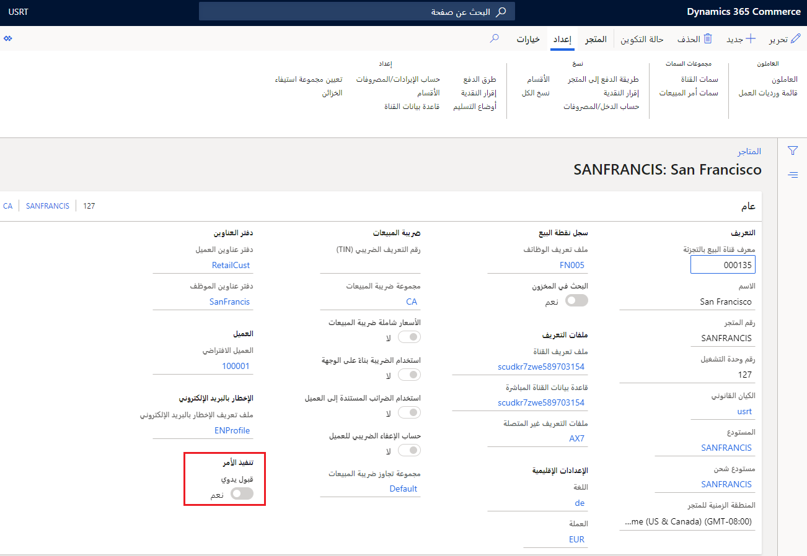
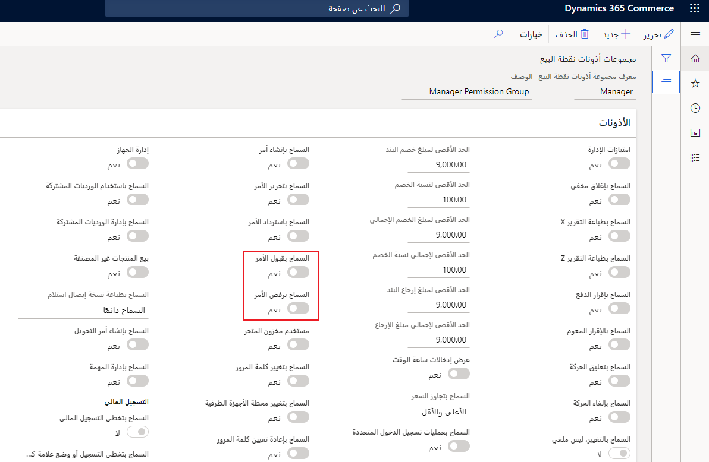

تعتبر كفاءة العمليات وتحسينها أمراً مهماً في جميع المجالات وبالأخص في مؤسسات البيع بالتجزئة سريعة الأطوار. تبحث شركات البيع بالتجزئة عن طرق لتحسين عملياتها وتنفيذ الأوامر. تتمثل إحدى الخطوات السهلة لتنفيذ مثل هذا التحسين في السماح لمتاجر البيع بالتجزئة بتلبية الأوامر. وبهذه القدرة، يمكنهم حل التحديات الإضافية مثل سيناريوهات المخزون الزائد لمتجر معين. بالإضافة إلى ذلك، يمكن لشركات البيع بالتجزئة الاستفادة من القدرة الإنتاجية الإضافية التي قد يمتلكها المتجر أو مسافة الشحن الأقرب لعنوان العميل لتحسين كفاءة التكلفة في تنفيذ الأوامر. 

ولتلبية هذه الحاجة، يسمح Commerce بعملية تنفيذ أوامر موحدة في Store Commerce، والتي توفر منطقة عمل واحدة لمعالجة الأوامر. باستخدام عملية **تنفيذ الأوامر** في تطبيق Store Commerce، يمكن للمستخدمين قبول تنفيذ الأوامر أو رفضها كما يمكنهم وضع علامة على بنود الأوامر على أنها منتقاة أو معبأة. بالإضافة إلى ذلك، يمكن للمستخدمين إكمال شحنات الأوامر التي يتم شحنها من المتجر أو بدء عمليات الاستلام للأوامر التي يتم استلامها من قِبل العميل في المتجر. 

قد تستخدم المؤسسة بشكل اختياري إطار عمل الإخطارات المتاح في Store Commerce لعرض إخطارات تنفيذ الأوامر. يمكن أن تضمن هذه الإخطارات أن الموظفين على دراية بالأوامر التي يحتاجون إلى تنفيذها. يمكنك أيضاً تكوين زر **تنفيذ الأوامر** في تخطيط شاشة Store Commerce لديك لإظهار العديد من الأوامر التي في انتظار التنفيذ. يمكن أيضاً تكوين الزر **تنفيذ الأوامر** للتصفية حسب طريقة التنفيذ (الشحن أو الاستلام)، مما سيسمح للمؤسسة بإظهار عرض منفصل للأوامر التي تحتاج إلى يتم تسليمها في المتجر مقابل تلك التي سيتم شحنها من المتجر، إذا رغبت في ذلك.

ستعرض عملية **تنفيذ الأوامر** في Store Commerce فقط الأوامر التي سيتم استلامها أو شحنها من متجر المستخدم. 

## قبول أمر يدوياً في المتجر

لتحديد ما إذا كان من الممكن قبول الأوامر يدوياً أو رفضها في المتجر، يتوفر إعداد تكوين يطلق عليه **القبول اليدوي** على مستوى كل متجر. لتعيين مربع الاختيار هذا، اتبع المسار **Retail وCommerce > القنوات > المتاجر > جميع المتاجر** وحدد المتجر حيث تريد تكوين هذا الإعداد، كما هو موضح في الصورة التالية.

 
إذا لم يتم تعيين خيار **القبول اليدوي**، فسوف تكون حالة تنفيذ جميع بنود الأوامر **مقبول** بشكل افتراضي ولا يمكن لشركاء المتجر رفض الأمر، سوف يتعين عليهم تنفيذ الأمر. 

في حالة تعيين **القبول اليدوي**، يجب أن يقوم المستخدمون في المتجر بتعيين إذن Store Commerce **السماح بقبول الأمر** إلى **نعم** حتى يتمكنوا من قبول الأوامر يدوياً قبل تعيين المتجر كموقع لتنفيذ الأمر. لتعيين خانة الاختيار **السماح بقبول الأمر** اتبع المسار **Retail وCommerce > الموظفين > ‏‫مجموعات الأذونات‬** وحدد مجموعة الأذونات حيث تريد تكوين هذا الإعداد، كما هو موضح في الصورة التالية.

 
تنتقل حالة تنفيذ الأمر من **معلق** إلى **مقبول** عندما يقوم المستخدم بقبول تنفيذ الأمر من شاشات **تنفيذ الأوامر** في Store Commerce. 

في حالة وجود أمر لاستلام العميل (على سبيل المثال، تم طلبه عبر الإنترنت، وسيتم استلامه من المتجر)، فلن تكون حالة تنفيذ هذا الأمر **معلق**. تهدف هذه العملية إلى المساعدة في تجنب المشكلات التي قد تحدث إذا لم يكن لدى شريك المبيعات الأذونات اللازمة لقبول الأمر ويأتي العميل لاستلام البضائع الخاصة به.

بعد قبول الأمر، يمكن للمستخدمين بعد ذلك استلام أو تعبئة أو شحن أو تنفيذ استلام الأمر من Store Commerce. يمكن أيضاً تحديد بند الأمر المقبول واستلامه أو شحنه على الفور في Store Commerce دون الحاجة إلى خطوات الاستلام والتعبئة. 

## رفض أمر يدوياً في المتجر

يمنحك تكوين المتجر **القبول اليدوي** خياراً لرفض تنفيذ الأوامر في حالة عدم وجود مخزون أو قدرة إنتاجية كافية في المتجر لتنفيذها. يتم منح المستخدمين هذا الخيار عن طريق تعيين إذن **السماح برفض الأمر** إلى **نعم** على أذونات Store Commerce الخاصة بالمستخدم. لتعيين خانة الاختيار هذه، اتبع المسار **Retail وCommerce > الموظفين > ‏‫مجموعات الأذونات** وحدد مجموعة الأذونات حيث تريد تكوين هذا الإعداد، كما هو موضح في الصورة الموجودة أعلاه.

عند رفض أحد البنود، قد يرغب تجار التجزئة في مطالبة عمالهم بتقديم سبب للرفض. يمكن تحقيق هذا المطلب باستخدام أكواد المعلومات الخاصة بنوع **نشاط كود المعلومات** أو **تنفيذ الأوامر** وتعيين كود المعلومات من أجل **رفض بند الأمر** في ملف تعريف الوظائف المرتبط بالقناة. قد يتم رفض البنود فقط إذا لم يتم انتقاؤها أو تعبئتها. إذا تم انتقاء البنود أو تعبئتها، فيجب أولاً إلغاء انتقائها أو تفريغها في المركز الرئيسي لـ Commerce قبل أن يتم رفضها. ويمكن مراجعة البنود المرفوضة في مساحة عمل المركز الرئيسي المسماة **‬‏‫الاستعلام عن أوامر المبيعات ومعالجتها**. 

عندما يتم رفض أمر في المتجر، إذا تمت تهيئة معالجة DOM، فإن إجراء الرفض هذا يرسل إشارة إلى المركز الرئيسي بأنه لن يتم تنفيذه في هذا المتجر وتتم معالجة الأمر تلقائياً مرة أخرى لإعادة تعيينه إلى متجر أو مستودع آخر. 

يمكن أيضاً إعادة تعيين بنود الأوامر المرفوضة يدوياً في المركز الرئيسي لـ Commerce من صفحة **أمر المبيعات** عن طريق تغيير المستودع في بند أمر المبيعات وتحديد ‎القائمة المنسدلة **تحديث البند** ثم تحديد **إعادة تعيين حالة التنفيذ**. بعد هذه الخطوة، سيتمكن موظفو المتجر المعنيين من الموقع المعين حديثاً من رؤية الأمر المراد تنفيذه من خلال متجرهم.  

## انتقاء أمر
بعد قبول الأمر، يمكن تحديد البنود ووضع علامة عليها بحالة التنفيذ **الانتقاء**. هذا النهج هو طريقة لإظهار أن عملية الانتقاء يتم تشغيلها بالفعل لهذا البند، وهي مفيدة في تجنب المواقف التي سيحاول فيها العديد من شركاء المبيعات اختيار نفس البنود في نفس الوقت.

لمساعدة العمال، يمكنك طباعة قوائم الانتقاء اختيارياً من Store Commerce. يمكن تحديد تخطيط قوائم الانتقاء هذه في **مصمم تخطيط الإيصالات** لـ Store Commerce. سيؤدي تحديد البنود وطباعة قائمة الانتقاء إلى تحديث هذه البنود تلقائياً إلى حالة التنفيذ "انتقاء". 

بعد إجراء الانتقاء، يمكن للمستخدم تحديث البنود إلى حالة التنفيذ **منتقى** من خلال تحديد **وضع علامة كمنتقى** من القائمة **انتقاء تنفيذ الأوامر**. يؤدي وضع علامة على بند أمر كمنتقي إلى إرسال رد اتصال في الوقت الحقيقي إلى المركز الرئيسي للسماح بوضع علامة على حركة المخزون على أنها منتقاة لحجز هذا المخزون. يمكن أن تنعكس مستويات المخزون المتوفرة المحدّثة لمستودع المتجر على الفور في المركز الرئيسي عندما يتم وضع علامة على البند على أنه منتقى. عند انتقاء البنود، يمكن للمستخدمين اختيار البنود جزئياً إذا لزم الأمر. إذا تم وضع علامة على الكمية بشكل غير صحيح على أنها **منتقاة**، لا يمكن إجراء عملية إلغاء الانتقاء إلا في Commerce Headquarters وليس في Store Commerce. 

## تعبئة أمر

يمكن تعبئة بنود الأمر في أي وقت بعد قبول بند الأمر. يمكن فقط تجميع البنود في نفس الأمر وبنفس طريقة التسليم معاً في نفس الوقت. سيؤدي إجراء تعبئة بنود الأمر إلى تحديث حالة تنفيذ البند إلى **معبأ** (أو معبأ جزئياً إذا لم يتم تمييز الكمية كلها على أنها معبأة). ويمكن أيضاً أن يؤدي وضع علامة على البنود على أنها معبأة إلى طباعة إيصال تعبئة. بالإضافة إلى ذلك، يؤدي وضع علامة على البنود كمعبأة إلى بدء رد الاتصال في الوقت الفعلي إلى المركز الرئيسي لـ Commerce للسماح بوضع علامة على حركة المخزون كمعبأة بحيث يمكن إجراء خصم من المخزون. هذا الانخفاض في مستويات المخزون الخاصة بمستودع المخزن سينعكس على الفور في المركز الرئيسي. كما هو الحال مع الانتقاء، إذا كانت البنود معبأة بشكل غير صحيح، فلا يمكن تصحيح دفتر يومية إيصال التعبئة إلا في Commerce Headquarters وليس في Store Commerce. 

## شحن أمر

بعد الموافقة على تعيين تنفيذ الأمر، إذا تم تكوين الأمر للشحن من المتجر (بدلاً من الاستلام)، فيمكن أيضاً شحن بنود الأمر هذه على الفور ويمكن أيضاً تخطي خطوات الانتقاء والتعبئة بشكل اختياري. عند تحديد بنود للشحن من صفحة **تنفيذ الأوامر**، لا يمكن إلا تحديد البنود من نفس الأمر فقط للشحن في نفس الوقت، حتى إن كان لها أوضاع تسليم مختلفة. 

عندما يتم شحن البنود من خلال تنفيذ الأوامر، لن يتمكن المستخدم من تغيير أو تحديث المدفوعات في هذه الأوامر؛ لذلك، من المهم أن تكون هذه الأوامر مدفوعة مسبقاً أو مفوضة مسبقاً بدفع ما يكفي لتغطية إجمالي الأمر عند إنشاء الأمر. سيتم تحرير فواتير الأوامر التي تم وضع علامة عليها للشحن من Store Commerce في HQ مباشرةً، وستتم تسوية أي مدفوعات مسبقة تم تسجيلها في الفاتورة. إذا دفع العميل بواسطة بطاقة مدينة، فسيتم تسجيل البطاقة أو رموز التفويض المميزة التي تم الحصول عليها مسبقاً وتسويتها في الفاتورة كجزء من عملية الفاتورة هذه التي تتم في المركز الرئيسي لـ Commerce. 

