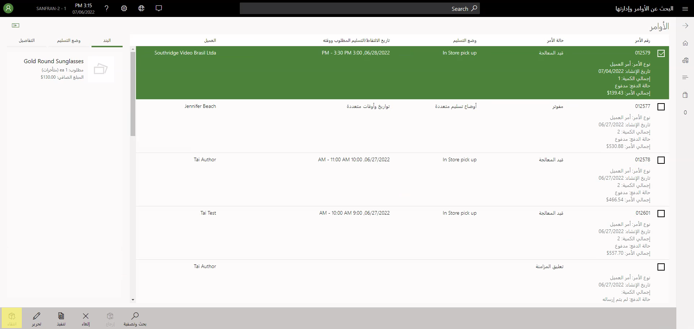
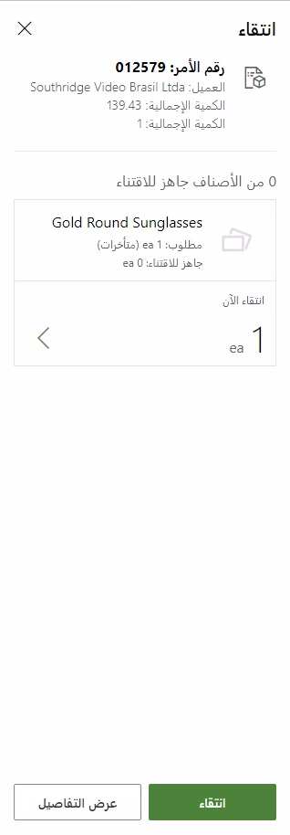
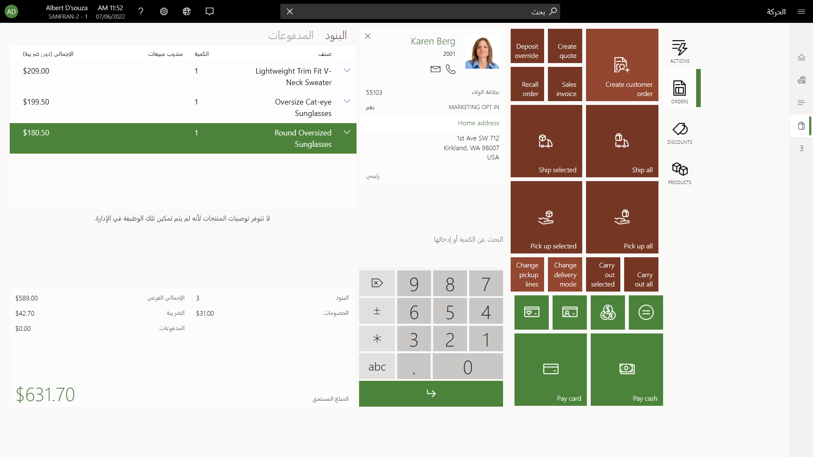
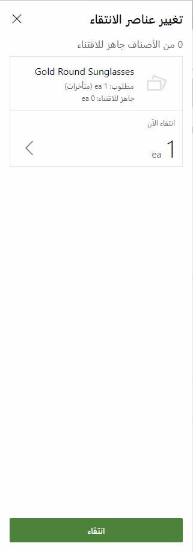

عندما يتم إنشاء أمر العميل للاستلام من المتجر، يمكن لموظف المتجر استخدام تطبيق نقطة البيع (POS) لبدء استلام المخزون. سيتم التعامل مع التقاط الدفع النهائي بواسطة نقطة البيع حسب الحاجة. كما ستنتهي أيضاً من الجرد والترحيل المالي للكميات المحددة.

إذا كنت من مستخدمي المتجر، فيمكنك إجراء الاستلام باستخدام إما عملية **استدعاء** الأمر أو عملية **تنفيذ الأمر** في نقطة البيع. لإتاحة عملية **الاستلام**، يجب عليك أولاً اتباع إحدى الخطوات التالية:

- لاستخدام عملية **استدعاء الأمر**، قم بالبحث عن الأمر الذي سيتم استلامه وقم بتحديده.
- لاستخدام عملية **تنفيذ الأمر**، قم بالبحث عن بند أمر واحد أو أكثر وقم بتحديده.

لن تكون عملية **الاستلام** متاحة إذا لم يتم تكوين بنود الأمر أو الأمر المحدد للاستلام في هذا المتجر المحدد، أو إذا تم استلام الأمر بالكامل بالفعل.

يمكن تشغيل ميزة **تجربة مستخدم محسّنة لاستلام معالجة الأمر في نقطة البيع** من خلال **إدارة الميزات** في المركز الرئيسي لـ Commerce. 

ويتعذر على المستخدمين تحديد كميات الاستلام إذا تم تعطيل هذه الميزة. بشكل افتراضي، الكمية الكاملة التي تم طلبها للبند هي الكمية التي سيتم استلامها. قد تمثل هذه التجربة مشكلة، لأن المستخدمين قد ينسون تحديد بعض الأصناف للاستلام عند قيامهم بعملية الاستلام من خلال تنفيذ الأمر.

تمنح ميزة **تحسين تجربة المستخدم لمعالجة طلبات الاستلام في نقطة البيع** مزيداً من التحكم في المنتجات التي سيتم استلامها وكمية هذه المنتجات. في صفحة **تنفيذ الأمر**، لا يتعين على المستخدمين تحديد كل بند من أمر المبيعات قبل تحديد **استلام**. سيتم عرض جميع الأصناف المتاحة للاستلام. حتى إذا تم اختيار خط إنتاج واحد فقط، يمكن للمستخدمين تحديد بنود متعددة للاستلام.

عند تشغيل ميزة **تحسين تجربة المستخدم لاستلام معالجة الطلب في نقطة البيع**، وتحديد **استلام**، يظهر مربع الحوار **استلام**. هناك، يمكنك تحديد الأصناف والكميات التي سيتم استلامها. بشكل افتراضي، يتم اعتبار أي كمية مطلوبة تحتوي على مخزون في حالة منتقى أو معبأ مؤهلة للاستلام. بشكل افتراضي، يتم تعيين هذه الكمية على أنها كمية الاستلام. يمكنك تغيير الكمية التي تم إدخالها، في حالة عدم كون تلك الكمية 0 (صفر) وعدم تجاوزها إجمالي الكمية المفتوحة (أي التي لم يتم تحرير فواتير بها) للبند المحدد.

تظهر صفحة الحركة بعد تحديد الكميات المراد استلامها ثم تحديد **استلام**. تطبيق الدفع إذا تم تمكين ميزة مدفوعات القناة متعددة الاتجاهات وكان هناك مدفوعات بواسطة بطاقة مدينة مصرح بها مسبقاً في الملف.

يقوم النظام بحساب المبالغ المستحقة على صفحة الحركة عن طريق حساب إجمالي المستحق لبنود الاستلام المحددة، ثم طرح أي ودائع تم تطبيقها مسبقاً أو مدفوعات بطاقة مدينة مصرح بها. لإكمال حركة الاستلام، يجب عليك إتمام الدفع. يمكنك إتمام الحركة دون تحديد طريقة دفع إذا كان تخطيط الشاشة لصفحة الحركة يتضمن عملية **إنهاء الحركة** ولا يوجد مبلغ مستحق. في حالة عدم توفر عملية إنهاء الحركة، يمكنك إنهاء الحركة عن طريق تحديد رابط **المبلغ المستحق 0.00 دولار** في جزء **الإجماليات** دون الحاجة إلى اختيار طريقة الدفع.

## تغيير بنود الاستلام أو كميات الاستلام
يمكنك تحديد **تعيين الكمية** إذا كنت بحاجة إلى تغيير كمية الاستلام بعد تحديد الأصناف المراد استلامها. لا يمكنك تعيين كمية الاستلام على 0 (صفر) أو إلى قيمة تتجاوز الكمية المتبقية التي لم تتم فوترتها للبند المطلوب. حدد حركة "لاغية" لإزالة بند استلام من سلة الحركة. سيتم إنهاء الحركة الحالية، وسيتم استئناف سير عملية الاستلام. 

في حالة تشغيل ميزة **تحسين تجربة المستخدم لاستلام معالجة الطلب في نقطة البيع**، يمكن للمؤسسات إضافة زر **تغيير بنود الاستلام** على تخطيط الشاشة لصفحة الحركة.

بعد إنشاء سلة حركة الاستلام في نقطة البيع وتحديد الأصناف، يمكنك تحديد **تغيير بنود الحركة** إذا كان يتعين عليك تغيير أصناف الاستلام ولكنك لا تريد إلغاء الحركة بالكامل. في مربع الحوار **تغيير بنود الاستلام** الذي يظهر، يمكنك تغيير الأصناف المراد استلامها وكمياتها. يتم بعد ذلك تحديث سلة الحركات لتعكس التغييرات التي قمت بإجرائها.

