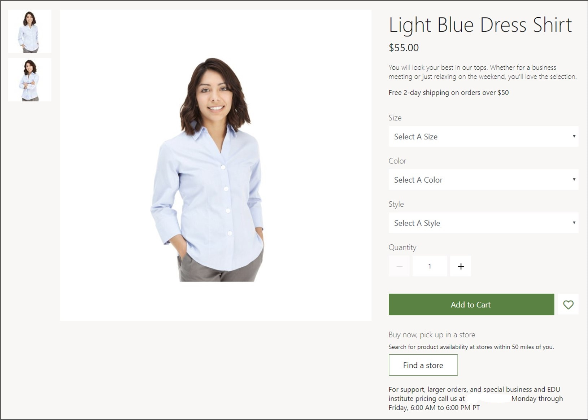
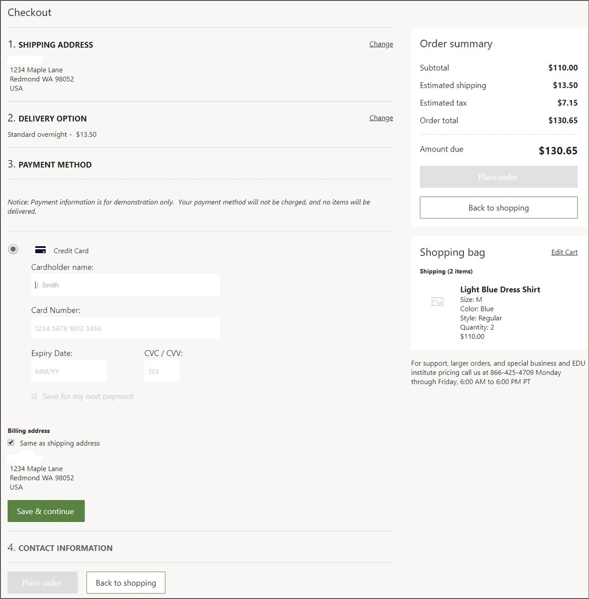
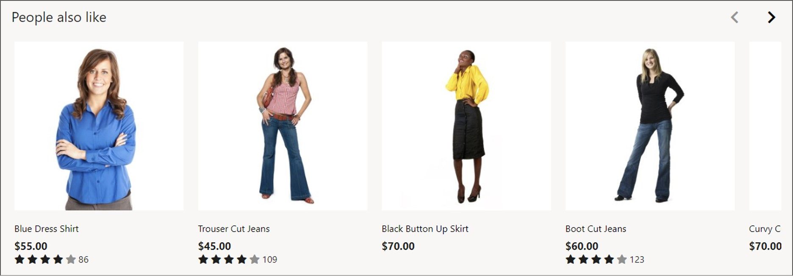

مكتبة الوحدات هي مجموعة من وحدات البناء المنطقية، أو الوحدات النمطية، التي يمكنك استخدامها عند إنشاء موقع التجارة الإلكترونية الخاص بك مع وظائف غنية جاهزة للاستخدام. تحتوي الوحدات المستخدمة في "مكتبة الوحدات" على جوانب واجهة المستخدم وجوانب السلوك الوظيفي، وتشكل هياكل الصفحة الخاصة بالموقع، مما يعني أن الوحدة تحدد مظهرها ووظائفها. 

على سبيل المثال، تتيح وحدة **عربة التسوق** للعملاء عرض وتعديل ما هو موجود في عربة التسوق الخاصة بهم، وبالتالي تحديد وظائف هذه الوحدة وكذلك التوزيع الأساسي لعناصر واجهة المستخدم، مثل وضع الصورة المصغرة **للمنتج** على اليمين في نظرة عامة على سلة التسوق، مع إظهار قائمة المنتجات على النحو التالي واحدة تلو الأخرى، وغير ذلك.

بجانب الوحدات توجد سمات يمكنك تطبيقها على الوحدات في مكتبة الوحدات لتغيير مظهر وسلوك الوحدات أو الموقع بأكمله. تستخدم السمات أوراق الأنماط المتتالية (CSS). يتم توفير سمة لموقع التجارة الإلكترونية الوهمي *Fabrikam* كجزء من مكتبة الوحدات ويمكن استخدامها كمرجع.

تشمل أنواع الوحدات التي تعد جزءاً من مكتبة الوحدات ما يلي:

- **الحاوية** - وحدة بسيطة تعمل كمضيف للوحدات الأخرى وتتحكم في تخطيط الوحدات الموجودة بداخلها.
- **التسويق** - يشمل كتلة المحتوى وكتلة النص ومشغل الفيديو ووحدات المكتبة. يمكن استخدام هذه الوحدات لعرض المحتوى، وهي مدفوعة ببيانات من نظام إدارة المحتوى (CMS) ويمكن وضعها على أي صفحة من صفحات الموقع.
- **رأس الصفحة وتذييلها** - يظهران في رأس وتذييل كل صفحات الموقع ويمكن تهيئتهما من خلال خصائص الموقع.
- **البحث** - يُستخدم لاكتشاف المنتجات. يمكن أيضاً اكتشاف المنتجات في صفحات الفئات، وهي صفحات مخصصة لكل فئة مدعومة في التدرج الهرمي للتنقل في القناة. بالإضافة إلى ذلك، يمكن استخدام وحدات المدقق لإجراء مزيد من التصفية على نتائج البحث وصفحات الفئات.
- **صفحة تفاصيل المنتج** - تستخدم عدة وحدات لعرض معلومات المنتج، مثل الاسم والسعر والوصف والأبعاد. 

     
    
- **مربع الشراء** - يتيح للعملاء عرض المنتجات وإضافتها إلى سلة التسوق. 
- **المواصفات الفنية** - إظهار تفاصيل المنتج. 
- **التقييمات والمراجعات** - يمكن استخدامها لعرض المراجعات وتقديمها، ومن خلال هذه الميزة، زيادة فرص البيع وإبلاغ العميل.
- **الشراء عبر الإنترنت والاستلام من المتجر** - يتكامل مع خرائط Bing ويمكن استخدامه للعثور على المتاجر القريبة حيث يمكن للعملاء استلام المنتجات التي اشتروها عبر الإنترنت.
- **شراء** - على سبيل المثال، وحدة **عربة التسوق** التي يمكن استخدامها لإضافة أصناف إلى عربة التسوق.
- **السداد مع الخروج** - يوضح عنوان الشحن وخيارات التسليم وبطاقة الهدايا وبرنامج الولاء والمعلومات الخاصة بالبطاقة المدينة بحيث يمكن معالجه الأمر. 

    
    
- **تأكيد الأمر** - بعد تقديم الأمر، يمكن استخدام وحدة **تأكيد الأمر** لإظهار تفاصيل التأكيد.
- **إدارة الحساب** - تتيح وحدة **تسجيل الدخول** للعملاء تسجيل الدخول إلى حساب موجود، وتتيح لهم وحدة **التسجيل** إنشاء حساب جديد. 
- **محفوظات الأوامر** - بعد إنشاء حساب، يمكن استخدام وحدة **محفوظات الأوامر** لعرض الأوامر الأخيرة، ويمكن استخدام وحدة **تفاصيل الأمر** لعرض تفاصيل الأمر.
- **التوصيات** - يتم عرض التوصيات باستخدام وحدة **وضع المنتج**. تدعم هذه الوحدة القوائم الحسابية والتحريرية التي يمكن عرضها في أي صفحة.

     

## وحدات commerce الجاهزة للاستخدام للتجارة الإلكترونية
يمكن للعملاء إنشاء موقع للتجارة الإلكترونية باستخدام مكتبة الوحدات في Dynamics 365 Commerce التي تتضمن مجموعة شاملة من الوحدات التي لا تتطلب أي تخصيص إضافي. 

تشمل الوحدات المتوفرة، على سبيل المثال لا الحصر:
- عنصر التحكم في علامة التبويب لتنظيم المعلومات في طريقة عرض مبوبة.
- تحكم الأكورديون لتنظيم المعلومات في أدراج قابلة للطي.
- مسار التنقل لتوفير تنقل ثانوي في الموقع.
- عربة تسوق صغيرة لإظهار ملخص عربة التسوق على رأس الصفحة.
- تحسينات على محدد مواقع المتاجر للعثور على جميع المتاجر والمتجر المفضل والمزيد.
- التكامل مع خرائط Bing لتقديم اقتراحات العناوين في وحدة محدد المتجر.
- التكامل مع خرائط Bing لتوفير عنصر تحكم في الخريطة يمكن استخدامه لعرض موقع المتاجر القريبة.
- تحسينات معرض الوسائط للسماح بملء الشاشة وإمكانيات التكبير وما إلى ذلك.
- منتقي السوق والإعدادات المحلية للسماح للمستخدم باختيار سوق أو مكان يرغب في التسوق فيه.
- تحسينات تدفق السداد وتسجيل الخروج لدعم أنواع مختلفة من تكاليف الشحن والتكاليف غير المتعلقة بالشحن.
- تحسينات قائمة التنقل للسماح بمستويات متعددة ودعم الصور.

لمعرفة المزيد من المعلومات، راجع [نظرة عامة على مكتبة الوحدات](/dynamics365/commerce/starter-kit-overview?azure-portal=true#additional-resources).

