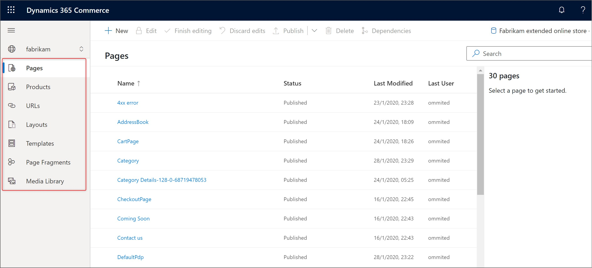
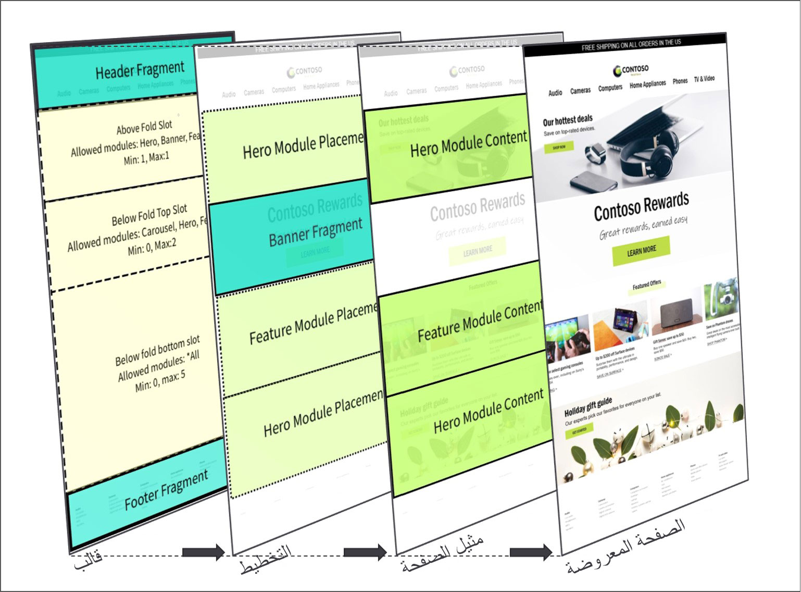
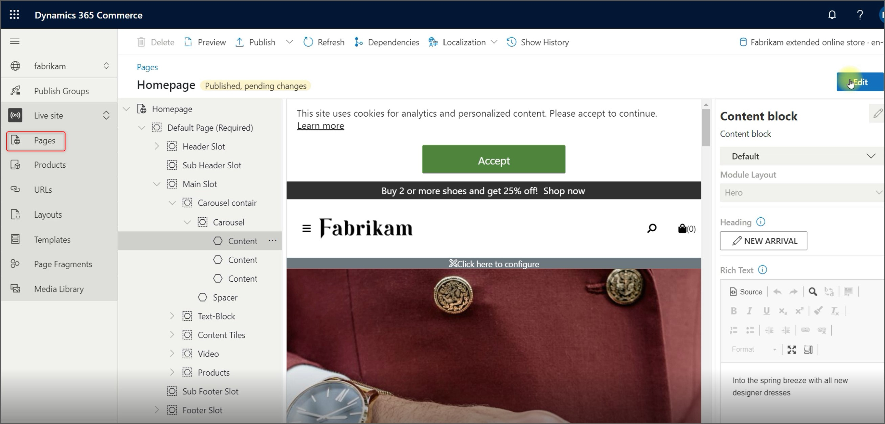
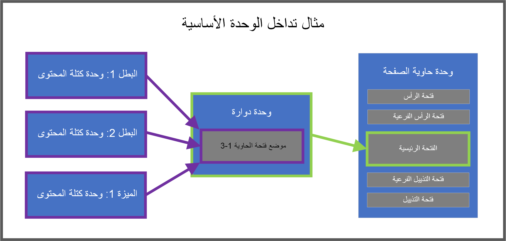

يجمع e-Commerce site builder بين الأدوات اللازمة لإنشاء موقع التجارة الإلكترونية. إنه المكان الذي يمكنك فيه إنشاء المحتوى وتحريره لإنشاء موقع. هذا المحتوى منظم في نموذج صفحة بمكونات مختلفة. 

يوضح الشكل التالي مثالاً لصفحة منشئ الموقع.

 
شاهد الفيديو التالي للحصول على نظرة عامة عالية المستوى على أداة إنشاء الموقع.

 > [!VIDEO https://www.microsoft.com/videoplayer/embed/RE4AJHz]

تتوفر العديد من الإعدادات لتحكم فيها في أداة إنشاء الموقع. تتيح لك هذه الإعدادات التحكم في اكتشاف المتجر المستند إلى الموقع ومخططات الموقع وخلاصة المنتج وموظفي إدارة الموقع والمزيد.

شاهد الفيديو التالي لمعرفة المزيد حول الإعدادات المتوفرة في منشئ الموقع.

 > [!VIDEO https://www.microsoft.com/videoplayer/embed/RE4AP3o]

يعرض منشئ الموقع قائمة بأنواع المستندات التي يمكنك إنشاؤها، بما في ذلك الصفحات والتخطيطات والقوالب وأجزاء الصفحات. 

شاهد الفيديو التالي للتعرف على حالات المستندات المختلفة ودورات حياتها.

> [!VIDEO https://www.microsoft.com/videoplayer/embed/RE4Aztz]

## واجهة تأليف محتوى WYSIWYG منشئ الموقع
WYSIWYG‏ (what-you-see-is-what-you-get) تسمح الواجهة للمسوقين بتحرير المحتوى في واجهة رسومية سلسة. يمكن للمسوقين إجراء تغييرات على المحتوى والإعدادات وعرضها في لوحة الإصدار الأولي في الوقت الفعلي. 

تجعل وظيفة WYSIWYG عملية تحرير المحتوى سهلة التعلم وأكثر فاعلية عن طريق جعل عناصر التحكم في التحرير قابلة للاكتشاف مباشرة في تجربة الإصدار الأولي الرسومية.

## نموذج صفحة التجارة الإلكترونية

تُظهر الصورة التالية نموذج صفحة التجارة الإلكترونية، والذي يتكون من قوالب وتخطيطات ومثيلات الصفحة، والتي عند دمجها، تنشئ صفحة الويب المعروضة.

 

الوحدات في نموذج صفحة التجارة الإلكترونية هي أصغر الكتل المنطقية التي تنظم هياكل الصفحة ولها أغراض مختلفة. 

### المحتوى

يمكن أن تحتوي الوحدات النمطية على محتوى، عندما يتعلق الأمر بوحدات البطل أو كتل المحتوى، مثل النصوص والصور ومقاطع الفيديو والأزرار والمزيد. 

### حاوية

يمكن أن تحتوي الوحدات أيضاً على وظيفة تنظيم الوحدات النمطية الفرعية الأخرى وعرضها، دون حمل أي محتوى، بمعنى أنها تعمل كحاوية عالية المستوى لهذه الوحدات الفرعية. تتيح لك وحدات الحاوية النمطية هذه إنشاء تدرجات هرمية للوحدات النمطية المتداخلة وتتضمن فتحات تُستخدم لإدارة تخطيط الوحدات النمطية الفرعية في الحاوية. على سبيل المثال، قد تحتوي وحدة حاوية الصفحة الأساسية على فتحة الرأس وفتحة النص الأساسي وفتحة التذييل.

تُظهر الصورة التالية مثالاً لهيكل الصفحة الرئيسية للموقع والمحتويات المتنوعة أو وحدات الحاوية التي تشكلها.

 
### فتحات

يمكن أن تحتوي الوحدات النمطية على فتحات محددة يتم تنظيمها بواسطة المطورين بحيث يمكنك إنشاء محتوى هناك، مما يعني أنه يمكن إضافة المزيد من الوحدات النمطية في الوحدات النمطية، بدلاً من هذه الفتحات. توضح الصورة التالية هذا المفهوم وتعرض مثالاً على كتل المحتوى التي يمكن إضافتها بدلاً من الفتحات في وحدة الرف الدائري. 

## الاختبار العلمي في التجارة
استخدم الاختبار العلمي في التجارة للتحقق من صحة الفرضيات حول فعالية صفحات التجارة الإلكترونية الخاصة بك واتخاذ القرارات بثقة تعتمد على البيانات. تدعم التجارة اختبار A / B على الصفحات والوحدات والأجزاء وتمكنك من قياس تأثير التغييرات المقترحة على موقع الويب الخاص بك.

يمكنك إنشاء معالجات الصفحة والمحتوى وتحريرها وإدارتها المعروفة باسم الاختلافات في منشئ موقع التجارة. تتكامل التجارة مع خدمات الجهات الخارجية التي يمكنك استخدامها لإنشاء تجارب ومهمات معالجة. تمكّن تدفقات الأحداث في الوقت الفعلي التي تم التقاطها في Commerce التحليلات التي تحدد نتائج التجربة في خدمة الجهة الخارجية. يمكنك بعد ذلك الاستفادة من هذه التحليلات للمساعدة في دعم فرضيتك أو دحضها.

لإعداد المتطلبات الأساسية، اتبع الخطوات التالية:

1.  **احصل على الإصدار الصحيح من التجارة** - قم بترقية مكتبة الوحدة الخاصة بك ومجموعة مواد تطوير برامج توسيع القنوات عبر الإنترنت (SDK)، وCommerce Scale Unit إلى الإصدار التجاري 10.0.13 أو في وقت لاحق.
2.  **قم بإعداد موصل تجريبي** - يسمح موصل التجارب لـ Commerce بالاتصال بخدمات الجهات الخارجية لاسترداد قائمة التجارب وتحديد وقت عرض التجربة للمستخدم. يمكنك شراء موصل طرف ثالث من [AppSource](https://appsource.microsoft.com/?azure-portal=true). اتبع تعليمات الإعداد التي قدمها الناشر. يمكنك بدلاً من ذلك استخدام نموذج موصل الاختبار من Commerce لاختبار سير عمل التجربة دون الحاجة إلى تكوين خدمة خارجية. 

    لمزيد من المعلومات، راجع [تكوين وتمكين الموصلات](/dynamics365/commerce/e-commerce-extensibility/connectors/?azure-portal=true).
3.  **قم بتشغيل خيارات ميزة التجريب في التجارة** - مكنك تمكين التجريب على مستوى المستأجر بالانتقال إلى **إعدادات المستأجر > الميزات** أو على مستوى الموقع في **إعدادات الموقع> الميزات**.
    - مكّن الخيار **التجربة** لإنشاء أشكال تجربة للوحدات داخل الصفحة دون التأثير على محتوى آخر ليس جزءاً من التجربة أو نسخه. يضمن ذلك أن تظل تحديثات المحتوى الجارية خارج التجربة متزامنة أثناء دورة حياة التجربة. يؤدي تعطيل هذه العلامة إلى إيقاف عرض جميع التجارب للمستخدمين وإزالة جميع وظائف التحرير في أداة إنشاء الموقع.
    - مكّن الخيار **التجربة على الصفحات أو الأجزاء** إجراء التجارب على صفحة أو جزء. يؤدي هذا إلى إنشاء نسخة مثيلة كاملة من الصفحة بأكملها أو جزء لكل الوحدات داخل الصفحة أو الجزء. استخدم هذا الوضع عندما تريد اختبار تغييرات المحتوى الشاملة، أو عندما لا تكون مزامنة تغييرات المحتوى الجارية عبر المثيلات مصدر قلق. يؤدي تعطيل هذا الخيار إلى منع إنشاء وتحرير تجارب جديدة على الصفحات والأجزاء.

    > [!NOTE]
    > **التجربة** يجب أيضاً تمكين خيار **التجربة على الصفحات أو الأجزاء** حتى تعمل وظيفة.

لمعرفة المزيد حول دورة حياة التجربة، راجع [التجريب في Dynamics 365 Commerce](/dynamics365/commerce/experimentation-overview/?azure-portal=true).
