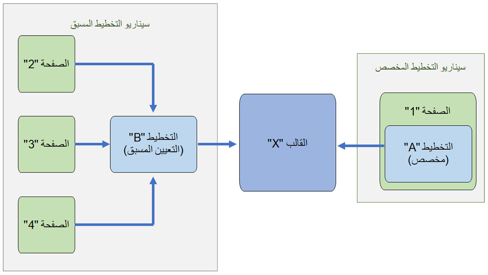

بينما يتم وصف القوالب بشكل أفضل من خلال الخيارات، فإن أفضل وصف للتخطيطات هو الاختيار الصريح. **التخطيطات** تتضمن الميزة ترتيب الوحدات النمطية والأجزاء وتحديد الفتحة التي تضع فيها الوحدة النمطية والنموذج الذي تختاره في التخطيط. **التخطيطات** تساعدك الميزة في تحديد طريقة العرض المحددة التي يتم توفيرها بواسطة القالب. باستخدام هذه الميزة، يمكنك تبديل التخطيطات على الصفحات بتخطيطات أخرى من نفس القوالب الأصلية. 

يمكن أن تكون التخطيطات من الأنواع التالية:

-   **الإعداد المسبق (ثابت)** - يمكن الرجوع إليها من خلال العديد من حالات الصفحة. في علاقة رأس بأطراف (1: n)، يمكن أن يكون لديك تخطيط من صفحة واحدة يتحكم في مئات الصفحات. يسمح بسير عمل إنشاء الصفحة حيث يتم تحديد وترتيب جميع الوحدات بالفعل ويكون إدخال البيانات فقط مطلوباً.
-   **مخصص** – التخطيطات ذات الاستخدام الفردي المضمنة في صفحة واحدة. لا يتم عرضها كخيار عند إنشاء صفحات جديدة أخرى أو في سيناريوهات تبديل التخطيط. يمكنك تحرير الصفحة بأي طريقة تريدها، إذا كان القالب يسمح بذلك. يمكن أيضاً حفظ التخطيط المخصص الذي تقوم بإنشائه كتخطيط مُعد مسبقاً. تحوله هذه الخطوة إلى مستند في نظام إدارة المحتوى (CMS) ويمكن بعد ذلك الرجوع إلى هذا التخطيط الجديد المُعد مسبقاً بواسطة العديد من الصفحات الأخرى. 

تُظهر الصورة التالية سيناريوهات للتخطيطات المعدة مسبقاً والمخصصة.

 

شاهد الفيديو التالي للحصول على عرض توضيحي لكيفية استخدام التخطيطات في أداة إنشاء الموقع.

 > [!VIDEO https://www.microsoft.com/videoplayer/embed/RE4AMfw]

مثل القوالب، يمكن للتخطيطات تعيين الإعدادات الافتراضية للوحدة النمطية أو تأمين المحتوى، ولا تحتوي على محتوى مترجم. 

الغرض من **التخطيطات** الميزة هي السماح لمديري العلامات التجارية بتحديث ترتيب جميع الصفحات النهائية بكفاءة عن طريق تحديث تخطيط مشترك واحد، دون إعادة كتابة كل المحتوى. يمكن لمؤلفي الصفحة أيضاً مشاركة ترتيب وحدة من صفحة معينة لاستخدامها بواسطة صفحات أخرى وتبديل التخطيطات للصفحات دون إعادة كتابة المحتوى. على سبيل المثال، يمكنك التبديل من قالب افتراضي إلى قالب عطلة ثم العودة إلى النموذج الافتراضي. 
