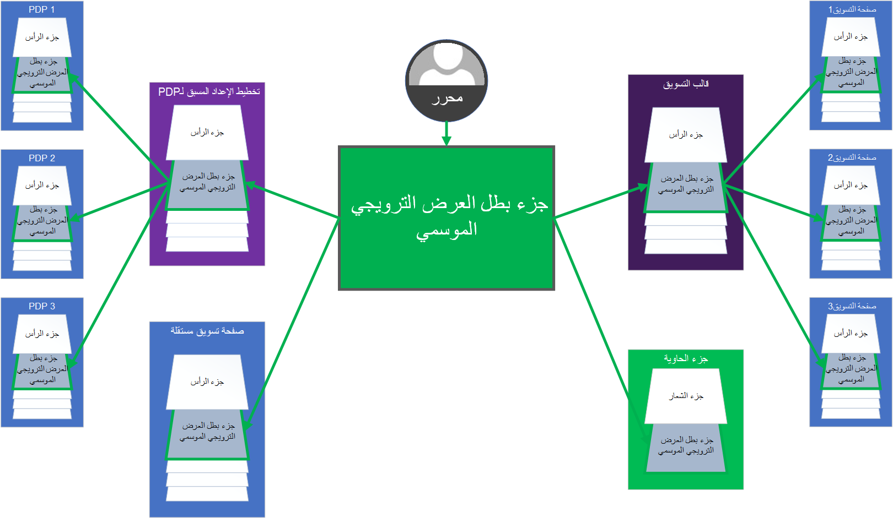

الغرض من عنصر الأجزاء هو التخلص من إنشاء المحتوى الزائد عن طريق تركيز تكوينات الوحدة النمطية التي يُعاد استخدامها عبر موقعك. إنها تسمح بتحديثات فعالة للمحتوى لأن تحرير جزء واحد يمكن أن يؤدي على الفور إلى تحديث آلاف الصفحات التي تشير إليه.

الأجزاء المكونة للوحدات النمطية بالكامل. 

يمكن تحويل أي نوع من الوحدات النمطية إلى جزء. يمكن إنشاء الأجزاء وتحديثها والإشارة إليها وحذفها بشكل مستقل. لديهم دورة حياة كاملة عبر نظام إدارة المحتوى، ويمكن مشاركتهم عبر العديد من الصفحات. الأمثلة النموذجية للأجزاء هي أجزاء الرأس والتذييل. 

يمكنك وضع جزء في قالب أو في تخطيط الصفحة. في أي مكان يمكنك وضع وحدة فيه، يمكنك استبداله بجزء، ويمكن أن يحتوي هذا الجزء على المحتوى المترجم.

 
شاهد الفيديو التالي للحصول على عرض توضيحي لكيفية إنشاء جزء.

> [!VIDEO https://www.microsoft.com/videoplayer/embed/RE4AP3k]
