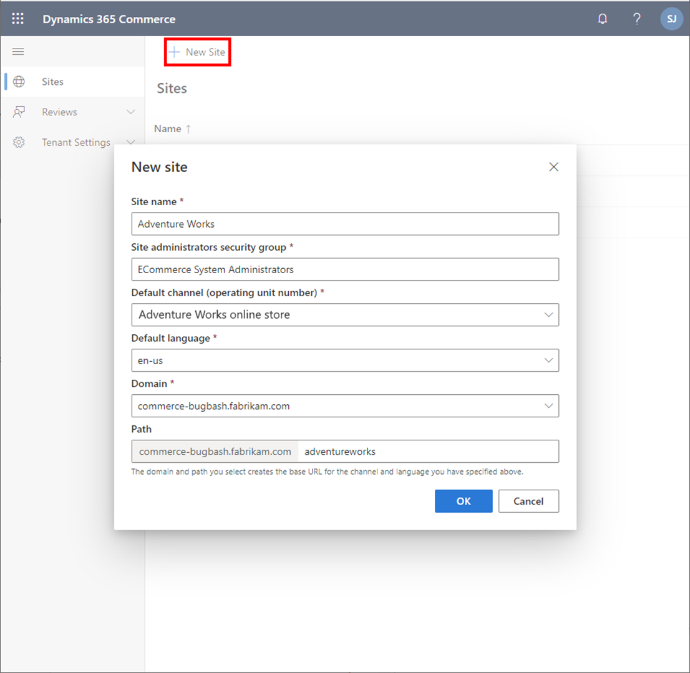

للبدء في تطوير موقع التجارة الإلكترونية الخاص بك، يجب عليك أولاً إنشاء موقع جديد في أداة منشئ المواقع. قبل أن تتمكن من إنشاء موقع جديد، يجب إنشاء متجر واحد على الأقل على الإنترنت في المركز الرئيسي (HQ) لـ Commerce. 

عند إنشاء موقع جديد للتجارة الإلكترونية، ستلاحظ عدم تضمين صفحات البداية والقوالب والصور وغيرها. تعد صفحات البداية هذه جزءاً من مكتبة الوحدات النمطية ويتم تضمينها فقط في تجربة التشغيل الأولى لموقع Fabrikam. 

شاهد مقطع الفيديو التالي للحصول على عرض توضيحي حول كيفية إنشاء موقع جديد في أداة منشئ المواقع.

 > [!VIDEO https://www.microsoft.com/videoplayer/embed/RE4AP3m]

لإنشاء موقع جديد في أداة منشئ المواقع، اتبع هذا الإجراء:

1. افتح أداة منشئ المواقع باتباع الارتباط الموجود في Lifecycle Services، في صفحة ميزات البيئة الخاصة بالتجارة الإلكترونية.
2. في الصفحة الرئيسية لبيئة تأليف الموقع، حدد **موقع جديد**. 
3. قم بتعبئة بعض معلومات الموقع.

    
    
4. أدخل اسماً مألوفاً لموقعك في الحقل **اسم الموقع**.
5. في الحقل **مجموعة أمان مسؤول الموقع**، حدد حساب Microsoft Azure Active Directory (Azure AD) الذي سيكون لديه حق وصول المسؤول لهذه المجموعة.
6. حدد **القناة الافتراضية**، التي تعد القناة عبر الإنترنت من المركز الرئيسي والتي تريد ربط موقعك بها. 
7. قم بتعيين **اللغة الافتراضية**.
8. حدد **المجال**. تتوفر المجالات عند توفير مكون التجارة الإلكترونية في Lifecycle Services.
9. في حقل **المسار**، أضف مساراً للموقع الخاص بالمجال المحدد.
10. حدد **موافق**.

