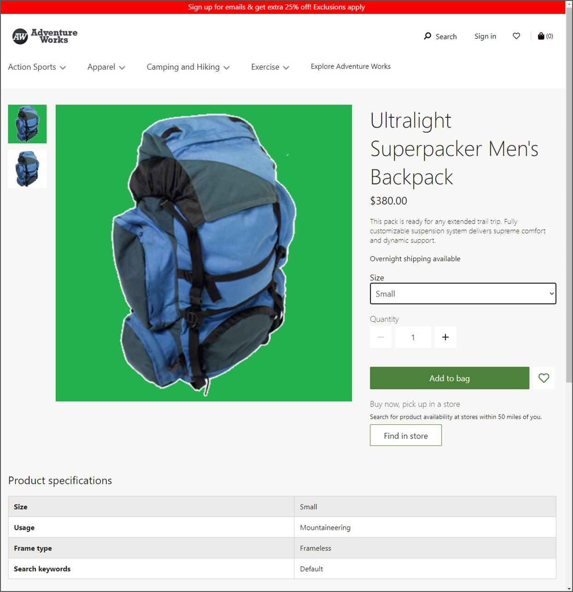
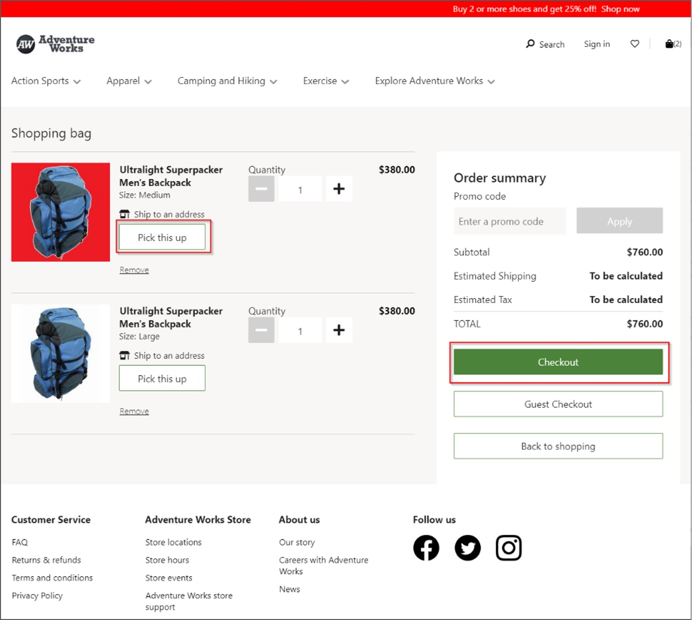
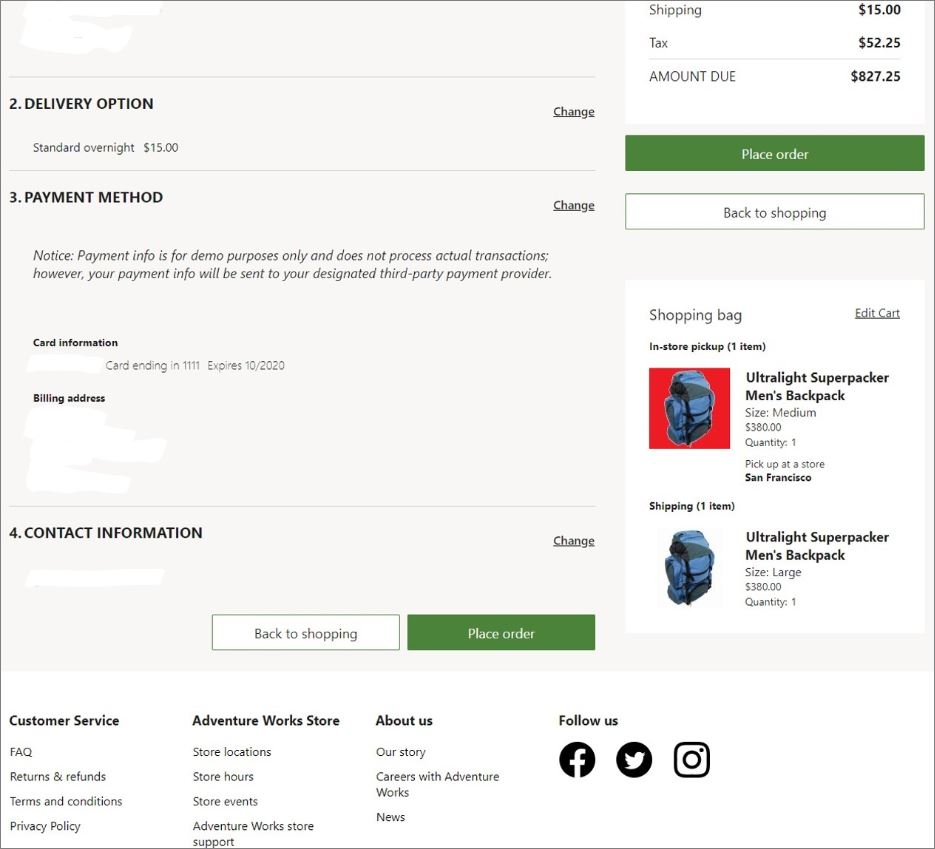
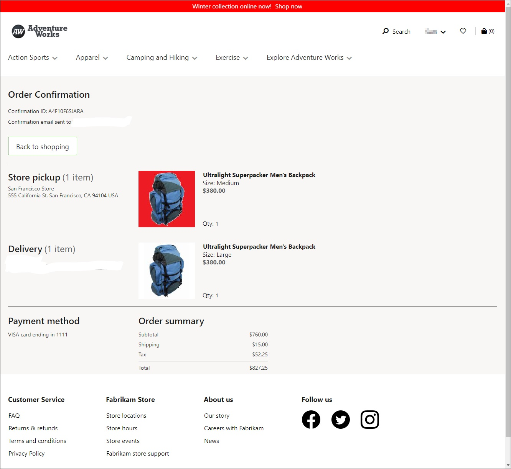
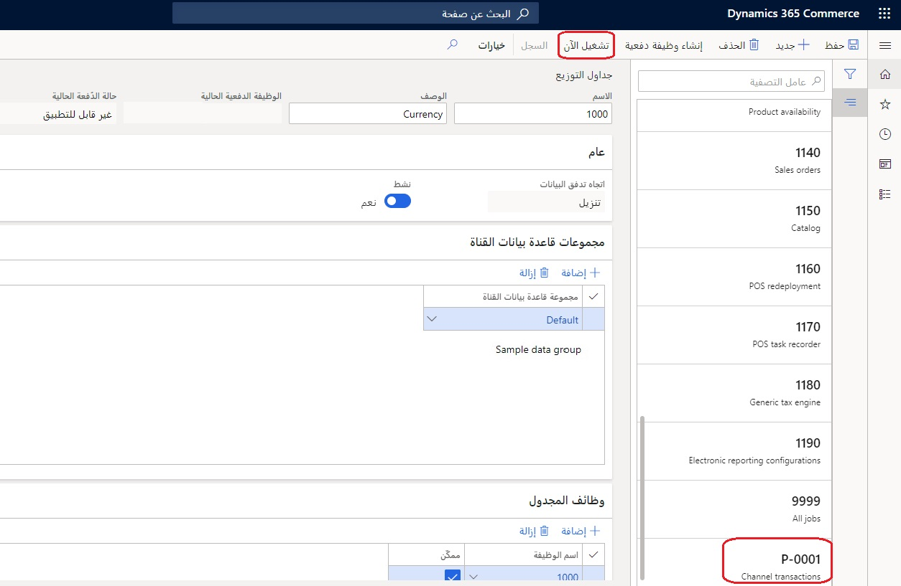
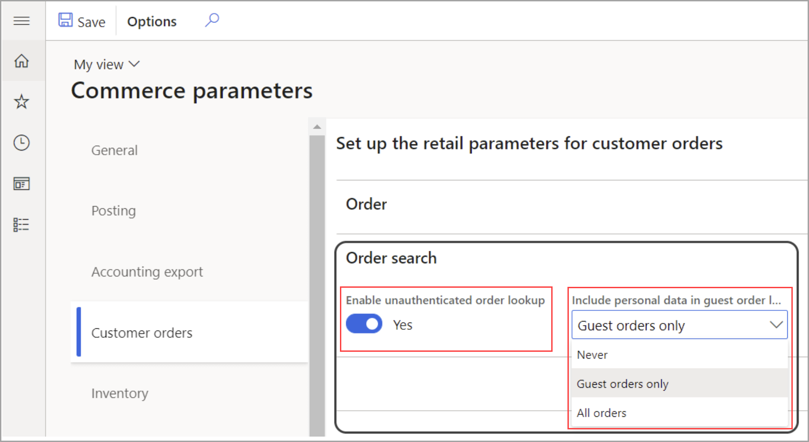

لإنشاء أوامر العميل الخاصة بالتجارة الإلكترونية (عملية الانتقاء والشحن)، اتبع الإجراء التالي:

1. انتقل إلى موقع التجارة الإلكترونية باتباع الارتباط في Microsoft Dynamics365 Lifecycle Services، في علامة التبويب **التجارة الإلكترونية**.
2. انتقل إلى صفحة المنتج، وحدد متغير المنتج، ثم حدد الزر **إضافة إلى الحقيبة**. 
3. انتقل إلى صفحة منتج مختلف، وحدد متغير المنتج، ثم حدد الزر **إضافة إلى الحقيبة**.

    
    
4. حدد أحد المنتجات للاختيار. في مربع الحوار **تحديد متجر**، أدخل المتجر الذي يمكن انتقاء البضائع فيه، ثم حدد زر **البحث**. في قائمة النتائج، ابحث عن المتجر الذي تريده للاختيار، ثم حدد **اختيار هنا**.

    > [!NOTE]
    > تعتمد المتاجر التي يمكنك تحديدها لانتقاء الأمر في نقطة البيع على تكوين **تعيين مجموعة التنفيذ** على المتجر على الإنترنت المرتبط بموقع التجارة الإلكترونية. 
 
يمكن شحن الصنف الآخر إلى أحد العناوين.

5. حدد **السداد**.

    
    
6. قم بتسجيل الدخول إلى حساب العميل أو حدد **تسجيل** لإنشاء حساب عميل جديد، إذا لم يكن لديك حساب بالفعل. 

    > [!NOTE]
    > يمكن إنشاء الأوامر ومعالجتها للاختيار والشحن كضيف وكعميل مسجل للدخول، سواء كعميل موجود، أو عند قيامك بإنشاء حساب عميل جديد اثناء إنشاء أمر الشراء.
    
     
    
7. سيؤدي التسجيل إلى إرسال رمز تحقق إلى عنوان البريد الكتروني الذي قمت بتقديمه. قم بتسجيل الدخول إلى حسابك الجديد على الموقع باستخدام رمز التحقق هذا. 
8. أثناء وجود الأمر الخاص بك قيد التقدم، قم بملء الجزء **عنوان الشحن**، ثم حدد **حفظ ومتابعة**.
9. حدد نمط التسليم، ثم حدد **حفظ ومتابعة**.

    
    
10. املأ طريقة الدفع. 

    > [!NOTE]
    > بالنسبة لأغراض الاختبار، يمكنك استخدام أي اسم واستخدام رقم بطاقة الائتمان 4111 1111 1111 1111بتاريخ انتهاء صلاحية 10/20 CVC 737.
    > لا تستخدم أبداً معلومات بطاقة الائتمان الفعلية في موقع الاختبار.
    
11. قم بتقديم عنوان بريد الكتروني في الحقل **معلومات جهة الاتصال** ثم حدد **وضع الأمر**. ستتلقى رسالة تأكيد بالبريد الكتروني بعد وضع الأمر.

    
    
سيعرض هذا الموقع صفحة **تأكيد الأمر**.

  
 
هناك اعتبار آخر يجب مراعاته على موقع التجارة الإلكترونية عند تقديم أمر، وهو الوظيفة الاختيارية لدعم إعادة طلب الأصناف التي تم شراؤها في السابق. بإمكان Commerce أن يدعم عملية إعادة الطلب لتحسين استبقاء العميل في الوحدة النمطية **تفاصيل الأمر**. يمكن تمكين الوظيفة **الشراء مرة أخرى** لإضافة الأصناف تلقائياً إلى عربة المشتري بدلاً من نقلها إلى صفحة **تفاصيل المنتج**. بإمكان العميل إضافة أصناف فردية أو أصناف متعددة طلبها في السابق، إلى أمر موجود.  

لعرض الحركة في Commerce Headquarters ‏(HQ)، قم بتشغيل المهمة **P 0001** و **مزامنة الأوامر** لسحب الأوامر من وحدات Commerce scale unit.

1. في المقر التجاري HQ، انتقل إلى **البيع بالتجزئة والتجارة >تكنولوجيا المعلومات(IT) بالتجزئة والتجارة > جدولة التوزيع**.
2. حدد المهمة **P-0001**، ثم حدد **تشغيل الآن**.

 
 
3. في Commerce HQ، انتقل إلى **البيع بالتجزئة والتجارة >تكنولوجيا المعلومات (IT) بالتجزئة والتجارة > مزامنة الأوامر**.
4. حدد القناة التي تعمل بها على الإنترنت وقم بإضافتها إلى **عُقد المؤسسة المحددة**.
5. حدد **موافق**.
6. ابحث عن **حركات المتجر على الإنترنت** للبحث عن الأمر في **قائمة الحركات**. يجب أن تكون قادراً على مطابقه التاريخ والوقت ورسوم الأمر بالنسبة للأمر الذي قمت بإنشائه على الموقع.

> [!NOTE]
> يتم تنفيذ تشغيل المهمة **P-0001** و **مزامنة الأوامر** عن طريق مهام الدفعات في سيناريوهات الحياة الحقيقية. تم تضمين هذه الخطوات في هذا التدريب بغرض استيعاب العملية.

## سداد مع الخروج كضيف‬

هناك مزايا متعددة تأتي مع الخيار **سداد مع الخروج كضيف** في موقع تجارة إلكترونية. هناك اعتبار إضافي يجب مراعاته عند السماح بالسداد مع الخروج كضيف وهي القدرة على تمكين البحث عن الأوامر لهؤلاء الضيوف. من شأن تمكين البحث عن الأوامر لعملية السداد مع الخروج كضيف أن يؤدي إلى ما يتجاوز زيادة معدلات التحويل، إذ يمكنه أيضاً إنشاء فرص جديدة للتواصل مع الضيف وتوليد التفاعل والاستبقاء المحتمل. 

يعتبر الضيف الذي لم يسجل دخوله مستخدماً غير مصدّق عليه، ويجب تمكين واجهة برمجة تطبيقات (API) جديدة في Commerce Scale Unit تسمح بالبحث عن الأمر باستخدام عنوان البريد الإلكتروني للضيف ومعرف تأكيد الأمر. ولأن البيانات الشخصية مثل عنوان الشحن والأرقام الأربعة الأخيرة من بطاقة الائتمان تظهر على الأمر في أغلب الأحيان، فإن معلمات Commerce تسمح بخيار عرض هذه المعلومات أو إخفائها عند البحث عن أمر ما. 

يمكن تحديث معلمة Commerce في **البيع بالتجزئة والتجارة > إعداد المركز الرئيسي > المعلمات > معلمات Commerce**، وتعرض لقطة الشاشة التي تظهر أدناه التغييرات التي يمكن إدخالها للمستخدمين غير المصدّق عليهم (الضيوف)، وما إذا كان يجب تضمين البيانات الشخصية أم لا. 
 

عند تكوين البحث عن أوامر الضيف، بإمكان الضيف البحث عن الأمر إما بالانتقال إلى عنوان URL المقدم في البريد الإلكتروني للحركة الخاص بأمره أو باستخدام صفحة تم إعدادها للبحث عن الأوامر في موقع التجارة الإلكترونية على الويب. 

شاهد الفيديو التالي للتعرف على كيفيه إنشاء أمر عميل خاص بالتجارة الإلكترونية من خلال عملية السداد مع الخروج كضيف. 

 > [!VIDEO https://www.microsoft.com/videoplayer/embed/RE4AJHT] 

