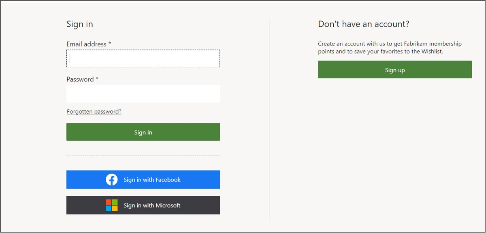
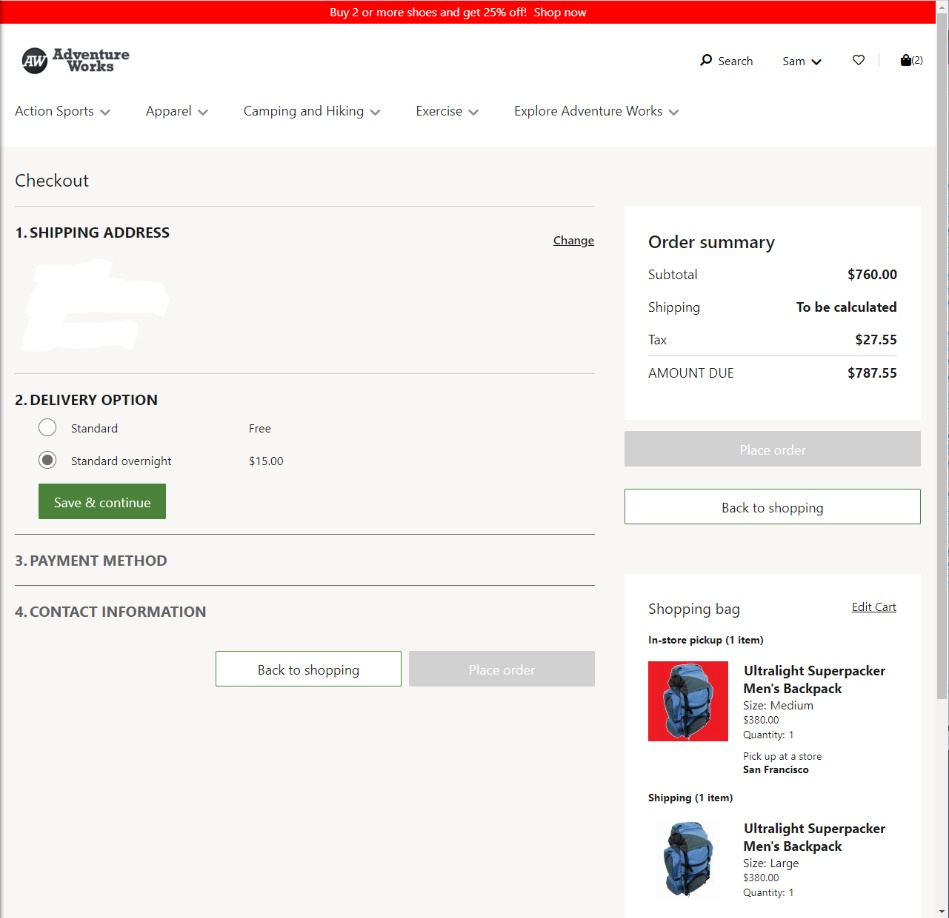

لإنشاء أوامر العميل الخاصة بالتجارة الإلكترونية (عملية الانتقاء والشحن)، اتبع الإجراء التالي:To create an e-Commerce customer order (pick-up and ship), follow this procedure:

1. انتقل إلى موقع التجارة الإلكترونية باتباع الارتباط في Microsoft Dynamics365 Lifecycle Services، في علامة التبويب **التجارة الإلكترونية**.Go to the e-Commerce site by following the link in Microsoft Dynamics 365 Lifecycle Services, in the **e-Commerce** tab.
2. انتقل إلى صفحة المنتج، وحدد متغير المنتج، ثم حدد الزر **إضافة إلى الحقيبة**.Go to a product page, select a product variant, and then select the **Add to bag** button. 
3. انتقل إلى صفحة منتج مختلف، وحدد متغير المنتج، ثم حدد الزر **إضافة إلى الحقيبة**.Go to a different product page, select a product variant, and then select the **Add to bag** button.

    
    
4. حدد أحد المنتجات للاختيار.Select one of the products for pickup. في مربع الحوار **تحديد متجر**، أدخل المتجر الذي يمكن انتقاء البضائع فيه، ثم حدد زر **البحث**.In the **Select a store** dialog box, enter the store where the goods can be picked up and then select the **Search** button. في قائمة النتائج، ابحث عن المتجر الذي تريده للاختيار، ثم حدد **اختيار هنا**.In the list of results, find the store that you want for the pickup and then select **Pick up here**.

    > [!NOTE]
    > تعتمد المتاجر التي يمكنك تحديدها لانتقاء الأمر في نقطة البيع على تكوين **تعيين مجموعة التنفيذ** على المتجر على الإنترنت المرتبط بموقع التجارة الإلكترونية.The stores that you will be able to select for picking up the order at POS depend on the **Fulfillment group assignment** configuration on the online store that is related to the e-Commerce site. 
 
يمكن شحن الصنف الآخر إلى أحد العناوين.The other item can be shipped to an address.

5. حدد **السداد**.Select **Checkout**.

    
    
6. قم بتسجيل الدخول إلى حساب العميل أو حدد **تسجيل** لإنشاء حساب عميل جديد، إذا لم يكن لديك حساب بالفعل.Sign in to your customer account or select **Sign up** to create a new customer account, if you don’t already have one. 

    > [!NOTE]
    > يمكن إنشاء الأوامر ومعالجتها للاختيار والشحن كضيف وكعميل مسجل للدخول، سواء كعميل موجود، أو عند قيامك بإنشاء حساب عميل جديد اثناء إنشاء أمر الشراء.You can create and process orders for pick-up and for shipping as a Guest and as a signed-in customer, either as an existing customer or when you are creating a new customer account during the creation of the order.
    
     
    
7. سيؤدي التسجيل إلى إرسال رمز تحقق إلى عنوان البريد الكتروني الذي قمت بتقديمه.Signing up will send a verification code to the email address that you provide. قم بتسجيل الدخول إلى حسابك الجديد على الموقع باستخدام رمز التحقق هذا.Sign in to your new account on the site by using this verification code. 
8. أثناء وجود الأمر الخاص بك قيد التقدم، قم بملء الجزء **عنوان الشحن**، ثم حدد **حفظ ومتابعة**.On your order in process, fill out the **Shipping Address** section and then select **Save & continue**.
9. حدد نمط التسليم، ثم حدد **حفظ ومتابعة**.Select a delivery mode and then select **Save & continue**.

    
    
10. املأ طريقة الدفع.Fill out the payment method. 

    > [!NOTE]
    > بالنسبة لأغراض الاختبار، يمكنك استخدام أي اسم واستخدام رقم بطاقة الائتمان 4111 1111 1111 1111بتاريخ انتهاء صلاحية 10/20 CVC 737.For testing purposes, you can use any name and use credit card number 4111 1111 1111 1111 expiry 10/20 CVC 737.
    > لا تستخدم أبداً معلومات بطاقة الائتمان الفعلية في موقع الاختبار.Never use actual credit card information on the test site.
    
11. قم بتقديم عنوان بريد الكتروني في الحقل **معلومات جهة الاتصال** ثم حدد **وضع الأمر**.Provide an email address in the **Contact information** field and then select **Place order**. ستتلقى رسالة تأكيد بالبريد الكتروني بعد وضع الأمر.You will receive a confirmation email after placing the order.

    
    
سيعرض هذا الموقع صفحة **تأكيد الأمر**.The site will show an **Order Confirmation** page.

  

لعرض الحركة في المقر التجاري (‏HQ)، قم بتشغيل المهمة **P 0001** و **مزامنة الأوامر** لسحب الأوامر من Commerce scale units.To view the transaction in Commerce Headquarters (HQ), run the **P-0001** job and **Synchronize Orders** to pull in the orders from the Commerce scale units.

1. في المقر التجاري HQ، انتقل إلى **البيع بالتجزئة والتجارة >تكنولوجيا المعلومات(IT) بالتجزئة والتجارة > جدولة التوزيع**.In Commerce HQ, go to **Retail and Commerce > Retail and Commerce IT > Distribution schedule**.
2. حدد المهمة **P-0001**، ثم حدد **تشغيل الآن**.Select the **P-0001** job and then select **Run now**.

 
 
3. في Commerce HQ، انتقل إلى **البيع بالتجزئة والتجارة >تكنولوجيا المعلومات (IT) بالتجزئة والتجارة > مزامنة الأوامر**.In Commerce HQ, go to **Retail and Commerce > Retail and Commerce IT > Synchronize Orders**.
4. حدد القناة التي تعمل بها على الإنترنت وقم بإضافتها إلى **عُقد المؤسسة المحددة**.Select the online channel that you are working with and add it to the **SELECTED ORGANIZATION NODES**.
5. حدد **موافق**.Select **OK**.
6. ابحث عن **حركات المتجر على الإنترنت** للبحث عن الأمر في **قائمة الحركات**.Search for **Online store transactions** to find the order in the **Transaction list**. يجب أن تكون قادراً على مطابقه التاريخ والوقت ورسوم الأمر بالنسبة للأمر الذي قمت بإنشائه على الموقع.You should be able to match the date, time, and order charge to the order that you created on the site.

> [!NOTE]
> يتم تنفيذ تشغيل المهمة **P-0001** و **مزامنة الأوامر** عن طريق مهام الدفعات في سيناريوهات الحياة الحقيقية.Running the **P-0001** job and **Synchronize orders** is performed by batch jobs in real-life scenarios. يتم تضمين هذه الخطوات في هذا التدريب بغرض استيعاب العملية.These steps are included in this exercise for the purpose of understanding the process.

شاهد الفيديو التالي للتعرف على كيفيه إنشاء طلب عميل خاص بالتجارة الإلكترونية من خلال عملية السداد للضيف.Watch the following video to learn how to create an e-Commerce customer order with a guest checkout. 

 > [!VIDEO https://www.microsoft.com/videoplayer/embed/RE4AJHT] 

