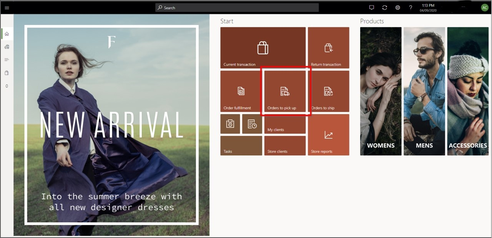
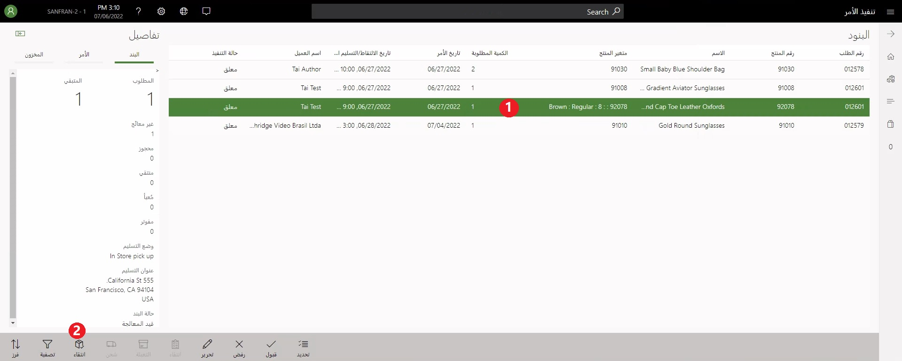
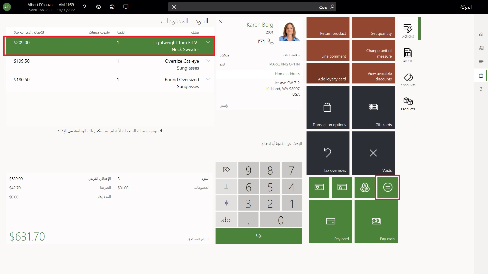

يجب تطبيق بعض المتطلبات الأساسية لتتمكن من الشراء عبر الإنترنت والاستلام في المتجر (BOPIS):Some prerequisites must be in place for you to buy online and pick up in store (BOPIS):

- تتطلب سيناريوهات BOPIS التي تتضمن الدفع بالبطاقة المدينة محطة أجهزة.BOPIS scenarios that involve a credit card payment require a hardware station. يتم دمج محطة الأجهزة في نقطة البيع الحديثة لعملاء Windows وAndroid.The hardware station is built into Modern POS for Windows and Android clients. إذا كنت تستخدم نقطة بيع خاصة بالمجموعة أو نقطة بيع حديثة لنظام iOS، يجب إقران عميل نقطة البيع بمحطة أجهزة مشتركة.If you're using Cloud POS or Modern POS for iOS, the point of sale (POS) client must be paired with a shared hardware station. 
- قم بتمكين الخيار **استخدام محطة الأجهزة** في نقطة البيع الحديثة.Enable the **Use hardware station** option in the Modern POS.
- قبل تسجيل الدخول إلى نقطة البيع، تأكد من أن حساب Microsoft Azure Active Directory (Azure AD) الذي تستخدمه مرتبط بالعامل الذي قام بتسجيل الدخول.Before signing in to POS, ensure that the Microsoft Azure Active Directory (Azure AD) account that you are using is associated with the worker who is signing in.

لقد تعلمت سابقاً كيفية إنشاء أمر الاستلام ومزامنته مع المركز الرئيسي لـ Commerce.Previously, you learned how to create an order for pickup and synchronize it to Commerce Headquarters.

للتعامل مع هذا الأمر الذي سيتم استلامه في المتجر، اتبع هذا الإجراء:To handle that order to be picked up in the store, follow this procedure:
 
1. قم بتسجيل الدخول إلى نقطة البيع (نقطة البيع الحديثة أو نقطة البيع الخاصة بالمجموعة)، وحدد **الأوامر المطلوب استلامها**.Sign in to POS (Modern POS or Cloud POS) and select **Orders to pick up**.

    
    
2. حدد الأمر المطلوب استلامه (1)، ثم حدد **استلام** (2)، كما هو موضح في لقطة الشاشة التالية.Select the order to pick up (1), and then select **Pick up** (2), as shown in the following screenshot.

    
    
3. حدد الصنف المراد استلامه، ثم حدد **طرق الدفع** لإكمال الحركة.Select the item to be picked up and then select **Payment methods** to complete the transaction.

     

