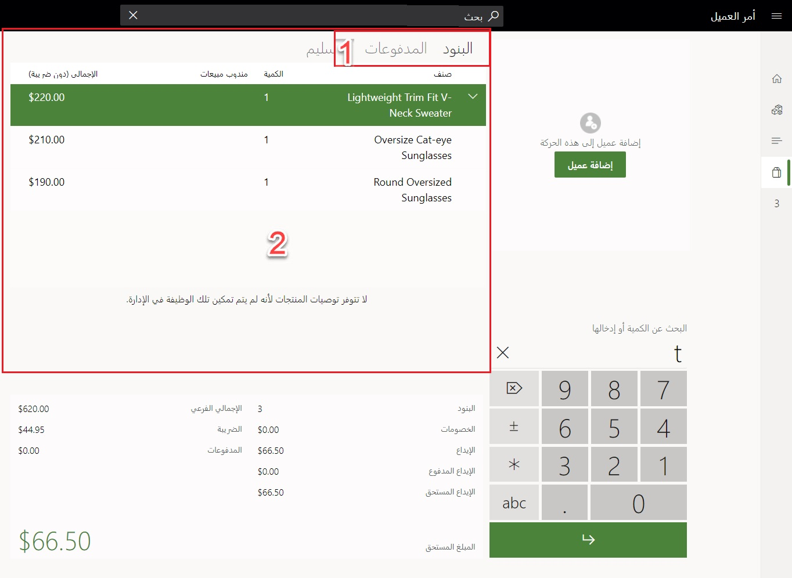

تعد الحركات النقدية هي أشهر حركات نقطة البيع التي يتم فيها مسح الأصناف. قد يتم، أو لا يتم، تحديد العميل في الأمر وكل المنتجات يتم الدفع مقابلها بالكامل. عند طرح عطاء الحركة، سيغادر العميل بالمنتجات. لا توجد إجراءات إضافية مطلوبة. 

شاهد الفيديو التالي لتوضيح كيفية إنشاء الحركات النقدية في نقطة البيع.

 > [!VIDEO https://www.microsoft.com/videoplayer/embed/RE4AxcZ]
 
يمكن تطبيق حركات نقطة البيع المحددة على الحركة، مثل إضافة العملاء وتطبيق التعليقات المدخلة من جانب العامل في الحركة وعلى مستوى تشكيلة الإنتاج، بالإضافة إلى تطبيق مندوبي المبيعات للعمولات والضرائب الرئيسية والمزيد. يتم تكوين إجراءات حركة نقطة البيع في شبكة الأزرار في مخطط نقطة البيع، كما هو موضح في[تكوين متجر بيع بالتجزئة ونقطة بيع في الوحدة النمطية للحل Dynamics 365 Commerce](/learn/modules/configure-retail-store-pos//?azure-portal=true). 

تتيح لك بعض عمليات نقاط البيع تطبيق أنواع مختلفة من عروض الخصم والقسائم يدوياً، بشكل إجمالي، أو خصومات على مستوى تشكيلة الإنتاج عبر مبلغ أو نسبة مئوية، زيادة الأسعار على مستوى تشكيلة الإنتاج. 

بمجرد تسجيل الحركات على شاشة **الحركة**، يمكن تكوين شاشة **الحركة** باستخدام **مصمم نقطة البيع** لعرض تفاصيل الحركة مثل العدد الحدي لتدقيق الحركة (على سبيل المثال، تتم تعبئة 5 أصناف عندما يعر النظام خمسة عناصر تم مسحها)، الحركة إجمالاً وإجمالي الضرائب ونوع طريقة الدفع التي تمت وإجمالي المبلغ المستحق والمزيد. 

تدعم نقطة البيع طرق عديدة للدفع في الحركة الواحدة مثل: 

- يمكن أن يُستخدم خليط من الدفع النقدي والدفع ببطاقة الائتمان لنفس عملية البيع. 
- يمكن تقسيم الحركة على بطاقتي ائتمان. 

قد تفرض عمليات نقطة بيع عملية الدفع والتي تم تعيينها لمخطط شاشة نقطة البيع، طرق الدفع وتكوين عمليات الدفع التي تم قبولها في تكوين قناة المتجر في Commerce Headquarters (HQ). يمكن إضافة أزرار عمليات الدفع إلى مخطط نقطة البيع من أجل تسهيل إجراءات الدفع السريع مثل **دفع المبلغ نقداً بالضبط**. 

أثناء الحركة، يحتوي الكائن **شبكة الإيصال** (الظاهر في لقطة الشاشة التالية باللون الأحمر) على خيار للتبديل بين البنود التي أضيفت إلى الحركة وتنص على أن العميل سيقوم بالدفع مقابل، وطرق الدفع التي أضيفت بالفعل إلى الحركة. من هذه البنود، يمكن للعامل أن يلغي البنود وعمليات الدفع. وستتم مناقشة إلغاء الحركات لاحقاً في هذه الوحدة. 

تعرض لقطة الشاشة التالية شاشة **الحركة** في البيانات التجريبية لنقطة البيع السحابية بمتجر **HOUSTON** سجل **HOUSTON-14**. 

الرقم الوارد في لقطة الشاشة يشير إلى العناصر التالية:

1.  علامتا التبويب **البنود** و **عمليات الدفع** في شاشة **الحركة**
2.  شبكة **الإيصالات**

 
تسمح المرونة في مخططات نقطة البيع بإجراء سيناريوهات بيع سريع لنقاط بيع مختلفة، كما يمكن تسهيل تدفق العمليات والحركات بشكل كبير. 

على سبيل المثال، إذا تعودت نقطة البيع على جمع مصاريف الإدخال لأحد الأحداث، فقد يحتوي سجل نقطة البيع على زر **نقطة البيع** الذي يضيف تلقائياً هذا الصنف إلى نقطة البيع. سيعمل الزر على تمكين عامل المتجر من استخدام شاشة نقطة البيع اللمسية بأقل من إجراءين لإكمال الحركة النقدية من البداية إلى النهاية. 

نظراً لأن أداء وخبرات عامل المتجر في الحركات النقدية ليسا من الأمور المهمة، يتعين مراعاة بعض العوامل الخارجية التي تؤثر على إدخال الأمر. على سبيل المثال، من المهم مراعاة كيف تم تكوين أجهزة المسح في نقطة البيع. 

يمكن لنقطة البيع أن تدعم الكود الشريطي سهل الاستخدام وارتباط الكائن وتضمين برنامج نقطة البيع بالتجزئة (OPOS) بالنسبة لأجهزة المسح. يعد القرار الذي سيتم اختيار المسار عليه مهماً. 

استخدام أداة مسح الكود الشريطي مثل محاكي لوحة المفاتيح هو أمر بسيط، مما يعني انه يمكن توصيل جهاز المسح والتمكن من قراءة الأكواد الشريطية على الفور باستخدام السطر الجديد. لا يلزم إجراء تثبيت لنظام Windows أو برنامج تشغيل OPOS. تضيف عملية المسح هذه الأصناف إلى شاشه الحركة، ولكن يتعين أن يكون تركيز نقطة البيع على وضع المؤشر على اللوحة الرقمية لكي تعمل. 

عند استخدام برنامج تشغيل OPOS، والذي يتطلب عملية إعداد إضافية، ستدرك نقطه البيع أن إدخال الكود الشريطي قيد الحدوث، وأن التركيز على اللوحة الرقمية الخاصة بالمؤشر غير ضروري. 

## تخطَ مربع حوار التغيير المطلوب في نقطه البيع عند عدم وجود تغيير مطلوب

حلت نماذج عمليات الدفع الأخرى، مثل بطاقات الائتمان وبطاقات المدين، محل الدفع النقدي بشكل كبير في بيئة البيع بالتجزئة في الوقت الحالي. وعادةً لا توجد ضرورة لإصدار تغييرات لأن عمليات الدفع من خلال بطاقة الائتمان والدائن معدة لدفع المبلغ الفعلي المستحق. تعد المطالبة بعمليات إقران المتجر لتحديد **إغلاق** في مربع الحوار **التغيير المطلوب** لكل حركة أمراً غير مجدٍ لكل بائعي التجزئة في نقطة البيع، حيث أن كل نقرة لها أهميتها. على المدى الطويل، سيقوم بائعو التجزئة الذين يرغبون في تسهيل تجربة عملية السداد في نقطة البيع بتوفير الكثير من الوقت من خلال تخطي هذه الخطوة عندما لا تكون مطلوبة.

وهذه الميزة يتم تمكينها في **ملف تعريف الوظائف** من خلال تكوين **التغيير المطلوب**. للمحافظة على التوافق مع الإصدارات السابقة، يتم تعيينها على **العرض دائماً**. يمكنك تغيير هذا الإعداد **تخطي في حالة الصفر** إذا أردت تخطي مربع الحوار **التغيير المطلوب** في نقطة البيع. عند تعيين مربع الحوار **التغيير المطلوب** على **التخطي في حالة الصفر**، فلن يظهر في نقطة البيع بالنسبة للحركات التي يكون المطلوب فيها المبلغ المستحق بالضبط. 

سيضع الخيار **حسب الطلب** الخيار المعني بطباعة إيصال الهدايا ضمن مربع الحوار **التغيير المطلوب**.  إذا كان ملف تعريف الإيصال المستخدم في نقطه البيع يتضمن إيصال الهدايا مع إجراء الطباعة، وتم تعيينه على **حسب الطلب**، سيتم تجاهل الإعداد **تخطي التغيير المطلوب**.

## مسح خصومات النظام من حركة المبيعات
قد تكون هناك حالات يكون إعداد الخصم فيها غير صحيح، لكن يتعذر على المتجر منع بيع الصنف. وبدلاً من الاضطرار لانتظار مستخدم المكتب الخلفي لتأكيد الخصم وتحديث المتاجر، يمكن لمستخدمي نقطة البيع (POS) إزالة خصومات النظام وتطبيق الخصومات اليدوية على حركة محددة.

سيظل بإمكان المستخدمين تطبيق خصومات يدوية وخصومات قسائم على الحركة.
