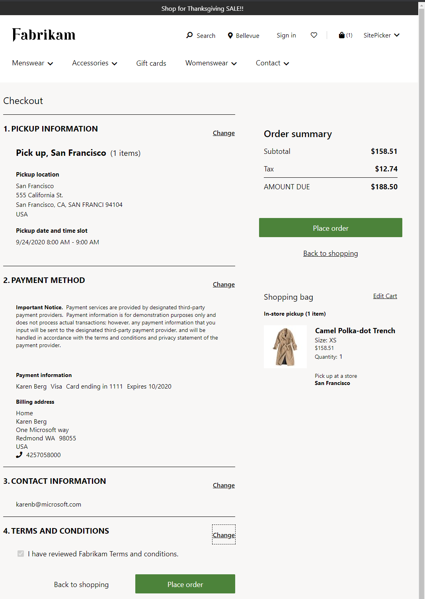

طلب العميل هو طلب نقطة البيع (POS) يتم إنشاؤه حيث سيتم الوفاء بالمنتجات لاحقاً.A customer order is a POS order that is created where the products are to be fulfilled later. تنفيذ الطلب يمكن أيضاً من خلال موقع مختلف.The order can also be fulfilled by a different location. 

يتم إدخال تفاصيل أوامر المبيعات من داخل نقطة البيع، مثل:Sales order details are entered from within the POS, such as:

- عنوان الشحنShipping address
- معلومات العميلCustomer information
- تاريخ الشحن والاستلامShipping and pickup date
- موقع الوفاءFulfillment location 
 
ثم يتم إنشاء الأمر وإرساله إلى المقر الرئيسي للتجارة (HQ) للمعالجة.The order is then created and sent to Commerce Headquarters (HQ) for processing. عادةً ما يحدث إنشاء أمر العميل إلى المقر الرئيسي من خلال عملية غير متزامنة بين المحرك التجاري والمقر الرئيسي.The creation of the customer order to HQ typically occurs through an async process between the Commerce engine and HQ. يمكنك أيضاً تكوينه ليتم إنشاؤه في الوقت الفعلي، إذا كنت تفضل ذلك.You can also configure it to be created in real time, if preferred. 

شاهد الفيديو التالي للتعرف على كيفية إنشاء طلب عميل في نقطة البيع.Watch the following video to learn how to create a customer order in POS.

 > [!VIDEO https://www.microsoft.com/videoplayer/embed/RE4ATOm]
 
عند إنشاء أمر عميل، فإنه يتبع نفس التدفق العام مثل سيناريو النقد والحمل.When you create a customer order, it follows the same general flow as the cash and carry scenario. ومع ذلك، يجب عليك استخدام خيارات نقطة البيع المناسبة لطلب العميل:However, you must use the appropriate POS options for a customer order:

- **شحن الكل****Ship all**
- **تم تحديد الشحن****Ship selected**
- **اختيار الكل****Pick up all**
- **اختيار المحدد****Pick up selected**
- **تنفيذ الكل****Carry out all** 
- **تنفيذ المحدد****Carry out selected**

عند استخدام أحد هذه الخيارات، سيُطلب منك **إنشاء طلب العميل** أو **إنشاء عرض أسعار**.When one of these options is used, you will be prompted to **Create customer order** or **Create quote**. 

عند استخدام **اشحن الكل**، **شحن المحدد**، **اختيار الكل**، أو **اختيار المحدد** تتطلب الخطوط تكويناً إضافياً للإشارة إلى مكان الشحن أو الاستلام.When you use the **Ship all**, **Ship selected**, **Pick up all**, or **Pick up selected** options, the lines require additional configuration to indicate where they'll be shipped or picked up.  

## الدفعPayment
قد يتطلب طلب العميل الدفع بالكامل أو بعضاً منه مقدماً.A customer order might require all or some payment upfront. تعتمد متطلبات الدفع على ما إذا كان قد تم ضبط **نسبة الإيداع** في معايير التجارة، أو إذا قام المستخدم بإعداد **مبلغ الإيداع** يدوياً للطلب.Payment requirements depend on whether a **Deposit percentage** is configured in the Commerce parameters, or if the user manually sets up a **Deposit amount** for the order. 

عند تقديم العطاءات، سيُطلب من المستخدم الحصول مسبقاً على دفعة البطاقة التي سيتم استخدامها لدفع الرصيد، أو يمكنهم تخطي هذه الخطوة لأوامر الاستلام والحصول على الدفعة المتبقية في وقت الاستلام.When tendering, the user will be prompted to pre-capture a card payment that will be used to pay the balance, or they can skip this step for pickup orders and obtain the remaining payment at the time of pickup. 

بعد إدخال معلومات الدفع، يكون الطلب مكتمل وسيتم حفظه في المقر الرئيسي.After the payment information is entered, the order is completed and will be saved to HQ. 

## تنفيذ المحددCarry out selected
في أحد أشكال السيناريو السابق، يمكن أن يحدث سيناريو مختلط حيث يتم طلب المنتج بشكل خاص، أو نفاد المخزون، أو يجب تسليمه، لكن العميل يريد أخذ بعض الأصناف معهم.In a variation of the previous scenario, a hybrid scenario can occur where a product is specially ordered, out of stock, or must be delivered, but a customer wants to take some items with them. استخدام **تنفيذ المحدد** يسمح للمستخدم بتحديد المنتجات التي سيأخذها المتسوق على الفور.Using the **Carry out selected** operation will allow the user to select which products will be taken by the shopper immediately. 

إذا كنت تستخدم الخيار **تنفيذ الكل** فسيقوم النظام بتحويل الحركة إلى ادفع واستلم.If you use the **Carry out all** option, the system will convert the transaction to a cash and carry. يجب دفع الأصناف التي تم وضع علامة عليها للترحيل بالكامل في نهاية الحركة، ويجب على العميل دفع مبلغ الإيداع الذي قد يكون مطلوباً للأصناف التي تم تحديدها ليتم شحنها أو استلامها لاحقاً.Items that are flagged for carryout must be paid in full at the end of the transaction, and the customer must pay the deposit amount that might be required for items that are selected to be shipped or picked up later. 

## قم بإنشاء وتحديث فترات زمنية لاستلام العميلCreate and update time slots for customer pickup

تسمح ميزة الفتحة الزمنية لتجار التجزئة بتعيين فترة زمنية من أجل الأصناف التي تم تعيينها على وضع تسليم استلام العميل.The time slot feature allows retailers to set a time slot for items that are set to customer pickup delivery mode. تسمح الفتحات الزمنية لتجار التجزئة بتحديد الأيام والأوقات التي يمكن فيها استلام الطلبات في متاجرهم.Time slots allow retailers to specify which days and times orders can be picked up in their stores. يمكن لبائعي التجزئة أيضاً تعيين حد لعدد الطلبات التي يمكن التقاطها في إطار زمني معين.Retailers can also set a limit on how many orders can be picked up in a given time frame. يمكن لبائعي التجزئة تحديد عدد الطلبات التي يمكن استلامها في يوم معين وفي وقت محدد بهذه الطريقة.Retailers can limit the number of orders that can be picked up on a specific day and at a specific time this way. نتيجة لذلك، سيكون لعملائهم تجربة أفضل.As a result, their customers will have a better experience. 

> [!NOTE]
> ميزة الفترة الزمنية متاحة في Dynamics 365 Commerce الإصدار 10.0.15 والإصدارات الأحدث.The time slot feature is available in Dynamics 365 Commerce version 10.0.15 and later.

تُظهر لقطة الشاشة التالية مثالاً على اختيار الفترة الزمنية أثناء الخروج من التجارة الإلكترونية.The following screenshot shows an example of time slot selection during e-commerce checkout.

### خصائص الفترة الزمنيةTime slot properties

الفترة الزمنية هي فترة زمنية محددة يمكن للعميل خلالها استلام طلب من متجر أو موقع معين.A time slot is a set period of time during which a customer can pick up an order from a particular store or location.  لا تتوفر ميزة إدارة الفترة الزمنية إلا عندما يتم تكوين وضع تسليم لاقط العميل في التجارة.The time slot management feature is only available when the customer pickup delivery mode is configured in Commerce.

يتم تحديد الفترة الزمنية باستخدام الحقول التالية:A time slot is defined by using the following fields:

- **طريقة التسليم** – يشير إلى طريقة الاستلام التي تكون الفترة الزمنية صالحة لها.**Mode of delivery** – Indicates the mode of delivery pickup for which the time slot is valid.

- **الحد الأدنى من الأيام** و **الحد الأقصى للأيام** – حدد أقرب وأحدث تواريخ الاستلام التي يمكن اختيارها فيما يتعلق بالطلب تاريخ التنسيب.**Minimum Days** and **Maximum Days** – Indicate the earliest and latest pickup dates that can be chosen in relation to the order's placement date.

    The **الحد الأدنى من الأيام** أن بائع التجزئة لديه الوقت الكافي لمعالجة الطلب قبل أن يصبح متاحاً للاستلام.The **Minimum Days** value ensures that the retailer has enough time to process the order before it becomes available for pickup. تمنع قيمة **الحد الأدنى من الأيام** المستخدم من اختيار تاريخ بعيد جداً.The **Maximum Days** value prevents the user from selecting a date that is too far away. على سبيل المثال، إذا تم تعيين الحقل **الحد الأدنى من الأيام** على **1**، تم تقديم الطلب في 20 سبتمبر، أقرب يوم سيكون فيه الطلب متاحاً للاستلام هو اليوم التالي المؤهل (21 سبتمبر).For example, if the **Minimum Days** field is set to **1**, and an order is placed on September 20, the earliest day that the order will be available for pickup is the next eligible day (September 21). بطريقة مماثلة، من خلال تعيين الحد الأقصى للقيمة، يمكنك تحديد الحد الأقصى لعدد الأيام التي يمكن فيها انتقاء الطلب.In a similar way, by setting a maximum value, you can define the maximum number of days that an order can be picked up. عندما يتم تحديد الحد الأدنى والحد الأقصى للقيم، يمكن لمستخدمي الموقع رؤية وتحديد مجموعة محددة من الأيام فقط أثناء تجربة السداد الخاصة بهم.When minimum and maximum values are defined, site users can see and select only a specific set of days during their checkout experience.

    يمكنك تعيين الحد الأدنى للقيمة على قيمة عشرية أقل من 1.You can set the minimum value to a decimal value that is less than 1. 

    على سبيل المثال، إذا كان الاستلام متاحاً بعد أربع ساعات من تقديم الطلب، فاضبط قيمة **الحد الأدنى من الأيام** إلى **0.17** (= 4 ÷ 24، مقرباً لأقرب منزلتين عشريتين).For example, if pickup is available four hours after an order is placed, set the **Minimum Days** value to **0.17** (= 4 ÷ 24, rounded up to two decimal places). إذا قمت بتعيين قيمة **لحد الأدنى من الأيام** إلى قيمة عشرية أكبر من 1، يتم تقريبها دائماً إلى أقرب رقم صحيح.If you set the **Minimum Days** value to a decimal value that is more than 1, it's always rounded up to the nearest whole number. على سبيل المثال، سيتم تقريب القيمة **1.2** سيتم تقريب القيمة **2**.For example, a value of **1.2** will be rounded up to **2**. وبالمثل، إذا قمت بتعيين قيمة **الحد الأدنى من الأيام** إلى قيمة عشرية، فسيتم تقريبها دائماً إلى أقرب رقم صحيح.Similarly, if you set the **Maximum Days** value to a decimal value, it's always rounded up to the nearest whole number.

- **تاريخ البدء** و **تاريخ الانتهاء** – يجب تحديد تاريخي بدء وانتهاء الفترة الزمنية.**Start Date** and **End Date** – The time slot's start and end dates must be specified. يتم تعيين تاريخ بدء وتاريخ انتهاء لكل إدخال في فترة زمنية.A start date and an end date are assigned to each time slot entry. نتيجة لذلك، لديك حرية إضافة خانات زمنية جديدة في أي وقت خلال العام (على سبيل المثال، عمليات الالتقاء خلال ساعات العطلات).As a result, you have the freedom to add new time slots at any time during the year (for example, pickups during holiday hours). إذا تم تغيير تاريخي البدء والانتهاء لفترة زمنية بعد تقديم الطلب، فلن تؤثر التغييرات على هذا الطلب.If the start and end dates of a time slot are changed after an order is placed, the changes will not affect that order. يجب مراعاة تواريخ إغلاق المتجر (على سبيل المثال، يوم عيد الميلاد لبعض البلدان / المناطق) عند تحديد تواريخ البدء والانتهاء، والتأكد من عدم تحديد الفترات الزمنية لتلك الأيام.You must consider store closure dates (for example, Christmas day for some countries/regions) when defining start and end dates, and ensure that time slots are not defined for those days.
- **ساعة نشطة من الاستلام** – اضبط الإطار الزمني عندما يُسمح بالاستلام.**Active Hours of Pickup** – Set the timeframe for when pickup is permitted. يمكن أن تتراوح أوقات الالتقاط، على سبيل المثال، بين 2 و5 مساءً.Pickup times, for example, could be between 2 and 5 p.m. كل يوم.every day. تتيح هذه الخاصية إمكانية استلام الأصناف خارج ساعات عمل المتجر.This property makes it possible to pick up items outside of store hours. نتيجة لذلك، يمكن لبائع التجزئة تحديد أوقات الاستلام التي تناسب احتياجات عمله المحددة.As a result, the retailer can set up pickup times that suit his or her specific business needs. عند تحديد ساعات الاستلام النشطة، ضع في اعتبارك ساعات المتجر وتأكد من عدم ضبط أوقات الاستلام عندما يكون المتجر مقفلاً.When defining the active hours of pickup, keep store hours in mind and make sure that pickup times aren't set for when the store is closed.

    > [!NOTE]
    > يجب تحديد ساعات الاستلام من المتجر في المنطقة الزمنية للمخزن المناسب.The hours for store pickup must be defined in the time zone of the appropriate store.

- **الفاصل الزمني** – اضبط الحد الأقصى لمقدار الوقت الذي يمكن استخدام فترة زمنية فيه.**Time Slot Interval** – Set the maximum amount of time each time slot can be used for. على سبيل المثال، يمكن أن تكون كل فترة زمنية 15 دقيقة أو 30 دقيقة أو ساعة واحدة.For example, each time slot could be 15 minutes, 30 minutes, or one hour long. عندما تكون قيمة الفترة الزمنية صفراً، تكون الفاصل الزمني متاحاً لكامل الفترة الزمنية بين وقت البدء ووقت الانتهاء.When the time slot value is zero, the time slot is available for the entire time interval between the start and end times.

- **الفواصل لكل فترة** – في كل فترة زمنية، حدد الحد الأقصى لعدد العملاء أو الطلبات التي يمكن تقديمها للاستلام.**Slots Per Interval** – In each time slot interval, specify the maximum number of customers or orders that can be served for pickup. 

- **يوم نشط** – اختر أيام الأسبوع التي تتوفر فيها خانات وقت الاستلام.**Active Days** – Choose which days of the week the pickup time slots are available. تتيح هذه الخاصية لبائع التجزئة تحديد الأيام التي سيدعم فيها أوامر الاستلام.This property allows the retailer to specify which days it will support pickup orders.

- **قنوات البيع بالتجزئة** – حدد قنوات البيع بالتجزئة التي سيتم استخدامها.**Retail Channels** – Indicate the retail channels to be used. يمكن ربط كل فترة زمنية بواحدة أو أكثر من مؤسسات البيع بالتجزئة.Each time slot can be linked to one or more retail establishments. يمكن إنشاء إدخال أو أكثر من مدخلات الفتحة الزمنية وربطها بقناة، بناءً على ساعات عمل كل متجر.One or more time slot entries can be created and associated with a channel, based on each store's operating hours.

 يمكن تكوين قالب الفتحة الزمنية مرة واحدة فقط لكل قناة.Only one time slot template can be configured per channel. تعد المتاجر التقليدية ومراكز الاتصال والأجهزة المحمولة ومواقع التجارة الإلكترونية أمثلة على هذه القنوات.Brick-and-mortar stores, call centers, mobile devices, and e-commerce sites are all examples of these channels.

### ضبط ميزة الفترة الزمنية في مقر التجارةConfigure the time slot feature in Commerce headquarters

يجب أن يحتوي كل وضع استلام للتسليم على فترات زمنية محددة في المقرات التجارية الرئيسية بحيث يمكن لقنوات نقطة البيع والتجارة الإلكترونية الرجوع إليها.Each pickup mode of delivery must have time slots defined in Commerce headquarters so that POS and e-commerce channels can reference them.

- يمكن إقران نموذج الفتحة الزمنية مرة واحدة فقط بكل متجر أو قناة.Only one time slot template can be associated with each store or channel.
- يجب أن تكون كل فترة زمنية يتم إنشاؤها فريدة لكل نمط تسليم في كل نموذج.Each time slot that is created should be unique to each delivery mode in each template.
- بعد تكوين ميزة الفترة الزمنية، سيكون تقويم الفترة الزمنية متاحاً للمتاجر المحددة أو مجموعات المتاجر.After the time slot feature is configured, the time slot calendar will be available to the selected stores or store groups. سيكون مرئياً أيضاً في نقطة البيع للرجوع إليها.It will also be visible at the POS, for reference.

لضبط ميزة الفترة الزمنية في المقر الرئيسي للتجارة، اتبع هذه الخطوات.To configure the time slot feature in Commerce headquarters, follow these steps.

1.  انتقل إلى **التجارة > إعداد القناة > خانة وقت الاستلام من المتجر**.Go to **Commerce > Channel setup > Store pickup time slot**.
2.  حدد **جديد** لإنشاء قالب شريحة زمنية جديد.Select **New** to create a new time slot template. لاستخدام قالب موجود، حدد القالب في الجزء الأيمن.To use an existing template, select the template in the left pane.
3.  أدخل القيم في حقلي **فاصل الزمني ID** و **الوصف**.Enter values in the **Time Slot ID** and **Description** fields.
4.  في علامة التبويب السريعة **استلام الطلب - إعدادات الوقت** حدد **إضافة**.On the **Order Pickup - Time Settings** FastTab, select **Add**.
5.  في مربع الحوار **انتقاء الطلب - إعدادات الوقت** حدد النطاق الزمني، وطريقة التسليم، وساعات التسليم النشطة، والأيام النشطة، والفاصل الزمني للفتحة الزمنية، والفترات الزمنية لكل فاصل زمني، واعدادات اخرى.In the **Order Pickup - Time Settings** dialog box, define the date range, mode of delivery, active hours of delivery, active days, time slot interval, slots per interval, and other settings.

    إذا كانت الفترات الزمنية ستظل ثابتة في المستقبل المنظور، فاضبط الحقل **تاريخ الانتهاء** على **أبداً**.If time slots will be static for the foreseeable future, set the **End Date** field to **Never**.

    

6.  عند الانتهاء، حدد **موافق**.When you've finished, select **OK**.
7.  إذا اختلفت الفترات الزمنية في يوم ما، فقم بإنشاء إدخالات إضافية في علامة التبويب السريعة **استلام الطلب - إعدادات الوقت** لضمان عدم تداخل التواريخ والأوقات.If the time slots in a day will vary, create additional entries on the **Order Pickup - Time Settings** FastTab to ensure that the dates and times don't overlap.
8.  في علامة التبويب السريعة **قنوات البيع بالتجزئة** حدد **إضافة** لإقران قالب خانة الوقت بالمتاجر أو القنوات حيث سيستخدم.On the **Retail Channels** FastTab, select **Add** to associate the time slot template with the stores or channels where it will be used.
9.  في مربع الحوار **اختر عُقد المؤسسة** استخدم أزرار الأسهم لتحديد (أو مسح التحديد) المتاجر والمناطق والمؤسسات التي يجب أن يرتبط بها القالب.In the **Choose organization nodes** dialog box, use the arrow buttons to select (or clear the selection of) the stores, regions, and organizations that the template should be associated with.
10. عند الانتهاء، حدد **موافق**.When you've finished, select **OK**.
11. في صفحة **جدول التوزيع** قم بتشغيل **1070** و **1135** وظائف لمزامنة البيانات مع القنوات.On the **Distribution schedule** page, run the **1070** and **1135** jobs to sync the data to the channels.
   
### اختيار الفتحة الزمنية لأوامر نقطة البيعTime slot selection for POS orders

عندما يتم تحديد أمر أو سطر أمر للاستلام في نقطة البيع، يمكن للصراف اختيار متجر أو موقع استلام، بالإضافة إلى فتحة التاريخ والوقت.When an order or order line is marked for pickup at the POS, the cashier can choose a pickup store or location, as well as a date and time slot. إذا قدم العميل طلباً للاستلام في موقع مختلف، فيمكن لأمين الصندوق اختيار وقت توفر الاستلام.If a customer has placed an order for pickup at a different location, the cashier can choose when the pickup will be available. ستتم الإشارة إلى تاريخ ووقت المتجر من خلال البحث عن المتجر.The date and time of the store will be referenced by the store lookup.

تُظهر لقطة الشاشة التالية مثالاً لاختيار الفتحة الزمنية لطلب نقطة البيع.The following screenshot shows an example of time slot selection for a POS order.

### اختيار الفتحة الزمنية لأوامر التجارة الإلكترونيةTime slot selection for e-commerce orders
للحصول على معلومات حول كيفية إتاحة تحديد الفتحة الزمنية لأوامر التجارة الإلكترونية، راجع [وحدة معلومات الاستلام](https://docs.microsoft.com/dynamics365/commerce/pickup-info-module/?azure-portal=true).For information about how to make time slot selection available for e-commerce orders, see [Pickup information module](https://docs.microsoft.com/dynamics365/commerce/pickup-info-module/?azure-portal=true).

> [!NOTE]
> يمكن للمستخدمين عرض أو تحرير خانات وقت الالتقاط على صفحة الخروج الخاصة بموقع التجارة فقط إذا تمت إضافة وحدة معلومات الالتقاط إلى تلك الصفحة.Users can view or edit pickup time slots on a Commerce site's checkout page only if the pickup information module has been added to that page. إذا لم تتضمن صفحة الخروج وحدة معلومات الالتقاط، فسيتم وضع الطلبات دون السماح للمستخدمين بتحديد أو عرض معلومات الفتحة الزمنية.If the checkout page doesn't include the pickup information module, orders will be placed without letting users specify or view time slot information.

تُظهر لقطة الشاشة التالية مثالاً لطلب التجارة الإلكترونية حيث تم تحديد فترة زمنية للاستلام.The following screenshot shows an example of an e-commerce order where a pickup time slot has been selected.

### اختيار الفتحة الزمنية لأوامر مركز الاتصالTime slot selection for call center orders
يمكن لمندوبين مركز الاتصال اختيار متجر أو موقع التقاط، بالإضافة إلى التاريخ والوقت، في تطبيق مركز الاتصال، كما هو موضح في لقطة الشاشة أدناه.Call center agents can choose a pickup store or location, as well as a date and time slot, in the call center app, as shown in the screenshot below.

## أوامر عرض الأسعارQuotation orders
يجب إنشاء أوامر عرض الأسعار للعملاء الذين يرغبون في طلب سعر خاص للمنتجات المطلوبة ولكنهم لن يوافقوا على تنفيذ الأمر حتى يتم التفاوض على السعر.Quotation orders should be created for customers who want to request a special price for the products ordered but won't agree to have the order fulfilled until a price is negotiated. يمكن مراجعة طلبات العميل التي تم إنشاؤها كطلبات عروض أسعار وإعادة تسعيرها في المقر الرئيسي.Customer orders that are created as quotation orders can be reviewed and repriced in HQ. يمكن تحويل أوامر عرض الأسعار هذه لاحقاً إلى أمر مبيعات من خلال المقر الرئيسي أو من خلال تطبيق نقطة البيع إذا وافق العميل على السعر المتفاوض عليه.These quotation orders can later be converted to a sales order through HQ or through the POS application if the customer agrees to the negotiated price. تسمح التجارة بانتهاء صلاحية عروض الأسعار تلقائياً بعد عدد معين من الأيام.Commerce allows for quotations to automatically expire after a certain number of days.

## طلب الودائعOrder deposits
بالنسبة إلى الصنف في طلب العميل لم يتم الوفاء به على الفور، يمكن للشركة أن تقرر ما إذا كان العميل سيحتاج إلى دفع ثمن هذه العناصر بالكامل، أو دفع وديعة فقط، أو أنه لن يكون مطالباً بدفع دفعة مقدمة على الإطلاق.For an item on a customer order that is not fulfilled immediately, the company can decide if the customer will need to pay for those items in full, pay only a deposit, or will not be required to pay a down payment at all.

بالنسبة لطلبات العميل التي تم إنشاؤها في نقطة البيع، يمكن ضبط **نسبة الإيداع الافتراضية** فرض متطلبات الإيداع المتسقة على مستوى الشركة، على سبيل المثال، *10% أقل مع البقية المستحقة عند التسليم أو الاستلام*.For customer orders that are created in POS, a **Default deposit percentage** can be configured to enforce a consistent deposit requirement company-wide, for example, *10% down with the rest due on delivery or pickup*. يمكن تجاوز الإيداع في نقطة البيع، إذا لزم الأمر، لكنه سيتحول إلى هذا المبلغ بشكل افتراضي.The deposit can be overridden in POS, if necessary, but it will default to this amount.

اعتماداً على معالج الدفع ببطاقة الائتمان الذي تم تحديده، مثل Adyen يمكنك تطبيق بطاقة ائتمان للتفويض المسبق للمبلغ الذي لم يتم تغطيته في الإيداع.Depending on the credit card payment processor that is selected, such as Adyen, you can apply a credit card to pre-authorize the amount that wasn't covered in the deposit. إذا تم التقاط البطاقة، فسيتم تحصيلها تلقائياً عند شحن طلب العميل أو استلامه.If a card is captured, it will be charged automatically when the customer order ships or is picked up. 

يمكن العثور على **إعداد معايير البيع بالتجزئة لطلبات العميل** صفحة واحدة، والتي تظهر في لقطة الشاشة التالية ضمن **البيع بالتجزئة والتجارة > إعداد المقر > المعايير > معايير التجارة**.The **Set up the retail parameters for customer orders** page, which is shown in the following screenshot, can be found under **Retail and Commerce > Headquarters setup > Parameters > Commerce parameters**.

 

