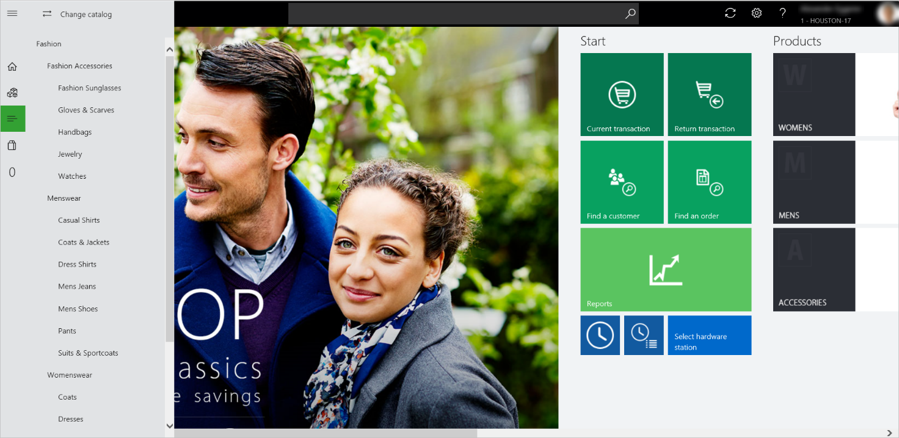
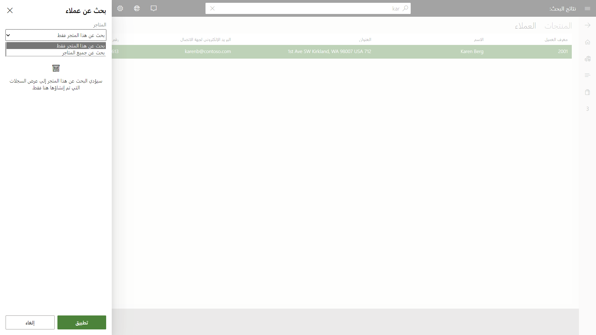

يسهل استخدام عمليات البحث عن المنتجات والعملاء مع نقطة البيع الحديثة (MPOS) ونقطة بيع المجموعة (CPOS). يمكن للموظفين البحث بسرعة عن المنتجات والعملاء لأن شريط البحث موجود دائماً في الجزء العلوي من نوافذ MPOS وCPOS.

## عمليات البحث عن المنتجات
يمكن إجراء البحث عن منتج كبحث عن منتج محلي، وبحث عن منتج عن بُعد.

- **البحث عن منتج محلي** - يحدث بشكل افتراضي عند الوصول إلى أجهزة MPOS أو CPOS. سيؤدي البحث عن منتج محلي إلى تقييد ناتج البحث على ما هو متاح حالياً في هذا الموقع. تبحث عملية البحث عن منتج محلي في خصائص المنتج التالية:
    - رقم المنتج
    - اسم المنتج
    - الوصف
    - الأبعاد
    - الكود الشريطي
    - اسم البحث
- **البحث عن منتج عن بُعد** - بالتوسع عند البحث عن منتج محلي، يمكن للموظف التبديل إلى بحث عن منتج عن بُعد مما سيسمح لناتج البحث بعرض مخزون الموقع الحالي بالإضافة إلى أي موقع آخر تديره الشركة. حدد زر **الفئات** في الجانب الأيمن من الصفحة لتغيير الكتالوج. حدد الزر **تغيير الكتالوج** أعلى الجزء الذي يظهر، ثم استعرض أحد الكتالوجات المتوفرة. سيبحث النظام عن المنتجات في الكتالوج الذي اخترته. 

في الصفحة **تغيير الكتالوج**، يمكن للموظفين تحديد أي متجر، أو يمكنهم البحث عن المنتجات في جميع المتاجر.

## البحث عن عميل
تعد القدرة على تحديد موقع عميل حالي معين لربط المعلومات بالحركة خطوة مهمة لمعظم تجار التجزئة. قد يبحث الموظف عن عميل لعرض محفوظات الشراء أو إعادة طباعة إيصال أو إجراء حركة جديدة لذلك العميل. توفر خوارزمية البحث مخرجات البحث بناءً على القيم الموجودة في خصائص العميل التالية:

- الاسم
- عنوان البريد الإلكتروني
- رقم الهاتف
- رقم بطاقة الولاء
- العنوان
- رقم العميل

من بين خصائص العميل، يوفر **الاسم** أكبر قدر من الاتساق للاستعلامات التي تتضمن عدة كلمات أساسية، لأن الخوارزمية تُرجع جميع العملاء الذين يتطابقون مع جميع الكلمات الأساسية التي تم البحث عنها. يظهر العملاء الأكثر ملاءمة لشروط البحث في الجزء العلوي من النتائج. يساعد هذا الإجراء الصرافين في الحالات التي يبحثون فيها عن عميل باستخدام الاسم بالكامل، ولكن تم تبديل اسم العائلة والاسم الأول في أثناء الإدخال الأولي للبيانات. 

من ناحية أخرى، تحافظ جميع الخصائص الأخرى على ترتيب الكلمات الأساسية للبحث لأغراض الأداء. وبهذا، لن يتم استرداد أي نتائج إذا كان ترتيب مصطلحات البحث لا يتبع الترتيب الذي تتم معالجة البيانات به. 

على سبيل المثال:

- في أثناء البحث باستخدام **الاسم** للعميل **John Doe**. إذا كنت تبحث عن **Doe**، **John**، فسترى نتائج **John Doe** أيضاً. 
- ولكن إذا كنت تبحث عن عميل برقم هاتفه، **(555) 987-6543**، فلا يمكنك البحث عن **987-6543** فقط. ستحتاج إلى تضمين رمز المنطقة أيضاً.

مثل البحث عن المنتجات، يمكن أن تندرج عمليات البحث عن العملاء أيضاً ضمن واحدة من فئتين.

- **البحث عن عميل محلي** - يتم تمكينه افتراضياً عندما يقوم الموظف بالبحث عن عميل معين. سيوفر البحث عن عميل محلي نتائج البحث عن دفتر عناوين العميل المرتبط فقط بموقع البيع بالتجزئة المحدد. 
- **البحث عن عميل عن بُعد** - إذا احتاج الموظف إلى البحث عن عميل بشكل عمومي، أو عبر مواقع البيع بالتجزئة الأخرى أو عبر الكيانات القانونية.

للبحث بشكل عام، يمكن للموظفين تحديد الزر **تصفية النتائج** في أسفل الصفحة، ثم تحديد خيار **البحث في جميع المتاجر**، كما هو موضح في لقطة الشاشة التالية. 

> [!NOTE]
> يجب إدخال ما لا يقل عن أربعة أحرف للبحث عن عميل عن بُعد لإرجاع النتائج. لمعرفة المزيد من المعلومات حول كيفية تمكين ميزة البحث المدعومة بالمجموعة، راجع [البحث عن المنتج والعميل في نقطة البيع](https://docs.microsoft.com/dynamics365/commerce/pos-search-improvements/?azure-portal=true).
