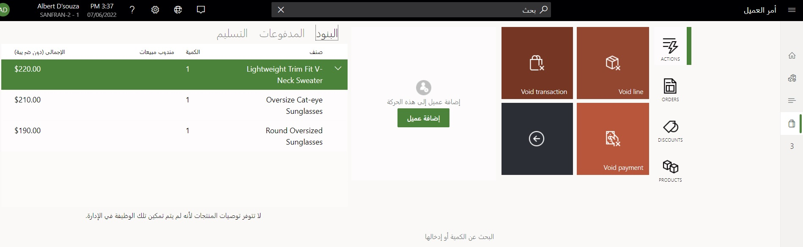

من حين لآخر، يحدث سيناريو حيث يلزم إزالة (إلغاء) حركة غير مكتملة من نقطة البيع. يمكن أن تكون هذه الحركات في منتصف الحركة أو في حالة تعليق من تفاعل سابق مع العميل. 

يمكن إلغاء الحركات وبنود الحركات والمدفوعات، اعتماداً على حالة الحركة. يمكن تعيين عمليات نقطة البيع لأزرار نقطة البيع لإلغاء هذه العناصر. 

تُظهر لقطة الشاشة التالية شاشة **الحركة** مع أزرار نقطة البيع المقرر إلغاؤها في نقطة بيع السحابة التجريبية لمتجر **HOUSTON** **HOUSTON-14**.

 
عندما تقوم بإلغاء خط أو حركة في منتصف عملية الدفع، سيظل البند أو الدفع ظاهراً على شاشة **الحركة**، ولكن سيتم شطبه. لن تتم طباعة هذه البنود أو المدفوعات على إيصال العميل ولن يتم احتسابها في إجماليات الأوامر. يؤدي إلغاء الحركة إلى مسح الحركة النشطة، مما يسمح للمستخدم ببدء حركة جديدة. 

## الحركات اللاغية أثناء إنهاء الوردية
في نهاية اليوم، قد توجد العديد من الحركات المعلقة الناتجة عن ترك الحركات. يساعد الخيار **لاغية عند إنهاء الوردية** على تسهيل هذا المطلب في المتاجر من خلال مطالبة المستخدم الذي ينهي الوردية بإكمال أو إبطال الحركات المعلقة. 

## أكواد المعلومات اللاغية
تحدث العديد من السيناريوهات التي يمكن أن يكون فيها إلغاء الحركات أو البنود نتيجة لحدوث احتيال داخل المتجر. على سبيل المثال، ربما تتم رؤية شخص ما من خلال كاميرا الأمن وهو يقوم بمسح أحد الأصناف ضوئياً ووضعه في حقيبة تسوق. ثم يقوم شريك المتجر بإلغاء هذا البند لاحقاً في الحركة. لا يوجد لدى الكاميرا سياق للإلغاء على الشاشة. 

لهذا السبب، يتوفر لك خيار لتكوين رموز المعلومات لسيناريوهات الإلغاء. يتم إعداد أكواد المعلومات في **Retail وCommerce > إعداد القناة > إعداد نقطة البيع > ملفات تعريف نقطة البيع > ملفات تعريف الوظائف** ويمكن أن تساعد في إنشاء بعض المساءلة عن عملية إلغاء الحركة. نظراً لوجود العديد من الأسباب المشروعة لإلغاء صنف ما في المواقف المشغولة، يجب أن يجعل أي تكوين لرمز المعلومات إدخال المستخدم سريعاً، مثل استخدام قائمة ثابتة من أسباب الإلغاء. 

يتم تتبع البنود اللاغية والحركات اللاغية والمدفوعات اللاغية وتسجيلها في سجل **الحركة** في نقطة البيع بحيث يمكن تحليلها بحثاً عن مشكلات محتملة بغرض منع الخسائر.

