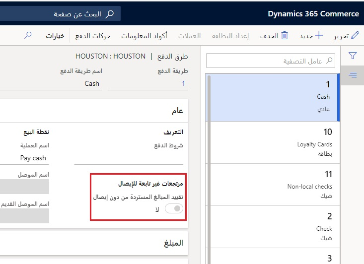

يمكن إنشاء مرتجع من خلال Store Commerce بعدة طرق: 

- إرجاع منتج
- إرجاع حركة
- استدعاء أمر عميل أو إرجاعه 
 
يمكن أن يكون للمرتجعات ثلاث نتائج دفع مختلفة: 

- يكون هناك ائتمان مستحق للعميل
- تبديل السلع بسلع أخرى بحيث يكون المبلغ الصافي المستحق صفر
- يكون هناك مبلغ مستحق من العميل 

قد يتوفر الإيصال لدى العميل أو لا يتوفر لديه. 

## إرجاع منتج
يمكن إرجاع المنتج بإيصال أو من دونه. في حالة عدم توفر إيصال، يمكن إضافة الصنف إلى الحركة ثم تحديده كصنف مرتجع. ستكون هذه الكمية سالبة وستؤثر في الإجماليات المستحقة طبقاً لذلك. 

إذا كان لدى العميل الإيصال الأصلي، يمكن استدعاء الحركة، ويمكن تحديد صنف واحد أو أكثر للإرجاع. سيكون النظام قادراً على تحديد الأصناف المؤهلة للإرجاع لتجنب حدوث سيناريوهات مثل إرجاع صنف مرتين. 

## إرجاع حركة
إذا كان العميل يقوم بإرجاع منتج مقابل حركة دفع نقداً واستلام فوراً حالية، يمكن استدعاء الأمر الأصلي، ومن ثم يمكنك تحديد الأصناف المحددة من تلك الحركة التي سيتم إرجاعها. تضمن هذه العملية مراعاة الأسعار والخصومات الأصلية عند إنشاء حركة الإرجاع.

إذا لم يكن لدى العميل إيصاله الأصلي، يمكن استخدام ميزة **إظهار دفتر اليومية** للبحث عن الحركة الأصلية وتحديد موقعها. من صفحة **إظهار دفتر اليومية**، يمكنك بعد ذلك إنشاء إرجاع مباشر للمنتج/المنتجات أو إعادة طباعة الإيصال الخاص بإرجاع المنتج/المنتجات. 

بعد تحديد الحركة في صفحة **إظهار دفتر اليومية**، يتم عرض **المنتجات القابلة للإرجاع** لتلك الحركة لإرجاعها. 

لقطة الشاشة التالية مأخوذة من سجل **هيوستن-14** في متجر **هيوستن** في Store Commerce لـ Browser الخاصة بالعرض التوضيحي، وهي تعرض **حركات الإرجاع** التي يمكن تحديدها للإرجاع.

 
### استدعاء الأوامر
إذا كنت تقوم بإنشاء مرتجع مقابل أمر العميل، فاستخدم الوظيفة **استدعاء الأوامر** للبحث عن الأمر الذي سيتم إرجاعه وتحديد موقعه. عند تحديد الأمر، يمكنك استخدام الخيار **إرجاع** لتحديد الأصناف المراد إرجاعها. يضمن استخدام هذه الطريقة مراعاة الأسعار والخصومات الأصلية عند إنشاء إرجاع لأمر العميل.

### تمكين المرتجعات لأوامر متعددة
يمكنك تضمين منتجات من أوامر مبيعات متعددة في أمر إرجاع واحد مجمع من خلال الخيار **تمكين المرتجعات لأوامر متعددة** في صفحة **معلمات Commerce**.

### Store Commerce لإرجاع المنتجات‬
يمكنك استخدام الخيار **نقطة بيع إرجاع المنتجات** في أثناء إجراء الحركة لسطر محدد. تحول هذه العملية **كمية** الحركة إلى قيمة سالبة بإجمالي سالب. لا يتم استخدام هذا الخيار عادةً إلا عندما يتعذر العثور على الحركة الأصلية لأنك غير قادر على تجاوز التفاصيل المتعلقة بالسعر أو الخصومات من البيع الأصلي. 

## إرجاع المنتجات غير الموجودة في فرز المتجر
عند استخدام فرز المنتجات، ربما لم تعد المنتجات جزءاً من فرز المتجر، أو لم تكن كذلك. تدعم Store Commerce إعادة هذه العناصر حتى عندما لا تكون جزءاً من فرز المتجر. 

## ‏‫أوامر الاستبدال في Store Commerce
يدعم Commerce سيناريو إجراء استبدال لصنف تم بيعه في أمر عميل (وليس عن طريق الدفع نقداً والاستلام فوراً). ويستخدم Commerce أوامر المبيعات للسماح بالإرجاع والبيع، وفي هذه الحالة للسماح بالاستبدال، لصنف في أمر مبيعات واحد. 

للوصول إلى هذه الوظيفة، قم بتمكين الخيار **معالجة أوامر الإرجاع كأوامر مبيعات** في الصفحة **معلمات Commerce**. 

عند تكوين الخيار، يمكن لعامل Store Commerceتحديد أمر المبيعات أو فاتورة المبيعات في Store Commerce لمعالجتها كعملية إرجاع. يمكن بعد ذلك إضافة أصناف جديدة إلى هذه الحركة الجديدة بالسطور التي يتم إرجاعها من أمر العميل. وتكون المعلومات نفسها مطلوبة لأوامر العملاء هذه كما هي لطلبات العملاء العادية، مثل أساليب التسليم ومواقع التنفيذ. 

يمكن أن تعرض Store Commerce ثلاثة حقول لمساعدة العاملين في Store Commerce في سيناريو الاستبدال: 

- **‏‫تم استخدام الإيداع‬** - مبلغ الإيداع المطبق على حركة ما عندما يقوم المستخدم بانتقاء أمر العميل‬.
- **مبلغ التنفيذ** – المبلغ الذي يجب أن يدفعه العميل لتنفيذ الأصناف في الأمر، بما في ذلك الضرائب والرسوم.
- **المبلغ المرتجع** – المبلغ الإجمالي للسطور ذات الكميات السالبة في أثناء استبدال أمر العميل، بما في ذلك الضرائب والرسوم. 

## رموز سبب الإرجاع
عند إرجاع أوامر العميل، يمكنك استخدام رموز سبب الإرجاع لتحديد سبب قيام العميل بإجراء إرجاع. تختلف هذه العملية عن العملية الخاصة بأوامر الدفع نقداً والاستلام فوراً، التي تستخدم رموز المعلومات وملفات تعريف الوظائف. 

يتم إنشاء رموز سبب الإرجاع، ثم يتم تعيينها لإحدى مجموعات **رموز سبب الإرجاع**. يجب إنشاء **كود ترتيب** لتحديد كيفية التعامل مع المنتج الذي تم إرجاعه عند استلامه، على سبيل المثال:

- الإصلاح والإرجاع إلى العميل
- إرجاع الصنف واستبداله
- الإرجاع وإعادة الرصيد إلى العميل
- إرجاع الصنف والتخلص منه 
 
لتنفيذ هذه المهمة، يتم تعيين **إجراء الترتيب** لكل **رمز ترتيب**. 

عند إرجاع أحد المنتجات، يجب تحديد **رمز سبب الإرجاع** و **رمز الترتيب**. 

## استرداد المدفوعات

يمكن لـ Commerce إجراء **عملية استرداد مرتبطة** لمشتريات البطاقة المدينة عند استخدام موصل الدفع Adyen أو موصل دفع مخصص تم تصميمه لدعم الرموز المميزة المشتركة. 

وتعني عملية الاسترداد المرتبط أنه يمكن إعادة المدفوعات إلى البطاقة المدينة الأصلية للعميل في وقت إنشاء أمر الإرجاع دون أن يُطلب من العميل عرض البطاقة المدينة الخاصة به أو تمريرها مرة أخرى. تتطلب عمليات الاسترداد المرتبطة تمكين الخيار **استخدام مدفوعات القناة متعددة الاتجاهات** في **البيع بالتجزئة والتجارة > إعداد المركز الرئيسي > المعلمات > معلمات Commerce المشتركة**، كما هو موضح في لقطة الشاشة التالية. 

يمكن استخدام وظيفة عملية الاسترداد المرتبطة لمرتجعات لها إيصال أو من دون إيصال، ولكن مع وجود عميل مرتبط بها. ستتمكن Store Commerce من تحديد التفويضات المختلفة لبطاقة ما عبر الإنترنت ليقوم عامل المتجر بالتحديد من بينها. 

إذا حاول أحد العملاء إرجاع منتج ما دون إيصال، يمكن لكل طريقة دفع تم تكوينها على المتجر أن تقوم بتقييد عمليات الدفع إلى العملاء بهذه الطريقة. تكون هذه الميزة مفيدة إذا كانت سياسة المتجر تسمح بالمبالغ المستردة في المتجر فقط (على سبيل المثال، بطاقات الهدايا). يتم إعداد طرق الدفع في الصفحة **طرق الدفع** في علامة التبويب **البيع بالتجزئة والتجارة > القنوات > المتاجر > جميع المتاجر > الإعداد** الموجودة في جزء الإجراءات **مجموعة الإعداد**. 

 
كبديل لتحديد **مرتجعات دون إيصال** لكل طريقة دفع خاصة بالمتجر، يمكن تكوين صفحة **سياسة الإرجاع للقناة** في **البيع بالتجزئة والتجارة > إعداد القناة > المرتجعات** لتحديد طرق الدفع المسموح بها لعمليات الاسترداد عبر المتاجر المتعددة مباشرة. كما يقوم هذا الخيار بتوسيع وظيفة السماح للمديرين بتجاوز السياسات الموجودة في الأساس التقديري. 

