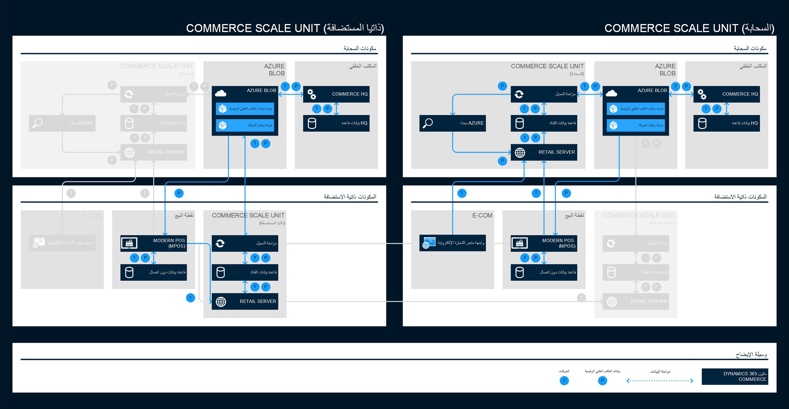

خدمة الوقت الحقيقي هي خدمة متكاملة توفر اتصالاً في الوقت الفعلي بين المقر الرئيسي (HQ)والقنوات.Real-time service is an integrated service that provides real-time communication between Headquarters (HQ) and the channels. تتيح الخدمة لأجهزة نقطة البيع الفردية والمتاجر عبر الإنترنت إمكانية استرداد بيانات محددة من المقر الرئيسي في الوقت الفعلي.This service enables individual POS computers and online stores to retrieve specific data from Headquarters in real time. على سبيل المثال، إذا كنت تقوم بإنشاء أوامر شراء أو أوامر مبيعات أو أوامر تحويل تتضمن حقولاً كمخزون أو عمليات بحث عن الأسعار، فإن هذه الخدمة توفر بيانات حديثة ومحدثة من المقر الرئيسي.For example, if you are creating purchase orders, sales orders, or transfer orders that include fields as inventory or price lookups, this service provides fresh and updated data from HQ. 

تُظهر الصورة التالية تدفق البيانات (الرئيسية والمعاملات) ومخازن البيانات المختلفة التي تستند إلى البنية المحددة.The following image shows the flow of data (master and transactional) and the various data stores that are based on the selected topology.

على الرغم من إمكانية إجراء معظم العمليات الرئيسية في قاعدة بيانات القناة المحلية، فإن المهام التالية تتطلب وصولاً مباشراً إلى البيانات المخزنة في المقر الرئيسي:Though most key operations can be performed in the local channel database, the following tasks require direct access to the data that is stored in Headquarters:

- إصدار واستبدال بطاقات الهداياIssuing and redeeming gift cards
- استبدال نقاط الولاءRedeeming loyalty points
- إصدار واسترداد المذكرات الدائنةIssuing and redeeming credit memos
- إنشاء وتحديث سجلات العملاءCreating and updating customer records
- إنشاء وتحديث واستكمال أوامر المبيعاتCreating, updating, and completing sales orders
- استلام المخزون مقابل أمر الشراء أو أمر التحويلReceiving inventory against a purchase order or transfer order
- جرد المخزونPerforming inventory counts
- استرجاع حركات المبيعات عبر المتاجر وإتمام معاملات الإرجاعRetrieving sales transactions across stores and completing return transactions

يتم استخدام الخدمات غير المتزامنة مع Microsoft SQL Server لتعقب التغييرات في قاعدة بيانات التجارة لتحديد تغييرات البيانات التي يجب إرسالها إلى القنوات كمجموعات بيانات.Async services with Microsoft SQL Server change tracking on the Commerce database is used to determine the data changes that must be sent to channels as datasets. بناءً على جدول التوزيع، سيقوم المقر الرئيسي بحزم تلك البيانات وحفظها في (‏‏‏‏مخزن الكائنات الثنائية كبيرة الحجم لـ Microsoft Azure ).Based on a distribution schedule, Headquarters will package that data and save it to central storage (Microsoft Azure Blob storage). 

تستخدم معالجة دُفعة منفصلة Commerce Data Exchange:مكتبة Async Client لإدراج حزمة البيانات هذه في قاعدة بيانات القناة.A separate batch process uses Commerce Data Exchange: Async Client library to insert this data package into the channel database. 

على سبيل المثال، لديك قنوات متعددة، ويمكن لكل قناة إنشاء طلبات العملاء.For example, you have multiple channels, and each channel can create customer orders. يجب على المقر الرئيسي تسجيل طلبات العملاء واستخدامها للإحصاءات للإنتاج.Headquarters should register those customer orders and use them for statistics for production. عند إنشاء أوامر العملاء في الوضع غير المتزامن، يتم سحبها وإدراجها في وظائف التجارة عن طريق Pull‏ (P).When customer orders are created in asynchronous mode, they are pulled and inserted into Commerce by Pull (P) jobs. سيتم إنشاء أوامر المبيعات المقابلة يدوياً أو من خلال عملية معالجة دُفعة لوظيفة المجدول لتحميل البيانات.The corresponding sales orders will be created manually or through a batch process of the scheduler job for uploading data.

