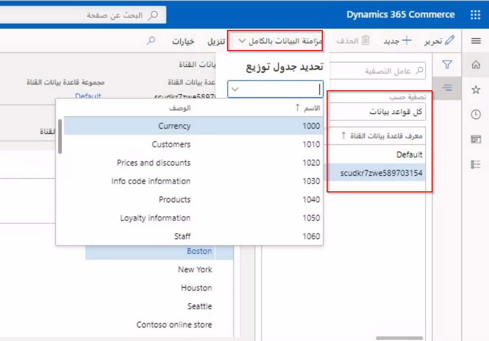

يمكن بدء عملية نقل البيانات يدوياً أو عن طريق جدولة وظيفة دفعية من خلال جدول التوزيع في المقر الرئيسي. يمكن أن يحتوي جدول التوزيع هذا على مجموعة بيانات قناة واحدة أو أكثر ووظيفة جدولة واحدة أو أكثر. عند توزيع حل التجارة، يتم إنشاء قاعدة بيانات افتراضية بشكل منهجي، ونوصي بتجنب إنشاء قاعدة بيانات ثانية أو إعادة تسمية القاعدة الافتراضية. 

تعمل جداول التوزيع في وضع غير متزامن عندما تقوم بتنسيق الاتصال وتسليم البيانات بين التجارة والمخازن. المجدول مرتبط بوظائف المجدول ومجموعات قواعد بيانات القنوات. باستخدام وظائف المجدول، يمكنك إعداد اتجاه تدفق البيانات، إما لتنزيل البيانات أو تحميلها. يعني إنشاء وظيفة دفعية كوظيفة مجدولة إعداد وظيفة سيتم تشغيلها في وقت محدد وتسمح بمعالجة الدُفعات المجدولة للبيانات. تتمثل ميزة استخدام وظيفة دفعية كوظيفة مجدولة في حقيقة أن لديك محفوظات تشغيل تسجل معلومات حول وقت تشغيل الوظيفة الدُفعية وما إذا كانت قد انتهت بنجاح أو مع وجود خطأ. إذا انتهى الأمر بخطأ، فسيكون سجل الوظائف الدُفعية متاحاً. 

تتكون وظائف المجدول من وظائف فرعية تحدد الجداول وحقول الجدول التي تحتوي على البيانات المراد توزيعها. يتضمن المقر الرئيسي وظائف جدولة محددة مسبقاً ووظائف فرعية تفي بمتطلبات النسخ المتماثل لمعظم المؤسسات. 

أنواع الوظائف المحددة مسبقاً هي:

- **تنزيل الوظائف** – إرسال البيانات التي تغيرت من المقر الرئيسي إلى قواعد بيانات القناة. يتم تعقب التعديلات على السجلات من خلال تعقب تغييرات SQL Server.
- **تحميل الوظائف (وظائف P)** – سحب حركات المبيعات من قناة إلى قاعدة بيانات التجارة. تقوم P-jobs بتحميل البيانات بشكل متزايد، مما يعني أنها لا تقوم بتحديث البيانات التي تم تحميلها مسبقاً. للتأكد من أن البيانات لم يتم تحميلها بالفعل، تتحقق مكتبة Async Client من عداد النسخ المتماثل للسجلات التي تم استلامها بالفعل من أحد المواقع. يتم تحميل سجل فقط إذا كان عداد النسخ الخاص به أكبر من أكبر قيمة تم العثور عليها.

تستخدم سجلات جدولة التوزيع تعقب تغييرات SQL في نظام التشغيل لتحديد البيانات التي يجب إدراجها أو تحديثها أو حذفها في مجموعات قاعدة بيانات القنوات، وهو ما يسمى دلتا (أو التغييرات فقط). في المرة الأولى التي يتم فيها تشغيل الوظيفة، أو عندما تملي إعدادات تتبع تغيير SQL أن الدفع الكامل مطلوب (عادةً حوالي ثلاثة أيام)، يمكن إرسال دفعة كاملة لجميع البيانات إلى المتجر. سيتم اقتطاع البيانات الموجودة في هذه الجداول (يتم حذفها بالكامل) وسيتم إدراج البيانات الجديدة. تتبع تغيير SQL يتم مواءمته مع جدولة التوزيع سجلات، إلى الجداول، وليس وظائف المجدول فقط يمكن أيضاً تشغيل عملية **مزامنة البيانات الكاملة** يدوياً من خلال صفحة **قاعدة بيانات القناة**، والتي لا تستخدم محرك تتبع التغيير. 

 
تتيح لك مجموعة **قاعدة بيانات القناة** تجميع المزيد من قواعد بيانات القنوات المتشابهة في مجموعة بيانات واحدة. تتمثل ميزة إنشاء مجموعة قاعدة بيانات القنوات في أنه يمكنك تحديد قواعد بيانات القنوات التي يجب تضمينها. 

على سبيل المثال، إذا كان لديك قناتان، كلتاهما متصلتان بوحدة Commerce Scale Unit الخاصة بهما وتحتاجان إلى نفس البيانات، يمكنك توصيل وحدات القياس بمجموعة قاعدة بيانات قناة واحدة. بعد هذا الإجراء، سيكون لكل من وحدتي المقياس نفس البيانات في قواعد البيانات الخاصة بهما. 

يتم تعريف كل مجموعة قواعد بيانات قنوات على أنها تحتوي على مخطط قناة التجارة الذي يحاذي إصدار قاعدة بيانات، مثل AX2012R3 أو AX7. تسمح هذه الميزة بحالات الاستخدام للإصدارات المختلفة من retail POS في الميدان ولإنشاء المخططات والتعيينات لقواعد بيانات غير Dynamics POS. 

