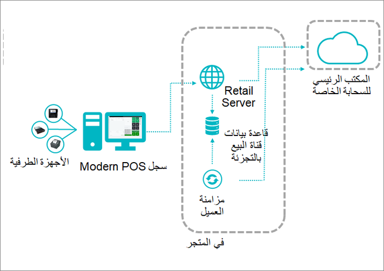

تتوفر العديد من نماذج التوزيع المتعددة للعملاء، وذلك وفقاً لاحتياجاتهم وبيئات التشغيل لديهم. يمكن استخدام النماذج بسيناريوهات متعددة، وتشمل السيناريوهات المختلطة في حالة وجود خليط من النماذج لديك، وسيناريو يمكنك من خلاله استخدام نماذج متعددة على نحو متزامن، والمزيد.

## الشبكة السحابية الأولى
 
المخطط الأول والأكثر شمولاً هو **Store Commerce الشبكة السحابية الأولى**. وعلى الرغم من أن هذا المخطط لا يدخل بشكل كبير ضمن الأمور المتعلقة بالتوزيع، إلا أنه يغطي أجزاءً من التوزيع مثل تثبيت ‏‫Store Commerce على Windows باستخدام نظام إدارة يعمل على الإشراف على ما تقوم به سجلاتك، كما أنه يقرر الشكل الذي ستظهر عليه قاعدة البيانات لديك. تتضمن **Store Commerce الشبكة السحابية الأولى** مجموعة متنوعة من الأجهزة الطرفية المتصلة بشكل مباشر. هذا النموذج هو المستخدم بشكل شائع عبر قاعدة العملاء، وخصوصاً للعملاء غير المتأكدين من مدى الجودة التي سيكون عليها اتصال WAN لديهم داخل المتجر. 

تعرض الصورة التالية **نموذج الشبكة السحابية الأولى**.

 
## Store Commerce لـ Browsers فقط.

تعرض الصورة التالية نموذج **‏‫Store Commerce لـ Browsers**. يكون هذا النموذج مفيداً للعملاء الذين يخططون لنسخ الشبكة احتياطياً مع الاحتفاظ باتصال WAN متاحاً بشكل دائم. لتمكين العمل المناسب لهذا النموذج واستخدام ‏‫Store Commerce لـ Browsers، سيكون لديك وحدة محطة أجهزة منفصلة داخل المتجر، والتي تتصل بالأجهزة الطرفية، ثم تقوم بتوصيلها جميعاً بالشبكة السحابية، وهو الأمر الذي يسمح لواجهة Retail Server و‏‫Store Commerce لـ Browsers في الشبكة السحابية من التصرف كبيئة أساسية. 

 
## Store Commerce لـ Browsers المزودة بمحطة أجهزة‬

‏‫يعد الإصدار الأكثر تنظيماً من نموذج **Store Commerce لـ Browsers فقط** هو **‬‏‫Store Commerce لـ Browsers المزودة بمحطة أجهزة**. يسمح هذا النموذج بالاتصال المباشر بالأجهزة الطرفية غير المتصلة بالشبكة. وقد يكون هو السيناريو الأكثر معيارية عندما تقوم بإعداد Store Commerce لـ Browsers، ولكنه يعد النموذج الأمثل مثل النموذج السابق بشكل فعال. 

تعرض الصورة التالية نموذج **‏‫Store Commerce لـ Browsers المزودة بمحطة أجهزة**.

## Store Commerce لـ Browsers المزودة بـ Store Commerce غير متصلة

يقدم النموذج **Store Commerce لـ Browsers المزودة بـ Store Commerce غير متصلة** نموذجاً مختلطاً يغطي كلاً من ‏‫Store Commerce لـ Windows و‏‫Store Commerce لـ Browsers كجزء من الإعداد.‬ الحالة النموذجية لهذا السيناريو هي المكان الذي تستخدم فيه Store Commerce لـ Browsers بشكل أساسي ثم تستخدم Store Commerce لـ Windows كوحدات نسخ احتياطي أو كوحدات قياسية تعمل دائماً عن طريق الصرّافين.

تعرض الصورة التالية نموذج **‏‫Store Commerce لـ Browsers المزودة بـ Store Commerce غير متصلة**.

 
 
## وحدات CSU الموزعة داخل المتجر

تمثل **وحدات Commerce Scale Units (‏CSU)** المفهوم المحلي، بمعنى أنه سيتم توزيعه داخل المتجر. على سبيل المثال، يمكن استخدام هذا النموذج في مركز بيانات أو في عدة أماكن أخرى. ومع ذلك، فإن السيناريو غالباً قد يتضمن Store Commerce لـ Windows أو Store Commerce لـ Browsers تتصل مباشرة بوحدة Commerce Scale Unit في الطبقة المحلية ثم الانتقال إلى الشبكة السحابية لإجراء مكالمات الوقت الحقيقي والسيناريوهات التي تتطلب وصول WAN. 

تعرض الصورة التالية نموذج **وحدة CSU الموزعة داخل المتجر**.
 
 

## وحدات CSU الموزعة في المجموعة الخاصة
 
يغطي نموذج **وحدات CSU الموزعة في المجموعة الخاصة** مفهوم المتاجر المتعددة. يمكنك استخدام هذا النموذج إذا كانت لديك قاعدة بيانات أحادية القناة، ثم أصبح لديك متاجر متعددة متصلة بوحدة CSU فردية. ولا تكون بالضرورة علاقة واحد لواحد. 

حالة الاستخدام هذه هي الأكثر شيوعاً لأن معظم المتاجر تتصل بوحدة CSU واحدة، وتقوم عادةً بمشاركة نفس مجموعة البيانات. وغالباً ما يُستخدم هذا السيناريو بواسطة عملاء المؤسسات الكبيرة الذين لديهم مراكز بيانات خاصة بهم ويرغبون في استخدامها. كما يفضلون الاعتماد على وحدات CSU في مراكز البيانات الخاصة بهم، ثم يكون لديهم متجراً وحداً أو أكثر تنتشر في مناطق مختلفة متصلة بمراكز البيانات لديهم. 

تعرض الصورة التالية نموذج **وحدة CSU الموزعة في مجموعة خاصة**.

 

## "N-1" مع AX2012 R3
 
سيتم استخدام النموذج **"‏N-1" مع AX 2012 R3** عندما تكون جميع المتاجر لديك من متاجر الإصدار القديم Dynamics AX 2012 R3، وترغب في استخدام Dynamics 365 Commerce. وتعد هذه الإصدارات إصدارات المتجر القديمة التي ستتصل بRetail Server، لكنك ستستخدم Microsoft Cloud لعمليات Dynamics 365. 

تعرض الصورة التالية النموذج **"‏N-1" مع AX2012 R3**. 

 

## مخطط المجموعة متعددة المناطق
   
يعد أول السيناريوهات الأكثر تقدماً هو **مخطط المجموعة متعددة المناطق**. عندما تقوم أولاً بإنشاء إحدى البيئات، إذا كانت مؤسستك تنتشر عبر مواقع عدة حول العالم، فمن الضروري أن تمتلك القدرة على إنشاء وحدات Commerce Scale Units (‏CSU) التي تتسم بالطابع المحلي بشكل أكبر للأماكن التي تقع بها مجموعات المتاجر لديك. سيظل المقر الرئيسي في موقع واحد، لذلك من المحتمل أن يحدث بعض التأخير في مكالمات الوقت الحقيقي لديك، لكن ستلحظ تحسناً كبيراً في التشغيل في التعاملات الأكثر شيوعاً لديك وفي الأنشطة التجارية اليومية.

تعرض الصورة التالية مثالاً على **مخطط المجموعة متعددة المناطق**.

 
 
## LBD – البيانات المحلية للشركة

يتم استخدام نموذج **LBD – البيانات المحلية للشركة** للحلول المحلية. يستخدم هذا النموذج نسيج الخدمة لمنحك بيئة متكاملة مزودة بكل الميزات للسيناريو المحلي، وذلك عندما يكون لديك مجموعة متنوعة من الأجهزة الظاهرية ولديك القدرة على التعامل مع المشكلات في الفرع الرئيسي، والوصول إلى مقراتك الرئيسية، ولديك القدرة على استخدام Retail Store Scale Unit أو وحدة Commerce Scale Unit (فيما سبق).

تعرض الصورة التالية نموذج **البيانات المحلية للشركة**.

