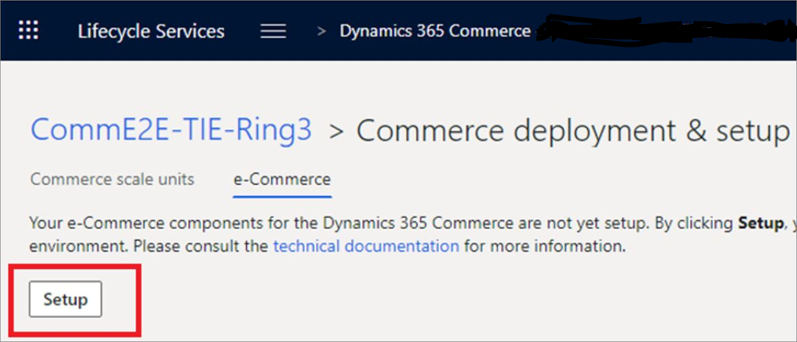
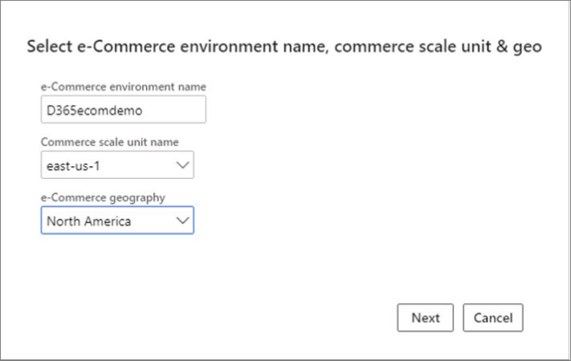

ميزة مرخصة بشكل منفصل، لا يتم تضمين e-Commerce لـ Dynamics 365 Commerce في ترخيص Dynamics 365 Commerce.A separately licensed feature, e-Commerce for Dynamics 365 Commerce is not included in the Dynamics 365 Commerce license. 

توفر E-Commerce جميع الأدوات المطلوبة لمساعدتك في إنشاء واجهة مستخدم (UI) ويب حديثة لأنشطة إدارة المحتوى.E-Commerce provides all the required tools to help you create a modern web UI for your content management activities. ترتبط كل بيئة من بيئات e-Commerce بوحدة CSU فردية.Each e-Commerce environment is associated with a single CSU. يمكن أن تحتوى كل بيئة من بيئات e-Commerce على مواقع متعددة، ويمكنك استخدام نفس البيئة لكل موقع من مواقعك.Each e-Commerce environment can contain multiple sites, and you can use the same environment for each of your sites. 

علاوة على ذلك، يمكن ربط كل موقع بالعديد من قنوات المتاجر عبر الإنترنت بـ Commerce Headquarters، مع الإعدادات الخاصة بها على تشكيلة المنتجات وإعدادات اللغة وجميع الإعدادات الأخرى.Furthermore, each site can be associated with multiple online store channels into Commerce Headquarters, with their own settings on product assortments, language settings, and all other setup.
 
عند البدء في تهيئة e-Commerce، سيطلب منك توفير Azure Active Directory مع مجموعة من المجموعات الأمنية لأغراض مختلفة.When starting the initialization of e-Commerce, you will be asked to provide Azure Active Directory with a set of security groups for different purposes. يجب أن يكون لديك مجموعة أمان واحدة لمسؤولي e-Commerce، وإذا اخترت ميزة التقييمات والمراجعات، يجب أن توفر واحدة لمشرفي التقييمات والمراجعات أيضاً.You need to have one security group for e-Commerce administrators, and if you opt in for the ratings and reviews feature, you need to provide one for the ratings and reviews moderators as well. يمكن استخدام نفس المجموعة الأمنية لكلا الغرضين.The same security group can be used for both purposes. 

عندما تقوم بتفعيل e-Commerce وإنشاء ملكية مجموعة الأمان، إذا قمت بإنشاء مجموعة الأمان، فهذا لا يعني أنك عضو فيها أيضاً.When you are initializing e-Commerce and creating the security group ownership, if you create the security group, it doesn’t mean that you are also member of it. سوف تحتاج إلى إضافة نفسك كعضو في تلك المجموعة الأمنية بحيث عندما تتم تهيئة e-Commerce في وقت لاحق، يمكنك الوصول إلى e-Commerce Site Builder.You will need to add yourself as a member of that security group so that, when e-Commerce is initialized later, you can have access to the e-Commerce Site Builder. يمكن تعديل أذونات E-Commerce بعد التهيئة من منشأ الموقع.E-Commerce permissions can be adjusted after the initialization from the Site Builder. وكجزء من عملية التهيئة، ينبغي دائماً إسناد دور أمان مسؤول e-Commerce إلى مجموعة من المستخدمين الذين سيحتاجون إلى الوصول إلى الإعدادات في وقت لاحق.As part of the initialization process, the e-Commerce administrator security role should always be assigned to a group of users who would need to access the settings later.
 
مع التهيئة الناجحة لوحدة CSU، يمكنك تحديد علامة تبويب **e-Commerce** لصفحة **توزيع Commerce وإعدادها** في LCS.With the successful initialization of the CSU, you would select the **e-Commerce** tab of the **Commerce deployment & setup** page in LCS.

 
في علامة تبويب **e-Commerce**، حدد **إعداد**.In the **e-Commerce** tab, you select **Setup**.

 
بعد تحديد **إعداد**، ستبدأ عملية التهيئة مع علامة تبويب **تحديد اسم بيئة e-Commerce، وcommerce scale unit والموقع الجغرافي لها**.After selecting **Setup**, the initialization will begin with the **Select e-Commerce environment name, commerce scale unit & geo** tab.

  
- **اسم بيئة e-Commerce** - فريد من نوعه، ومعرف سهل لهذه البيئة وسوف يكون مرئياً في عناوين URL الخاصة بـ Site Builder.**e-Commerce environment name** - Is a unique, friendly identifier for this environment and will be visible in the Site Builder URLs. 
- **اسم Commerce scale unit** - يتم تعبئته تلقائياً، أويتم إنشاؤها من أجلك، استنادا إلى وحدة CSU التي قمت بتأهيلها أو توزيعها لهذه البيئة.**Commerce scale unit name** - is filled out automatically, or is created for you, based on the CSU that you have initialized or deployed for this environment. 
- **الموقع الجغرافي لـ e-Commerce** - يعتمد التوافر العالي الذي يتم تنفيذه في e-Commerce على قيامك بإعداد مناطقك الجغرافية الأولية والثانوية.**e-Commerce geography** - The high availability that is implemented in e-Commerce relies on you having set up your primary and secondary geographical regions. فمن الممكن أن يكون لدينا مناطق أكثر من المنطقتين الأوليتين، مما يتيح إمكانية النسخ المتماثل من منطقة إلى أخرى. وستقوم مكونات e-Commerce بالاتصال Commerce API بشكل متكرر، ولن يتم صرف معظم هذه المكالمات لأن الاتصالات يجب أن تتم في الوقت الحقيقي.It's possible to have more regions than the initial two, which enable potential replication from one region to another.E-Commerce components will call the Commerce API frequently, and most of those calls will not be cashed because the communication needs to be in real time. لهذا السبب، نوصي باختيار موقع جغرافي قريب من موقع وحدة CSU لأنه سيساعد على تجنب مشاكل زمن الانتقال.For this reason, we recommend that you select a geographical location that is close to the CSU location because it will help avoid issues with latency.

بعد تحديد اسم البيئة، وCSU، والموقع الجغرافي، حدد **التالي** واستمر في الإعداد.After selecting your environment name, CSU, and geographical location, select **Next** and continue with the setup. 

يتم تنفيذ الخطوة الثانية من التهيئة في علامة التبويب **الإعدادات الأخرى**.The second step of the initialization is performed in the **Other settings** tab.

- **إعداد أسماء المضيفين** - المكان الذي ستقوم فيه بإدخال المجالات أو أسماء المضيفين المقبولة في بيئة e-Commerce.**Set up host names** - Where you will enter the domains or the host names that are accepted by the e-Commerce environment. لن يتم تسجيل أي مجال أو أنشطة DNS على هذه المجالات عن طريق إدخال المعلومات في هذا القسم.No domain registration or DNS activities will take place on these domains by entering the information in this section. يتم تكوين هذه المعلومات في النظام بحيث عندما ترسل المكونات الأولية (على سبيل المثال، CDM أو البيانات من موازنات أحمال عمل مختلفة) حركة زيارات من هذا المجال إلى e-Commerce، ستعرف وستسمح لحركة الزيارات هذه بالمرور.This information is configured in the system so that when the upstream components (for example CDM or data from different load balancers) send traffic from this domain into e-Commerce, they will know to let that traffic through. 
- **مجموعه أمان e-Commerce** - يمكنك إدخال هذه البيانات عن طريق البحث عن مجموعة الأمان.**Security group for e-Commerce** - You can enter this data by searching for the security group. 
- **مجموعه أمان التقييمات والمراجعات** - ستتمتع الحسابات الموجودة في مجموعة الأمان هذه بالوصول إلى المراجعات من Site Builder وسيكون بإمكانها تنسيقها ومعرفة ما تمت تهيئته.**Ratings and reviews security group** - The accounts in this security group will have access to the reviews from the Site Builder and they are able to moderate them and see what has been initialized. عند التحقق من تأكيد مجموعة الأمان الخاصة بك بشكل صحيح، يمكنك تحديد **تهيئة**.When you have verified that your security groups are correctly selected, you can select **Initialize**.

بعد هذه الخطوة، سيتم توجيهك إلى **الإصدار الأولي من e-Commerce**، وستبدأ التهيئة.After this step, you will be redirected to the **e-Commerce preview**, and the initialization will begin. بالإضافة إلى ذلك، بعد تنفيذ هذه الخطوة، سيتم تنفيذ سلسلة من الأنشطة فيما يتعلق بجميع مكونات e-Commerce التي سبق ذكرها.Additionally, after performing this step, a pipeline with activities will be implemented for all e-Commerce components that were previously mentioned. عند هذه النقطة، يمكنك مغادرة الشاشة والعودة لاحقاً للتحقق من التقدم.At this point, you can leave the screen and return later to check the progress.

الآن، تم تهيئة e-Commerce بنجاح، وستتمكن من الوصول إلى روابط موقع e-Commerce الجديد وe-Commerce Site Builder.Now, e-Commerce has been successfully initialized, and you will have access to links for the new e-Commerce site and e-Commerce Site Builder. هذه الروابط مفيدة لأنه يمكنك التحقق بسرعة من عنوان IP للواجهة وأسماء بيئة e-Commerce الفريدة لكل بيئة.These links are useful because you can quickly check the interface IP address and the e-Commerce environment names that are unique for every environment.

