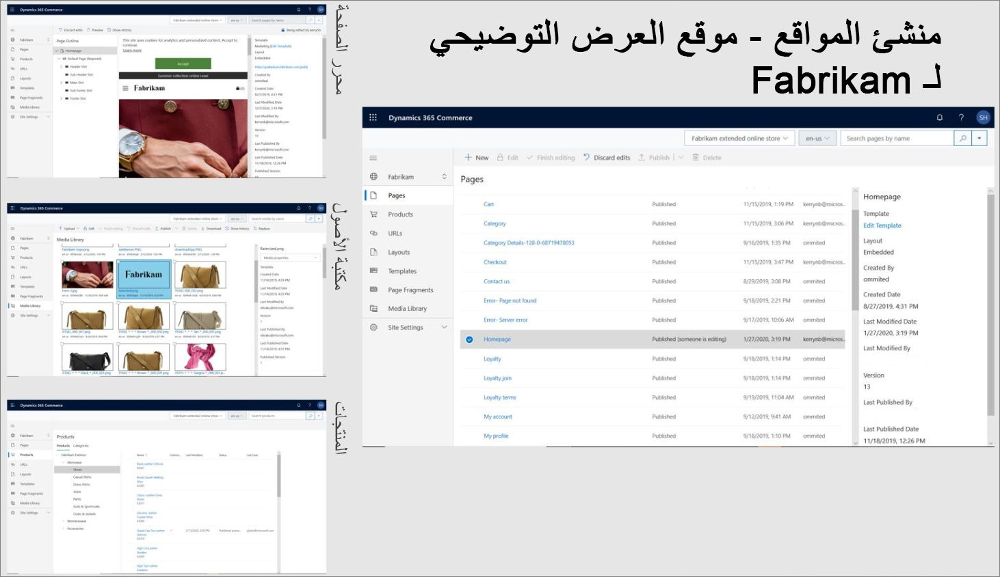
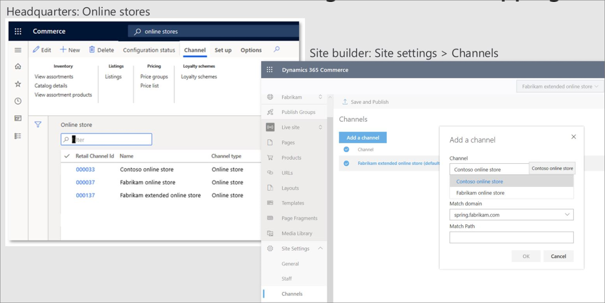

يمكنك اتباع خطوات ما بعد التزويد لإنهاء توزيع بيئة التجارة الإلكترونية الخاصة بك وتكوينها. ‫يُعد منشئ الموقع بمثابة البيئة الخاصة بك حيث يمكنك إنشاء المواقع وإدارتها وحيث يمكنك تحميل الأصول الرقمية الخاصة بك وإدارتها.
 
سيؤدي تحديد رابط **منشئ الموقع** لـ LCS إلى نقلك مباشرةً إلى بيئة Site builder. لاحظ أن الصفحة المنتقل اليها بها موقعين. هذه المواقع عبارة عن مواقع تجريبية تم تكوينها مسبقاً باستخدام الصفحات والأصول والأجزاء وعناوين URL. يمكنك استخدام هذه المواقع المنشأة مسبقاً لأغراض مرجعية، أو يمكنك تخصيصها والبدء في إنشاء الموقع. 

يظهر مثال لموقع تم عرضه في لقطة الشاشة التالية.
 

يُعد منشئ الموقع بمثابة البيئة التي سيعمل فيها أي شخص له دور في إنشاء الصفحات وإدارة المحتوى وإدارة الصور والأصول الرقمية. 

في هذه البيئة، يمكنك تحديد عناوين URL التي سيستخدمها العملاء للوصول إلى الصفحات عن طريق تعيينها إلى الصفحات بدلاً من الصفحات التي تمثل عناوين URL. لذلك، يتم فصل عنوان URL لصفحة على موقع ما عن المكان الذي توجد فيه الصفحة، ويعمل كمؤشر لصفحة حتى لا تضطر إلى الاحتفاظ بتدرج هرمي للصفحة في منشئ الموقع. ونتيجة لذلك، يمكنك تبديل الصفحات دون تغيير عنوان URL. 

ومن المفاهيم المهمة التي يجب فهمها حول منشئ الموقع هي علاقته بالمركز الرئيسي لـ Commerce، وبالتالي، وحدة Commerce Scale Unit التي يتواصل معها. عندما يتم إنشاء مواقع جديدة، يتم الربط بين منشئ الموقع وقناة واحدة أو أكثر سيخدم هذا الموقع المحتوى أو المنتجات، كما هو موضح في لقطة الشاشة التالية. 

يوجد على الجانب الأيسر من المثال ثلاثة متاجر عبر الإنترنت أو قنوات عبر الإنترنت في المركز الرئيسي، وداخل أداة منشئ الموقع، يمكنك ربط الموقع بإحدى هذه القنوات أو جميعها. هذه الميزة مهمة نظراً لأن منشئ الموقع يمنحك القدرة على البحث في منتجاتك وتصفحها، كما يساعدك على التنقل عبر المنتجات للقناة التي يرتبط بها الموقع. من خلال قيامك بإنشاء هذا الرابط، يمكنك تنفيذ عملية تخصيص أو سرد قصص حيث يمكنك تحسين منتج لإنشاء محتوى تسويقي إضافي ومبيعات متخصصة إضافية ورسائل مقنعة تتعلق بمنتج واحد. 

لديك قدر كبير من المرونة لربط موقع وقناة عنوان URL الخاصة بك. على سبيل المثال، من الممكن أن يكون لديك موقع يخدم جميع المناطق والأسواق التي تستخدم قناة واحدة. خذ بعين الاعتبار الأمثلة من قبيل Contoso.com وContoso.uk وغيرها من المواقع. هذه المواقع عبارة عن عروض عمومية أو مواقع عمومية لشركة Contoso وتشير جميعها إلى قناة واحدة ومجموعة واحدة متنوعة من المحتوى ومجموعة واحدة من المنتجات. من الممكن أيضاً تقسيم كل سوق من هذه الأسواق أو المناطق إلى قنوات منفصلة، حيث يشير موقع Contoso.com إلى قناة واحدة أو مجموعة واحدة من المنتجات، بينما قد يشير موقع اليابان Contoso.jp إلى قناة مختلفة أو مجموعة مختلفة من المنتجات.
 
هناك اتصال مهم آخر بين منشئ الموقع والمركز الرئيسي لـ Commerce (HQ) وهو يتعلق بالأصول الرقمية. المركز الرئيسي هو المقر الرئيسي للمنتجات، ويحتوي على جميع المعلومات حول المنتج مثل الاسم والوصف والسمات. كما أنه يعرف الصور المتوفرة للمنتجات؛ ومع ذلك، تتم استضافة الصور بواسطة Digital Asset Manager وتتم إدارتها في منشئ الموقع. 

عندما يتم تحميل هذه الصور في Digital Asset Manager ومنشئ الموقع، سيتعرف منشئ الموقع على مكان الصور وسيحدد أنها أساس صور URL الخاصة بك، وسيفهم المركز الرئيسي ما المنتجات الموجودة في القناة. يمكن أن يؤدي الجمع بين هاتين الميزتين معاً في المركز الرئيسي إلى تقديم عنوان URL الصحيح لصورة المنتج. خطوة التكوين الإضافية هذه هي خطوة يجب إجراؤها في المركز الرئيسي عن طريق تعيين الارتباط الصحيح إلى مدير الأصول الرقمية.
 
سيلزم اتخاذ خطوة إضافية بعد التزويد إذا كنت تريد استخدام إمكانيات بريد معاملات المركز الرئيسي لـ Commerce. بالنسبة للمتاجر عبر الإنترنت، ستتلقى اتصالات مستمرة عبر البريد الإلكتروني كنتيجة لإجراء عملية شراء عبر الإنترنت، مثل "شكراً لك على طلبك" أو "لقد تلقينا طلبك" أو في حالة الاستلام من المتجر، "تم شحن طلبك". سيتم إرسال رسائل البريد الإلكتروني هذه إليك بصفتك مستهلكاً للموقع قد أجرى عملية شراء عبر الإنترنت. 

يتيح لك المركز الرئيسي لـ Commerce إمكانية إنشاء رسائل البريد الإلكتروني هذه كما يوفر إمكانيات عديدة. يوفر قالب بريد إلكتروني يمكنك تكوينه باستخدام محتوى هذا البريد الإلكتروني. ويتيح أيضاً إمكانية التعيين بين الحدث والقالب، بحيث يمكنك تعيين كل أمر تم استلامه، وكل أمر تم شحنه، وكل أمر تم استلامه من المتجر، وكل أمر تم إلغاؤه، وجميع الأحداث الأخرى المدعومة بقوالب فردية. بالإضافة إلى ذلك، يمكنك تكوين خادم SMTP للبريد الصادر والذي سيرسل رسائل البريد الإلكتروني هذه لأنها ليست خدمة يوفرها Dynamics 365 بشكل جاهز. بالنسبة لهذه الميزة، سيحتاج العميل إلى توفير البنية التحتية لخدمة SMTP الخاصة به لإرسال رسائل البريد الإلكتروني. 

تتمثل الخطوة التالية في إعداد السير لتعيين الأحداث في المركز الرئيسي إلى قوالب فردية. يمكن لكل قناة عبر الإنترنت، أو بالأحرى، يمكن لكل قناة بيع بالتجزئة أن تستخدم نفس التعيين، والذي يشار إليه بملف تعريف إخطار البيع بالتجزئة. يمكنك مشاركة نفس التعيين مع كل قناة باستخدام نفس القوالب، أو يمكنك مزجها ومطابقتها بحيث تستخدم كل قناة التعيين الخاص بها بين الأحداث والقوالب. 
 
قالب البريد الإلكتروني هو العرض الذي يحصل عليه العميل. إذا كنت تستخدم قنوات متعددة عبر مناطق متعددة، فيمكن ترجمة القوالب لتناسب اللغات المختلفة. بالإضافة إلى ذلك، يمكنك تحميل قوالب لكل لغة من هذه اللغات. نتيجة لذلك، عندما يقوم شخص ما بإجراء عملية شراء في تلك القناة، سيتلقى بريداً إلكترونياً باللغة المترجمة الخاصة بتلك القناة. يتكون القالب من HTML، حيث يمكنك تكوين العناصر النائبة أو الرموز المميزة حيث يتم إدراج البيانات الديناميكية من أمر المبيعات في القالب. عندما يتم إرسال بريد إلكتروني، يتم استرداد معرف المبيعات من أمر المبيعات ويتم إدراجه في العنصر النائب الصحيح للقالب وإرساله إلى العميل. 
