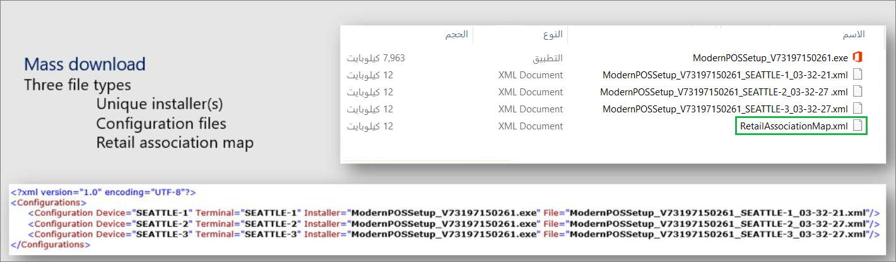

<span data-ttu-id="e228e-101">تتضمن الحالة الحالية من التوزيع الجماعي المعالجة الصامتة لعمليات التثبيت الحالية والتوزيع الصامت لنقطة البيع.</span><span class="sxs-lookup"><span data-stu-id="e228e-101">The current state of mass deployment includes silent servicing of current installations and silent POS deployment.</span></span> <span data-ttu-id="e228e-102">يمكن للتوزيع الجماعي التحديث إلى إصدار أحدث على أي مكونات مثبتة حالياً من بنية Commerce.</span><span class="sxs-lookup"><span data-stu-id="e228e-102">Mass deployment can update to a newer version on any currently installed components from the Commerce architecture.</span></span> <span data-ttu-id="e228e-103">وتعني المعالجة الصامتة تشغيل المثبت بصمت وعدم استخدام واجهة مستخدم رسومية (GUI).</span><span class="sxs-lookup"><span data-stu-id="e228e-103">Silent servicing means that it runs the installer silently and no graphical user interface (GUI) is used.</span></span> <span data-ttu-id="e228e-104">المعالجة الصامتة قابلة للبرمجة، مما يعني أنه يمكن استخدام الأوامر لجميع مثبتات الخدمة الذاتية القياسية لـ Commerce ونقطة البيع.</span><span class="sxs-lookup"><span data-stu-id="e228e-104">Silent servicing is scriptable, which means that commands can be used for all standard self-service installers for Commerce and POS.</span></span>

<span data-ttu-id="e228e-105">يبدأ مخطط التوزيع الجماعي بتثبيت المعالجة الصامتة في CSU ونقطة البيع.</span><span class="sxs-lookup"><span data-stu-id="e228e-105">The mass deployment roadmap starts with the silent servicing installation to the CSU and POS.</span></span> <span data-ttu-id="e228e-106">وبعد ذلك، يكون المكون التالي الذي سيتم توزيعه هو محطة الأجهزة.</span><span class="sxs-lookup"><span data-stu-id="e228e-106">Then, the next component to deploy is the hardware station.</span></span> <span data-ttu-id="e228e-107">الهدف النهائي هو تكامل إدارة البيانات الرئيسية (MDM)، والذي يتم استخدامه لاقتران المجموعة والإنشاء التلقائي للحزم القابلة للتوزيع.</span><span class="sxs-lookup"><span data-stu-id="e228e-107">The end goal is the Master Data Management (MDM) integration, which is used for collection association and automatic creation of deployable packages.</span></span>

<span data-ttu-id="e228e-108">يمكن توزيع كافة المكونات باستخدام الأوامر التالية:</span><span class="sxs-lookup"><span data-stu-id="e228e-108">All components can be deployed with the following commands:</span></span>
   
- <span data-ttu-id="e228e-109">**الأمر الذي يقوم بتحديث التثبيت الحالي لـ CSU باستخدام ملف تكوين محدد**.</span><span class="sxs-lookup"><span data-stu-id="e228e-109">**Command that updates the current installation of CSU by using a specific configuration file**.</span></span> <span data-ttu-id="e228e-110">- قد لا يكون ملف التكوين هذا في نفس موقع الملف القابل للتنفيذ الخاص بالمثبت.</span><span class="sxs-lookup"><span data-stu-id="e228e-110">- This configuration file might not be in the same location as the executable file for the installer.</span></span> <span data-ttu-id="e228e-111">يقوم هذا الأمر بتخطي التحقق من المتطلب الأساسي وينتقل إلى خطوات التثبيت.</span><span class="sxs-lookup"><span data-stu-id="e228e-111">This command skips the prerequisite check and moves on to the installation steps.</span></span> <span data-ttu-id="e228e-112">يمكنك استخدام هذا الأمر للتطوير أو الاختبار.</span><span class="sxs-lookup"><span data-stu-id="e228e-112">You can use this command for development or testing.</span></span>

    ```Console
    StoreSystemSetup_V72.exe -S -C "C:\Temp\StoreSystemSetup_V72_Houston.xml" -SkipPrerequisiteCheck
    ```

- <span data-ttu-id="e228e-113">**الأمر الذي يقوم بتثبيت نقطة البيع الحديثة أو تحديثها بصمت** - وهو يتضمن بنية الأمر القياسية المستخدمة في معالجة المكونات المثبتة حالياً بشكل تلقائي.</span><span class="sxs-lookup"><span data-stu-id="e228e-113">**Command that silently installs or updates Modern POS** - It has the standard command structure that is used for silent servicing of components that are currently installed.</span></span> <span data-ttu-id="e228e-114">وتستخدم البنية القيم الأساسية لـ <InstallerName>.exe وأمر التثبيت التلقائي: **-S**.</span><span class="sxs-lookup"><span data-stu-id="e228e-114">The structure uses the basic values of <InstallerName>.exe and the command for silent installation: **-S**.</span></span> <span data-ttu-id="e228e-115">يستخدم هذا الأمر ملف التكوين الموجود في نفس موقع الملف القابل للتنفيذ للمثبت، في حالة وجود ملف تكوين هناك.</span><span class="sxs-lookup"><span data-stu-id="e228e-115">This command uses the configuration file that is in the same location as the executable file for the installer, if a configuration file exists there.</span></span> <span data-ttu-id="e228e-116">يجب عدم استخدامه في حالة توفر ملفات تكوين متعددة.</span><span class="sxs-lookup"><span data-stu-id="e228e-116">It should not be used if multiple configuration files are available.</span></span>
    
    ```Console
    ModernPOSSetup_V73.exe -S
    ```

- <span data-ttu-id="e228e-117">**الأمر الذي يقوم بالتثبيت التلقائي للتثبيت الحالي لنقطة البيع الحديثة باستخدام ملف تكوين محدد**.</span><span class="sxs-lookup"><span data-stu-id="e228e-117">**Command that silently installs the current installation of Modern POS by using a specific configuration file**.</span></span> <span data-ttu-id="e228e-118">- قد لا يكون ملف التكوين هذا في نفس موقع الملف القابل للتنفيذ للمثبت، أو قد تتوفر ملفات تكوين متعددة.</span><span class="sxs-lookup"><span data-stu-id="e228e-118">- This configuration file might not be in the same location as the executable file for the installer, or multiple configuration files might be available.</span></span>

    ```Console
    ModernPOSSetup_V72.exe -S -C "C:\Temp\ModernPOSSetup_V73_Houston-3.xml"
    ```

- <span data-ttu-id="e228e-119">**أمر يقوم بتثبيت محطة الأجهزة أو تحديثها بصمت** - يقوم الأمر التالي بتثبيت (أو تحديث) محطة الأجهزة بصمت.</span><span class="sxs-lookup"><span data-stu-id="e228e-119">**Command that silently installs or updates hardware station** - The following command silently installs (or updates) hardware station.</span></span> <span data-ttu-id="e228e-120">وهو يتضمن بنية الأمر القياسية المستخدمة في معالجة المكونات المثبتة حالياً بشكل تلقائي.</span><span class="sxs-lookup"><span data-stu-id="e228e-120">It has the standard command structure that is used for silent servicing of components that are currently installed.</span></span> <span data-ttu-id="e228e-121">يستخدم الهيكل القيم الأساسية لـ **&lt;InstallerName&gt;.exe**، وأمر التثبيت التلقائي **-S**.</span><span class="sxs-lookup"><span data-stu-id="e228e-121">The structure uses the basic values of **&lt;InstallerName&gt;.exe** and the command for silent installation, **-S**.</span></span> <span data-ttu-id="e228e-122">كما أنه يستخدم المحدد **-SkipMerchantInfo** لتخطي تنزيل معلومات حساب التاجر من خلال الأداة المساعدة.</span><span class="sxs-lookup"><span data-stu-id="e228e-122">It also uses the **-SkipMerchantInfo** delimiter to skip the download of merchant account information through the utility.</span></span> <span data-ttu-id="e228e-123">يستخدم هذا الأمر ملف التكوين الموجود في نفس موقع الملف القابل للتنفيذ للمثبت.</span><span class="sxs-lookup"><span data-stu-id="e228e-123">This command uses the configuration file that is in the same location as the executable file for the installer.</span></span>

    ```Console
    HardwareStationSetup_V10.exe -S -SkipMerchantInfo
    ```

- <span data-ttu-id="e228e-124">**الأمر الذي يقوم بالتثبيت التلقائي للتثبيت الحالي لمحطة الأجهزة‬ باستخدام ملف تكوين محدد**.</span><span class="sxs-lookup"><span data-stu-id="e228e-124">**Command that silently installs the current installation of the hardware station by using a specific configuration file**.</span></span> <span data-ttu-id="e228e-125">- قد لا يكون ملف التكوين هذا في نفس موقع الملف القابل للتنفيذ للمثبت، أو قد تتوفر ملفات تكوين متعددة.</span><span class="sxs-lookup"><span data-stu-id="e228e-125">-  This configuration file might not be in the same location as the executable file for the installer, or multiple configuration files might be available.</span></span>

    ```Console
    HardwareStationSetup_V10.exe -S -SkipMerchantInfo -C "C:\Temp\HardwareStationSetup_V10__20-19-35.xml"
    ```

<span data-ttu-id="e228e-126">لتتمكن من تنزيل أدوات تثبيت الوحدة الطرفية لنقطة البيع بشكل جماعي، من Commerce، انتقل إلى **Retail وCommerce module > القنوات > توزيع القنوات**.</span><span class="sxs-lookup"><span data-stu-id="e228e-126">To be able to collectively download your POS terminal installers, from Commerce, go to **Retail and Commerce module > Channels > Channel deployment**.</span></span> <span data-ttu-id="e228e-127">حدد **التنزيل الشامل** لتنزيل المثبتات الطرفية.</span><span class="sxs-lookup"><span data-stu-id="e228e-127">Select **Mass download** to download your terminal installers.</span></span>

<span data-ttu-id="e228e-128">يتيح لك توزيع القناة تحديد العقد الخاصة بك من منظور التدرج الهرمي للمؤسسات لسحب وتنزيل كل مثبت فريد وكل ملف تكوين.</span><span class="sxs-lookup"><span data-stu-id="e228e-128">The channel deployment allows you to select your nodes from an organization hierarchy perspective to pull over and download every unique installer and every configuration file.</span></span>

<span data-ttu-id="e228e-129">بعد التنزيل، سيظهر لك ثلاثة أنواع من الملفات للتوزيع الشامل، كما هو موضح في المثال التالي.</span><span class="sxs-lookup"><span data-stu-id="e228e-129">After the download, you will be presented with three types of files for mass deployment, as shown in the following example.</span></span> 

<span data-ttu-id="e228e-130">[ ](../media/mass-deploy-file-types.png#lightbox)</span><span class="sxs-lookup"><span data-stu-id="e228e-130">[ ](../media/mass-deploy-file-types.png#lightbox)</span></span>
 
<span data-ttu-id="e228e-131">تتوفر أنواع متعددة من المثبتات: المثبت الافتراضي، والذي ينتقل إلى كل متجر، والعديد من المتاجر التي يتم توزيعها على مجموعة فرعية من المتاجر.</span><span class="sxs-lookup"><span data-stu-id="e228e-131">Multiple types of installers are available: a default installer, one that goes to every store, and several that are distributed to a subset of stores.</span></span> <span data-ttu-id="e228e-132">تقوم هذه المجموعة الفرعية من المتاجر بتثبيت إصدار الجيل التالي من الوحدة الطرفية للتحقق في الإنتاج (على نطاق أصغر) من أن كل شيء يعمل كما ينبغي.</span><span class="sxs-lookup"><span data-stu-id="e228e-132">This subset of stores installs the next generation version of the terminal to verify in production (on a smaller scale) that everything is working as it should.</span></span> 

<span data-ttu-id="e228e-133">بعد ذلك، سيكون لديك ملفات التكوين الخاصة بك، والتي تتم الإشارة اليها كمخطط اقتران البيع بالتجزئة.</span><span class="sxs-lookup"><span data-stu-id="e228e-133">Then, you will have your configuration files, which are referred to as the retail association map.</span></span> <span data-ttu-id="e228e-134">يُستخدم مخطط اقتران البيع بالتجزئة لفهم ملفات التكوين التي تنتقل إلى المثبتات.</span><span class="sxs-lookup"><span data-stu-id="e228e-134">The retail association map is used to understand which configuration files go to which installers.</span></span> 
 
<span data-ttu-id="e228e-135">بشكل عام، يمكنك تعيين الملفات بناءً على التسمية أو عن طريق التحقق من أسماء الملفات بعد فتح ملف المخطط.</span><span class="sxs-lookup"><span data-stu-id="e228e-135">In general, you can map the files based on naming or by checking the files names after you have opened the map file.</span></span> <span data-ttu-id="e228e-136">باستخدام البرامج النصية، يمكنك تعيينها تلقائياً وتوزيعها، وهذا هو الغرض من Microsoft System Center.</span><span class="sxs-lookup"><span data-stu-id="e228e-136">With scripts, you can auto map and deploy them, which is the purpose of the Microsoft System Center.</span></span> 

<span data-ttu-id="e228e-137">يقوم System Center بإجراء المعالجة الصامتة.</span><span class="sxs-lookup"><span data-stu-id="e228e-137">The System Center conducts the silent servicing.</span></span> <span data-ttu-id="e228e-138">بشكل أساسي، يقوم بتحديث المكونات المكونة حالياً ويدير توزيع MPOS وSQL.</span><span class="sxs-lookup"><span data-stu-id="e228e-138">Basically, it updates the currently configured components and manages the MPOS and SQL deployment.</span></span>
 
<span data-ttu-id="e228e-139">تشمل الفوائد المتعددة لاستخدام System Center ما يلي:</span><span class="sxs-lookup"><span data-stu-id="e228e-139">The multiple benefits of using the System Center include:</span></span>

- <span data-ttu-id="e228e-140">**زيادة إنتاجية المستخدم** - يُمكّن الموظفين من الوصول إلى تطبيقات الشركة التي يحتاجون إليها ليكونوا منتجين من أي مكان، وعلى أي جهاز يختارونه، مع المساعدة في حماية معلومات الشركة.</span><span class="sxs-lookup"><span data-stu-id="e228e-140">**Empower user productivity** – Enables employees to access the corporate applications that they need to be productive from anywhere, on whatever device they choose, while helping to protect corporate information.</span></span>
- <span data-ttu-id="e228e-141">**تبسيط الإدارة** - يدير أنظمة العميل ويوفر رؤية محسّنة وخيارات إنفاذ للحفاظ على توافق النظام.</span><span class="sxs-lookup"><span data-stu-id="e228e-141">**Simplify administration** – Administers client systems and offers improved visibility and enforcement options for maintaining system compliance.</span></span>
- <span data-ttu-id="e228e-142">**توحيد البنية الأساسية لإدارة تكنولوجيا المعلومات لديك** - يبسط العمليات باستخدام بنية أساسية موحدة تدمج إدارة الجهاز وحمايته عبر البيئات المتنقلة والمادية والافتراضية.</span><span class="sxs-lookup"><span data-stu-id="e228e-142">**Unify your IT management infrastructure** – Streamlines operations with unified infrastructure that integrates device management and protection across mobile, physical, and virtual environments.</span></span>
 
<span data-ttu-id="e228e-143">باستخدام System Center، يمكنك إنشاء حزم قابلة للتوزيع وتحديد المعلمات المطلوبة باستخدام ملف التكوين هذا كدليل.</span><span class="sxs-lookup"><span data-stu-id="e228e-143">With System Center, you can create deployable packages and specify the required parameters by using that configuration file as a guide.</span></span> <span data-ttu-id="e228e-144">في كثير من الأحيان، مع نقطة البيع الحديثة، لديك أيضاً قاعدة بيانات SQL غير متصلة بالإنترنت والتي يجب أن تكون موجودة بالفعل على نفس الجهاز ويتم إعدادها بشكل صحيح.</span><span class="sxs-lookup"><span data-stu-id="e228e-144">Frequently, with Modern POS, you also have an offline SQL database that must already be on the same machine and set up properly.</span></span> <span data-ttu-id="e228e-145">إذا كان لديك موصلات دفع خاصة، أو تخصيصات، أو خدمة برمجية أخرى عرضية لنقطة بيع ثانوية وهي تثبيت منفصل، فإن وجودها كحزم منفصلة أمر ممكن أيضاً.</span><span class="sxs-lookup"><span data-stu-id="e228e-145">If you have special payment connectors, customizations, or another software service that is tangential to a minor POS and is a separate installation, having those as separate packages is also a possibility.</span></span> 

<span data-ttu-id="e228e-146">يعد إطار الخدمة الذاتية نموذجاً جديداً يمثل جزءاً من الإصدار 2.0 من التوزيع الجماعي.</span><span class="sxs-lookup"><span data-stu-id="e228e-146">The self-service framework is a new model that is a part of Mass deployment version 2.0.</span></span> <span data-ttu-id="e228e-147">يركز هذا النموذج الجديد بشكل أكبر على القدرة على التوزيع بطريقة أكثر بعداً.</span><span class="sxs-lookup"><span data-stu-id="e228e-147">This new model is more focused around the ability to deploy in a more remote way.</span></span> <span data-ttu-id="e228e-148">كان تركيز إطار عمل الخدمة الذاتية على القدرة على البرمجة النصية والقدرة على التشغيل عن بُعد في جلسة عمل غير تفاعلية.</span><span class="sxs-lookup"><span data-stu-id="e228e-148">The focus of the self-service framework has been on ability to be scriptable and being able to run remotely in a non-interactive session.</span></span> <span data-ttu-id="e228e-149">الفائدة الرئيسية هي أنه يمكنك دفع التوزيع في نموذج ضخم بدلاً من محاولة القيام بذلك لكل صندوق على حدة.</span><span class="sxs-lookup"><span data-stu-id="e228e-149">The main benefit is that you could push the deploy in a massive model as opposed to trying to do it on a box-per-box basis.</span></span> <span data-ttu-id="e228e-150">يمكنك أيضاً مراقبة سير التوزيع سواء أكتمل التثبيت بنجاح أم لا.</span><span class="sxs-lookup"><span data-stu-id="e228e-150">You can also monitor the deployment flow whether the installation completed successfully or not.</span></span> 

<span data-ttu-id="e228e-151">والميزة الأخرى لإطار عمل الخدمة الذاتية هي أن المثبتات تتوفر من مستودع LCS.</span><span class="sxs-lookup"><span data-stu-id="e228e-151">The other benefit of a self-service framework is that the installers are available from the LCS repository.</span></span> <span data-ttu-id="e228e-152">من LCS هناك علامة تبويب باسم **مثبتات الخدمة الذاتية** ويتم نشرها في كل مرة.</span><span class="sxs-lookup"><span data-stu-id="e228e-152">From LCS there is a tab named **Self-service installers** and they are published every time.</span></span> <span data-ttu-id="e228e-153">يمكنك رؤية التكرارات الجديدة من المثبتات الخاصة بك في تلك القائمة.</span><span class="sxs-lookup"><span data-stu-id="e228e-153">You can see new iterations of your installers in that list.</span></span> <span data-ttu-id="e228e-154">بعد ذلك، في Commerce، من المعلمات التجارية المشتركة، يمكنك سحب تكرارات أدوات التثبيت تلقائياً.</span><span class="sxs-lookup"><span data-stu-id="e228e-154">Then, in Commerce, from commerce-shared parameters, you can pull in the iterations of installers automatically.</span></span> <span data-ttu-id="e228e-155">نتيجة لذلك، تصبح العملية مؤتمتة ومفيدة للمطورين دون الحاجة إلى إنشاء حزم خاصة يجب تحميلها إلى LCS ودفعها إلى البيئات يدوياً.</span><span class="sxs-lookup"><span data-stu-id="e228e-155">As a result, the process becomes automated and helpful for developers without the need for generating special packages that should be uploaded to LCS and pushed to the environments manually.</span></span> <span data-ttu-id="e228e-156">يمكنك إخراج المثبت وتحميله على الفور في البيئة.</span><span class="sxs-lookup"><span data-stu-id="e228e-156">You can push out the installer and upload it immediately in the environment.</span></span>

<span data-ttu-id="e228e-157">عندما تحتاج إلى توزيع حزمة على حزمة كل شهر، والحفاظ بشكل متكرر على البيئات بسبب التخصيصات، فهذا مؤشر على أن العديد من الحزم تحتاج إلى تحميلها وإدارتها.</span><span class="sxs-lookup"><span data-stu-id="e228e-157">When you need to deploy package upon package every month, and frequently maintain the environments because of customizations, it is an indication that several packages need to be uploaded and managed.</span></span> <span data-ttu-id="e228e-158">توفر صفحة وظيفة إدارة الحزم قائمة بالحزم، حيث يمكنك تطبيق الحزم المحددة المطلوبة.</span><span class="sxs-lookup"><span data-stu-id="e228e-158">The Package Management Functionality page provides a list of packages, where you can apply the specific packages that are needed.</span></span>
 
<span data-ttu-id="e228e-159">معلومات حساب التاجر هي الطريقة التي يمكنك من خلالها سحب معلومات حساب التاجر بشكل آمن لتشغيل المدفوعات من خلال الأجهزة.</span><span class="sxs-lookup"><span data-stu-id="e228e-159">Merchant account information is how you can securely pull the merchant account information that is necessary to run payments through hardware.</span></span> <span data-ttu-id="e228e-160">يقوم MPOS بذلك تلقائياً عن طريق سحبه لأسفل أثناء عملية تسجيل الدخول، حيث تكون بالفعل في بيئة آمنة.</span><span class="sxs-lookup"><span data-stu-id="e228e-160">MPOS does it automatically by pulling it down during the sign-in process, where you are already in a secure environment.</span></span> <span data-ttu-id="e228e-161">عندما تقترن نقطة البيع بمحطة أجهزة، فسوف سيتم تلقائياً سحب معلومات حساب التاجر لمحطة الأجهزة.</span><span class="sxs-lookup"><span data-stu-id="e228e-161">When POS pairs to a hardware station, it will automatically pull down that merchant account information for the hardware station.</span></span> 

