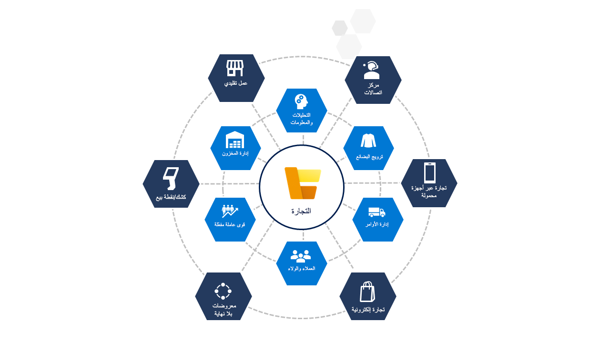

عميل التجزئة الحديث على اطلاع جيد ويتطلب تجربة تسوق رائعة. إنهم يريدون أن يشعروا بالتحكم في تجربتهم، من البحث عن سعر المنتج وجودته، إلى الشراء من العلامة التجارية التي تقدم الخدمة الأكثر تخصيصاً وملاءمة، إلى تعظيم قيمة كل دولار يتم إنفاقه. يمكن أن تبدأ رحلة التسوق في قناة واحدة، والتقدم في قناة أخرى، ثم تنتهي في قناة ثالثة من اختيار العميل.

لتلبية متطلبات العميل، أنت بحاجة إلى حل يمكنه:

- **اجذب العملاء** من خلال التجارب المخصصة وعمليات المتجر المبسطة. 
- **تنافس بشكل أفضل** من خلال مساعدة عملائك على أن يصبحوا محترفين ومساعدتك على بناء علاقات دائمة معهم.
- **أنشئ تجارب ثرية تركز على العميل أولاً** في جميع نقاط الاتصال المرتبطة بالعمليات الخلفية. 
- **تحسين كفاءات التسويق** باستخدام الإحصاءات الذكية.
- **توحيد البيانات** والاستفادة من النهج المستند إلى البيانات.
- **امنح موظفيك الأدوات والمعلومات** التي يحتاجون إليها لخدمة العملاء فائقة الاستجابة.

لتلبية هذه المتطلبات، أنت بحاجة إلى حل تجارة سحابية حديث ومرن مثل Microsoft Dynamics 365 Commerce. Dynamics 365 Commerce هو حل متكامل للبيع بالتجزئة يمنحك تجربة موحدة عبر جميع القنوات. يتضمن المبيعات والتنقل والذكاء والإنتاجية لمساعدتك على تحقيق المزيد بطريقة تعتمد على السحابة أولاً وعلى الأجهزة المحمولة.

يوضح الرسم التالي مكونات Dynamics 365 Commerce.

> [!div class="mx-imgBorder"]
> 

لا تتعلق Connected Commerce فقط بتقديم تجارب رائعة للعملاء. من خلال الجمع بين القنوات غير المتصلة تاريخياً مثل المتاجر الفعلية والتجارة الإلكترونية ومراكز الاتصال والقنوات الناشئة، يمكنك تفكيك صوامع البيانات الخاصة بأعمال البيع بالتجزئة التقليدية. Dynamics 365 Commerce يتيح لك استخدام الأدوات الحديثة مثل التعلم الآلي والذكاء الاصطناعي لاكتساب رؤى أفضل للأعمال. باستخدام هذه الرؤي التحليلية، يمكنك قيادة سلسلة إمداد ذكية ودعم موظفيك وتقديم تجارب لم تكن ممكنة قبل عقد من الزمان.

شاهد الفيديو التالي للحصول على شرح متعمق لـ Dynamics 365 Commerce والقيمة التي تقوم بإحضارها لأعمالك.
 
> [!VIDEO https://www.microsoft.com/videoplayer/embed/RE4dspC]

خلال هذه الوحدة، سوف تتمكن مما يلي: 

- اكتشاف خيارات التوزيع.
- التعرف على أنظمة نقاط البيع.
- استكشاف القناة متعددة الاتجاهات والترويج.

> [!NOTE]
> في هذه الوحدة، جميع البيانات الواردة في لقطات الشاشة وهمية.

بعد ذلك، ستقوم بمراجعة التحديات التي تواجهها مؤسسات البيع بالتجزئة وكيف يمكن لـ Dynamics 365 Commerce المساعدة في مواجهة هذه التحديات.
