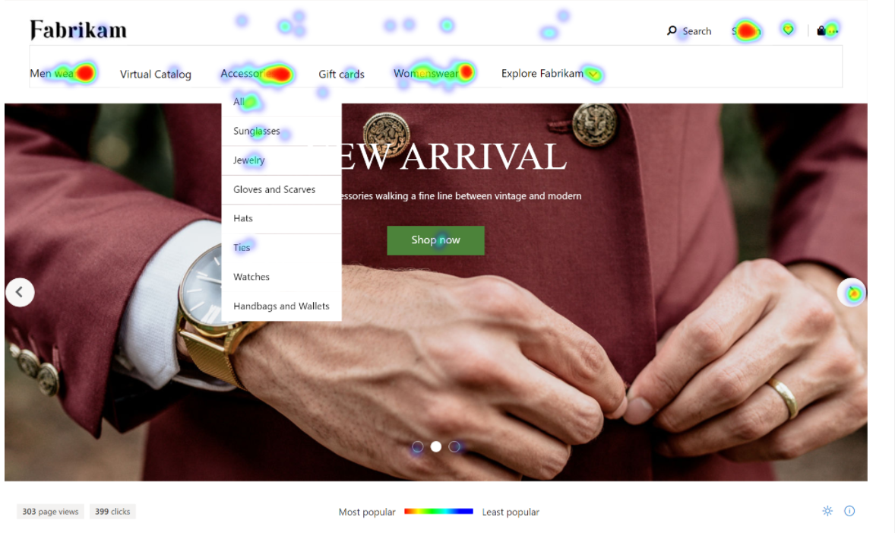

تعد صناعة البيع بالتجزئة واحدة من أكثر الصناعات ثورية وديناميكية. يجب أن تكون على دراية بالتكنولوجيا، وعلى دراية، وتمييز مثل عملائها، الذين يخلقون توقعات متزايدة باستمرار لخدمة البيع بالتجزئة.

التجارة الموحدة هي تحول أساسي في كيفية دعم التكنولوجيا لأعمال البيع بالتجزئة. مع التجارة الموحّدة التي تدمج الأنظمة الأمامية والخلفية في نظام أساسي واحد، لم تعد التكنولوجيا مجموعة من الكيانات المستقلة. بدلاً من ذلك، تمنح التكنولوجيا أعمال بائع التجزئة أساساً وتخلق نظاماً مرناً لتقديم خدمة ثاقبة وفعالة في كل نقطة اتصال.

وعندما يتعلق الأمر بتلبية توقعات العملاء وتجاوزها، فمن الأفضل القيام بذلك من خلال تحديد احتياجاتهم وكيفية تلبيتها. باستخدام Commerce، يمكن تعقب رؤى العملاء وتسجيلها لتقديم تجربة فريدة لكل شخص يتفاعل مع أعمالك. ويتم ذلك عن طريق توحيد تجارب المكتب الخلفي، والتجارب في المتجر، والتجارب الرقمية في نظام واحد يسمح لك بالحصول على عرض كامل لأعمالك وعملائك. 

يوضح الرسم التالي نظرة عامة حول إمكانيات Commerce وكيفية تكاملها مع بعضها البعض لإنشاء صورة كاملة عن أعمالك.

  

في بيئة البيع بالتجزئة الحديثة، يكون المستهلكون على دراية جيدة ويتطلعون إلى تجارب ذكية وجذابة وثرية بالمعلومات عند التسوق. يشار إلى هذا الموقف باسم *connected commerce*، وأفضل وصف لها هو:

- تقديم تجارب عملاء رائعة مع حل حقيقي متعدد القنوات.
- السماح للموظفين بتقديم خدمة عملاء استثنائية.
- تعزيز التخطيط الاستراتيجي وممارسات الترويج.
- دمج سلسلة التوريد في جميع نقاط الاتصال.
- توحيد عمليات الأعمال عبر كل قناة.

يوضح الرسم التوضيحي التالي كيف تدعم إمكانيات Commerce رحلة العميل الحديثة.
 
> [!div class="mx-imgBorder"]
> 

يمكن أن يوفر تنفيذ Commerce بنجاح تجارب عملاء شاملة عبر جميع نقاط الاتصال ويمكن توسيع نطاقها وفقاً لاحتياجاتك عبر القنوات التقليدية والناشئة. فيما يلي بعض الطرق التي يمكن من خلالها تحقيق ذلك بشكل خاص في Commerce. 

#### بناء التجارة الرقمية وتشغيلها

تساعدك أدوات تطوير وتأليف الويب المضمنة على إنشاء واجهات متاجر رقمية جذابة وذكية. يؤدي الاتصال بـ Dynamics 365 Marketing إلى إنشاء تكامل للأصول والعروض الترويجية والمخزون والأسعار عبر جميع القنوات التي يمكن استخدامها للوصول إلى قطاعات معينة من العملاء. من خلال أداة "منشئ المواقع" الذكية المتوفرة في Commerce، يمكن إنشاء محتوى مخصص لمجموعة كبيرة ومتنوعة من قنوات وقطاعات العملاء باستخدام بيانات في الوقت الحقيقي. يمكن تسويق محتوى موقع محدد وعرضه بناءً على رؤى العملاء التي يتم جمعها من بعض المقاييس مثل الموقع الجغرافي للحصول على مزيد من المساعدة بشأن تقسيم العملاء واستهدافهم. 

مزيد من المعلومات حول استخدام أداة "منشئ المواقع" لموقع التجارة الإلكترونية الخاص بك، راجع [إنشاء تواجد عبر الإنترنت في Dynamics 365 Commerce](/learn/modules/create-online-presence/?azure-portal=true).

فيما يلي مثال لما قد يبدو عليه موقع الويب الذي تم تطويره من أجل Commerce من وجهة نظر العميل.

  

#### بناء الولاء وتجاوز توقعات العملاء

تتمثل إحدى الطرق الأساسية التي يمكن من خلالها استخدام Commerce لتجاوز توقعات العملاء في تقديم تجارب مخصصة لكل عميل. من خلال اقتراحات تحديد المنتج والتوصيات ذات الصلة، يمكن للعميل الاستمتاع بتجربة شراء مخصصة تركز على تلبية احتياجاته. ومن خلال تسهيل العملية على العميل لتسجيل الخروج، سواء كان يشترى عبر الإنترنت أو في المتجر، ستمكّن العملاء من جلب أعمالهم إليك والمساعدة في بناء الولاء للعلامة التجارية. 

يمكن تحسين تقديم تجربة شراء فريدة عند دمجها مع تطبيقات Dynamics 365 الأخرى مثل Dynamics 365 Marketing، التي تدعم إدارة المحتوى والأصول والعروض الترويجية والمخزون والأسعار عبر القنوات.

#### تبسيط العمليات باستخدام الذكاء السحابي

يمكن تحسين العمليات اليومية من خلال استخدام التوصيات الخاصة بـ ‏‫Store Commerce لـ Windows وتلك التي تعتمد على الذكاء الاصطناعي. يمكن أن يسمح استخدام هذه الأدوات باتخاذ قرارات توريد مخزون فعالة من حيث التكلفة بالإضافة إلى استهداف المنتجات المناسبة للعملاء المناسبين في الوقت المناسب. الذكاء السحابي مهم للمساعدة في الحفاظ على التنظيم في عملية Commerce والحصول على بيانات في الوقت الحقيقي لدعم قرارات العمل المهمة. 

باستخدام Commerce، يمكنك تعقب معلومات المنتج والفرز والفئات والأسعار الخاصة بالمنتجات بشكل مركزي عبر كافة القنوات ومن خلال استخدام AI insights، ويمكنك التنبؤ بدقه بطلب العميل وفقاً لهذه المقاييس. يساعدك هذا الذكاء على التكيف باستمرار مع احتياجات العمل المتغيرة وتحسين الجودة الشاملة للخدمة ورضا العملاء. 

تعرض ‬‏‫لقطة الشاشة التالية الذكاء السحابي عملياً على لوحة معلومات **التحليلات** في Commerce.

> [!div class="mx-imgBorder"]
> 

#### Microsoft Clarity 
مع تمكين Microsoft Clarity، يمكنك بسهولة ضبط محتوى الموقع في الوقت الفعلي حيث تظهر الأفكار المتعلقة بتفاعل العميل. باستخدام البيانات الواردة في Microsoft Clarity، سيكون التمثيل المرئي قادراً بسهولة على إظهار كيفية استجابة العميل لصفحات الويب المختلفة. بالاقتران مع Commerce، يوفر Clarity رؤية واضحة لكيفية تفاعل المستخدم النهائي مع موقع التجارة الإلكترونية. 

> [!div class="mx-imgBorder"]
> 
> 

انتقل إلى [Microsoft Clarity](https://clarity.microsoft.com/?azure-portal=true) لمعرفة المزيد. 

#### قابل للتوسيع ويمكن الاعتماد عليه وآمن ومتوافق

تتيح لك خيارات النشر المرنة تلبية احتياجات عملك، وتوفير خيارات طرح قابلة للتوسيع بدرجة كبيرة وقابلة للتكيف. يلتزم Dynamics 365 بمعايير التوافق والأمان العالمية.

بعد ذلك، ستقوم بمراجعة بعض الميزات الرئيسية لـ Commerce.
