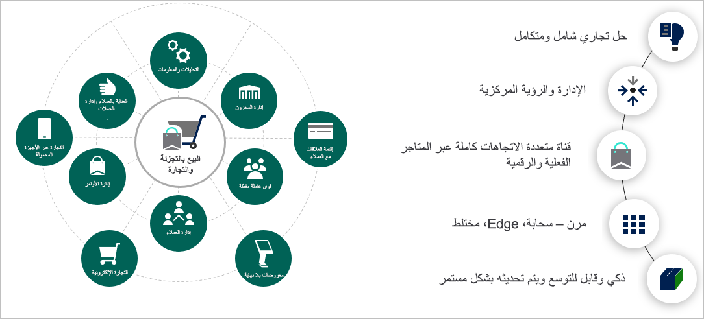
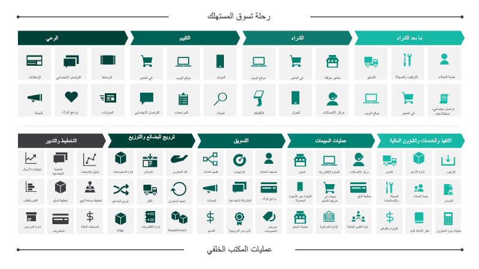
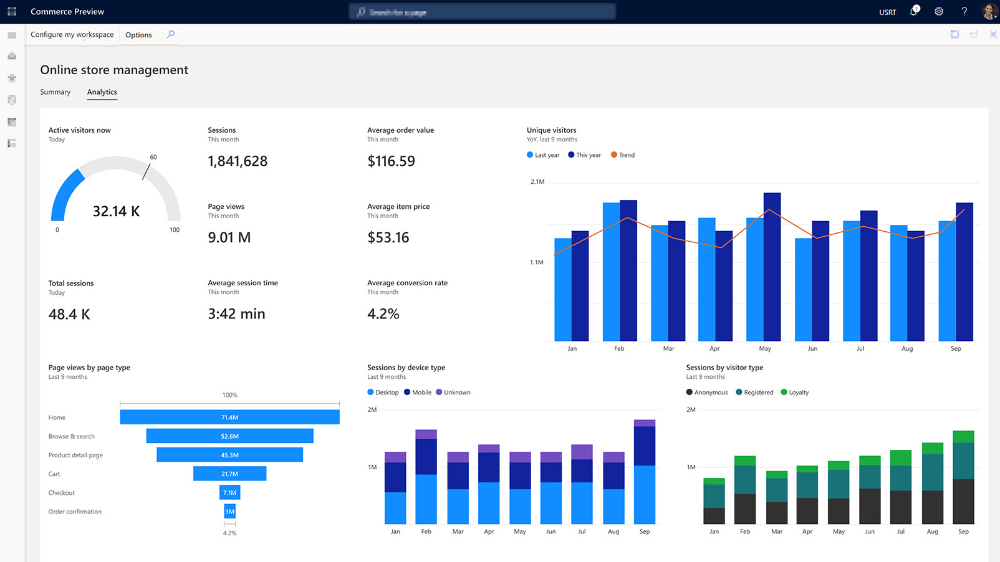

تعد صناعة البيع بالتجزئة واحدة من أكثر الصناعات ثورية وديناميكية. يجب أن تكون على دراية بالتكنولوجيا، وعلى دراية، وتمييز مثل عملائها، الذين يخلقون توقعات متزايدة باستمرار لخدمة البيع بالتجزئة.

التجارة الموحدة هي تحول أساسي في كيفية دعم التكنولوجيا لأعمال البيع بالتجزئة. مع التجارة الموحّدة التي تدمج الأنظمة الأمامية والخلفية في نظام أساسي واحد، لم تعد التكنولوجيا مجموعة من الكيانات المستقلة. وبدلاً من ذلك، تمنح التكنولوجيا أعمال بائع التجزئة أساسًا وتخلق نظامًا رشيقًا لتقديم خدمة ثاقبة وفعالة في كل نقطة اتصال.

Microsoft Dynamics 365 Commerce هو حل كامل للبيع بالتجزئة يوفر تجارة موحدة عبر جميع القنوات. يتضمن المبيعات والتنقل والذكاء والإنتاجية ويساعدك على تحقيق المزيد بطريقة تعتمد على السحابة أولاً.

يُظهر الرسم التالي نظرة عامة على إمكانيات Dynamics 365 Commerce.

  

Dynamics 365 Commerce يقدم حلاً شاملاً يوحد المكتب الخلفي، والتجارب في المتجر، والرقمية مع إمكانات البيع بالتجزئة.

يمنحك Dynamics 365 Commerce التجارة المتكاملة والمخزون وإدارة الطلبات والتخزين والبيانات المالية. يدعم هذا التكامل التخصيص المدعوم بالذكاء الاصطناعي والحماية من الاحتيال والبحث. بالإضافة إلى ذلك، يدعم Dynamics 365 Commerce Microsoft Power Platform لتقديم التحليلات وتنظيم سير عمل الأعمال.

Dynamics 365 Commerce يسمح لك بما يلي:

- بناء الولاء للعلامة التجارية من خلال تفاعلات العملاء الشخصية.
- يمكنك زيادة الإيرادات من خلال تحسين إنتاجية الموظفين.
- قم بتحسين العمليات لتقليل التكاليف وزيادة كفاءة سلسلة التوريد.

في بيئة البيع بالتجزئة الحديثة، يكون المستهلكون على دراية جيدة ويتوقعون تجارب بديهية وجذابة وغنية بالمعلومات عند التسوق. يشار إلى هذا الموقف باسم *connected commerce*، وأفضل وصف لها هو:

- تقديم تجارب عملاء رائعة مع حل حقيقي متعدد القنوات.
- السماح للموظفين بتقديم خدمة عملاء استثنائية.
- تعزيز التخطيط الاستراتيجي وممارسات الترويج.
- دمج سلسلة التوريد في جميع نقاط الاتصال.
- توحيد العمليات التجارية عبر كل قناة.

يوضح الرسم التوضيحي التالي كيف تدعم إمكانات Dynamics 365 Commerce رحلة العميل الحديثة.
 
> [!div class="mx-imgBorder"]
> 

يوفر Dynamics 365 Commerce دعماً شاملاً للتسويق والمخزون وإدارة القنوات. بالإضافة إلى ذلك، يمنحك تجارب عملاء غامرة عبر جميع نقاط الاتصال والمقاييس لاحتياجاتك عبر القنوات التقليدية والناشئة.

#### بناء وإدارة التجارة الرقمية

تساعدك أدوات تطوير وتأليف الويب المضمنة في إنشاء واجهات متاجر رقمية جذابة وذكية. يؤدي الاتصال بـ Microsoft Dynamics 365 Marketing إلى تكامل الأصول والعروض الترويجية والمخزون والأسعار عبر جميع القنوات.

#### بناء الولاء وتجاوز توقعات العملاء

تلبية طلب عملائك وتقديم تجارب تجارية مخصصة ومباشرة. تدعم الأنظمة الأساسية المتصلة لـ Dynamics 365 Marketing and Commerce إدارة المحتوى والأصول والعروض الترويجية والمخزون والتسعير عبر القنوات.

#### تقديم تجربة شاملة مرنة وذكية

يمكنك تقديم مشاركة بسيطة ومتسقة وفريدة من نوعها عبر القنوات عبر الإنترنت وغير المتصلة. تتيح هذه المشاركة لعملائك الشراء متى وكيف وأينما يريدون. كما يمنحهم أيضاً خيارات حول طرق الدفع الحديثة وتسليم المنتج.

#### تبسيط العمليات باستخدام الذكاء السحابي

تستفيد عمليات المكتب الخلفي المتكاملة والمحسّنة من تقنية الذكاء السحابي المدمجة. تساعدك هذه المعلومات الذكية على التكيف مع احتياجات العمل المتغيرة وتحسين جودة الخدمة ورضا العملاء. يمكنك أيضاً استخدام التعلم الآلي لمساعدة العملاء في العثور على المنتجات والخدمات التي تلبي احتياجاتهم.

تظهر لقطة الشاشة التالية لوحة معلومات تحليلات Dynamics 365 Commerce.

> [!div class="mx-imgBorder"]
> 

#### قابل للتوسيع ويمكن الاعتماد عليه وآمن ومتوافق

تتيح لك خيارات النشر المرنة تلبية احتياجات عملك، وتوفير خيارات طرح قابلة للتوسيع بدرجة كبيرة وقابلة للتكيف. يلتزم Dynamics 365 بمعايير التوافق والأمان العالمية.

بعد ذلك، ستقوم بمراجعة بعض الميزات الرئيسية لـ Dynamics 365 Commerce.
