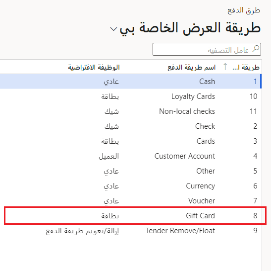
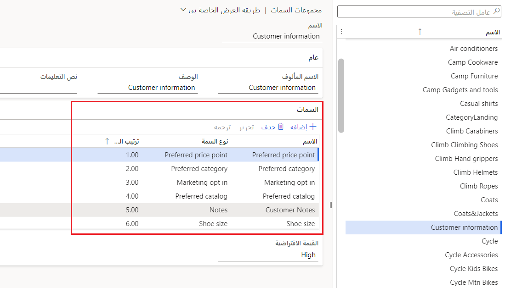

تتضمن الميزات الرئيسية لـ Commerce ما يلي:

- **التجارة الموحدة** - يمكنك إنشاء تجارب تسوق موحدة عبر المتاجر والويب والأجهزة المحمولة ومراكز الاتصال.
- **‏Modern Point of Sale (MPOS)** - هو تطبيق نقطة بيع (POS) للأجهزة. باستخدام MPOS، يمكنك معالجة المعاملات والأوامر من أي جهاز.
- **إدارة البضائع** - يمكنك إنشاء كتالوج المنتج وتكوينه قبل عرض العناصر للبيع.
- **ولاء العملاء** - يمكنك تتبع اتجاهات عملائك وعاداتهم ثم إرسال إشعارات وعروض مخصصة تجعل التسوق في قنواتك أسهل.

تستعرض الأقسام التالية الميزات بشكل فردي.

## التجارة الموحدة

لم تعد مؤسسات البيع بالتجزئة مجرد متاجر تقليدية. أنت بحاجة إلى القدرة على توحيد تجربة التسوق عبر جميع منافذ البيع بالتجزئة. تعد الحاجة إلى دعم أنواع مختلفة من المتاجر، بما في ذلك المتجر التقليدي والمتاجر عبر الإنترنت ومراكز الاتصال، جزءاً أساسياً من الأعمال الحديثة. 

في حين أن كل متجر يمكن أن يكون له طرق الدفع الخاصة به وطرق التسليم ومجموعات الأسعار وحسابات الدخل والمصروفات والسجلات والموظفين، فلا يزال من الضروري أن تسمح كل من هذه المتاجر للعملاء باستخدام طريقة الدفع المفضلة لديهم. هذا يعني أنه عبر جميع قنوات الشراء، يمكنك منح العملاء الراحة والمرونة للشراء في المتجر، أو الاستلام من مواقع أخرى، أو الحصول على خدمة التوصيل إلى المنازل باستخدام أدوات الطلب والتنفيذ المحسّنة.

ويتم ذلك باستخدام إعداد طرق الدفع في الوحدة النمطية للبيع بالتجزئة والتجارة في Dynamics 365 Finance. على سبيل المثال، إذا أراد العميل تسجيل الخروج من عربة التسوق الخاصة به باستخدام بطاقة هدايا، ولكن لم يكن هناك تكوين داخل نقطة البيع، فلن تتمكّن من إتمام الحركة. من خلال الإنشاء الصحيح لطرق الدفع هذه كما هو موضح في لقطة الشاشة أدناه، يمكن أن يوفر ذلك تجربة تجارة موحدة من شأنها تلبية متطلبات الدفع المفضلة للعميل. 

## نقطة البيع 

يمكنك دعم تجارب نقاط البيع (POS) الخاصة بك وإدارتها مع Commerce. يمكنك تكوين عملياتك عبر المتاجر وعبر الإنترنت، أثناء استخدام أدوات البحث الذكية عن المنتجات والمخزون. يمكنك أيضاً إنشاء أزرار للإجراءات الوظيفية ومعالجة المبيعات وإدارة الإيصالات بعد إتمام العملاء للمبيعات.

تدعم Commerce تجارب نقاط البيع السحابية (cloud POS) وتجارب نقاط البيع الحديثة (MPOS). يمكنك استخدام نقاط البيع السحابية (cloud POS) على المتصفحات مع الأجهزة المحمولة، أو استخدام نقاط البيع الحديثة (MPOS) لمعالجة المبيعات والأوامر والعمليات والمخزون عبر الأجهزة الأخرى. علاوة على ذلك، يمكنك تعقب العمولات والإيصالات ومراقبتها أثناء أحداث البيع وبعدها.

تدعم Commerce خيارات نقاط البيع التالية:

- **Retail Modern POS (MPOS)** لأنظمة تشغيل Windows والأجهزة المحمولة
- **‏‫Cloud POS‏ (CPOS)** التي تمكّن ميزات نقاط البيع (POS) في المتصفحات المدعومة

في جميع الحالات، تشارك نقاط البيع التعليمات البرمجية نفسها الخاصة بالتطبيق الرئيسي، وهو ما يمثل عاملاً مهمًا نظراً للأسباب التالية:

- واجهة المستخدم (UI) متسقة، بغض النظر عن النظام الأساسي أو عامل التصميم.
- في كل منها، يمكنك دمج متغيرات نقاط البيع وتشغيلها بشكل متزامن. على سبيل المثال، بالنسبة لسجلاته الرئيسية، يمكنك استخدام MPOS على الأجهزة التي تعمل بنظام Windows. ومع ذلك، يمكنك استكمال هذه السجلات بأجهزة طرفية أو أجهزة محمولة قائمة على المستعرض.
- يمكنك استخدام التخصيصات والإضافات عبر الأنظمة الأساسية وعوامل النموذج. نظراً لمشاركة التطبيق الرئيسي في التعليمات البرمجية، يمكنك تنفيذ معظم التخصيصات مرة واحدة بدلاً من عدة مرات.

مع Commerce، يمكنك استخدام مجموعة واسعة من الأجهزة مع MPOS وCPOS. يوفر كلاهما واجهات متعددة وخيارات توزيع لمساعدتك بشأن سيناريوهات عملك المختلفة. 

يسمح لك جهاز محاكاة الأجهزة الطرفية الظاهري باختبار الأجهزة الطرفية المادية دون الحاجة إلى نشر عميل نقطة البيع. يتضمن محاكي الأجهزة الطرفية الظاهري ومحاكي نقاط البيع (POS) لاختبار توافق الأجهزة الطرفية المادية.

## ترويج البضائع والمخزون

وعندما يتعلق الأمر بالتعامل مع جوانب مخزون Commerce، فإن الحفاظ على تنظيمها لا يمكن أن يساعد فقط على زيادة الكفاءة، ولكن يمكنك التخطيط بشكل استراتيجي لترويج البضائع والمخزون لزيادة المبيعات والربحية أيضاً. ومع ذلك، قبل أن تتمكن من عرض أي منتجات للبيع في قنوات البيع بالتجزئة الخاصة بك، يجب عليك إنشاء المنتجات وتكوينها في Commerce. هذه عملية بسيطة حيث يمكنك إنشاء المنتجات، وتحديد سمات المنتجات وخصائصها، وتعيين المنتجات للتدرجات الهرمية لفئات البيع بالتجزئة. عند القيام بذلك، لإتاحة المنتجات لقنوات البيع بالتجزئة الخاصة بك وإضافتها إلى عمليات الفرز النشطة. يمكنك إصدار المنتجات للكيانات القانونية حيثما تكون متاحة.

إذا لزم الأمر، يمكنك أيضاً تغيير سعر المنتج وإعداد الخصومات المطبقة على عنصر سطر أو حركة في نقطة البيع أو في أمر مبيعات مركز الاتصال أو في أمر عبر الإنترنت. من خلال تكوين الخصومات والأسعار بشكل فعال، يمكن لـ Commerce تعقب البضائع والمخزون الذي يتدفق من المستودعات إلى المتاجر، وينتج عنه دخل في قطاع الأعمال. 

تعرض لقطة الشاشة التالية صفحة **إدارة المنتج والفئة** حيث يمكن تعقب المنتجات الصادرة والتدرجات الهرمية للفئات والمجموعات المتنوعة النشطة وإدارتها. 

## نظرة عامة على قاعدة العملاء

عندما يتعلق الأمر ببناء ولاء طويل الأجل مع عملاء معينين، فمن المهم تعقب أي معلومات حول العميل يمكن الرجوع إليها لاحقاً. والغرض من قاعدة العملاء هو أن الشركة يجب أن تسعى جاهدة مع الموظفين لتكوين علاقات طويلة الأمد مع العملاء الرئيسيين لإنشاء أعمال متكررة. قد تتوقع أن يكون الموظفون على علم بأمور تتعلق بالعملاء مثل الأشياء التي يحبونها وتلك التي يكرهونها وسجل مشترياتهم وتفضيلات المنتجات والتواريخ المهمة لديهم مثل الذكرى السنوية وأعياد الميلاد.

في حين أنه من الجيد معرفة هذه المعلومات، إلا أنها مفيدة فقط إذا كان من الممكن التقاطها وتعقبها بشكل فعال. عندما يتم تعقب المعلومات وإتاحتها في عرض واحد، يمكن لموظفيك استهداف العملاء الذين يستوفون معايير محددة. على سبيل المثال، يمكنهم العثور على جميع العملاء الذين يفضلون التسوق لشراء حقائب اليد أو العملاء الذين يترقبون عيد ميلاد أو ذكرى سنوية قادمة.

باستخدام أدوات قاعدة عملاء Commerce والتكامل مع Dynamics 365 Customer Insights، يمكنك الحصول على عرض شامل لعملائك وتجميعهم وفقاً لذلك. 

ومن خلال إنشاء مجموعات سمات دفتر العميل، يمكنك تجميع العملاء الذين يستوفون معايير محددة معاً. على سبيل المثال، قد يرغب أحد متاجر الأزياء في تجميع العملاء الذين يشتركون في اتجاهات التسوق والاهتمامات المتشابهة معاً. باستخدام هذه المعلومات، إذا كانت هناك أزياء جديدة من علامة تجارية تفضلها مجموعة معينة من العملاء، فبمساعدة قاعدة العملاء يمكن للمخزن إخطار هؤلاء العملاء بإطلاق خط الأزياء الجديد هذا. سيكونون بعد ذلك "أول من يعلم" وسيكونون على استعداد للمشاركة بشكل أكبر في هذا العمل بسبب بناء الولاء للعلامة التجارية بشكل مستمر.
 
تعرض لقطة الشاشة التالية مثالاً لمجموعة سمات دفتر العميل وكيفيه تعبئة قسم **السمات** بمعلومات حول العميل يكون من المفيد الرجوع إليها لاحقاً واستخدامها في تحسين الاحتفاظ به. 

## ولاء العميل

تعمل برامج الولاء على زيادة ولاء العملاء من خلال مكافأة العملاء على تفاعلهم مع علامتك التجارية. في Commerce، يمكنك إعداد برامج ولاء تطبّق عبر كياناتك القانونية في أي قناة بيع بالتجزئة.

يمكنك إعداد برامج ولاء لمختلف حوافز المكافآت التي تقدمها بما في ذلك:

- تحديد قواعد الكسب لإظهار الأنشطة التي يجب على العملاء إكمالها لكسب المكافآت.
- إصدار بطاقات ولاء من أي قناة بيع بالتجزئة تشارك في برامج الولاء الخاصة بك.
- ربط بطاقات الولاء بأي برامج ولاء يمكن للعملاء المشاركة فيها.
- ربط سجلات العملاء ببطاقة ولاء بحيث يمكن للعملاء تجميع نقاط الولاء من بطاقات متعددة واستردادها.

تعرض لقطة الشاشة التالية مثالاً على نقاط الولاء التي جمعها العميل. حصل العميل على قسيمة خصم بنسبة 5% لكونه جزءاً من برنامج الولاء، ونتيجة لذلك تمكن من توفير 6,00 دولارات أمريكية عند شرائه سترة جديدة بغطاء للرأس. ومع تحديد قواعد الدخل، يكون العميل على علم بالمبلغ المالي الذي يجب أن ينفقه للحصول على خصم ولاء العميل. 

 
وتعمل هذه الوظيفة في Commerce عبر الأجهزة للاستفادة من قوة السحابة. وعن طريق ذلك، يمكنك إنشاء توصيات المنتج عبر تجارب التجارة الإلكترونية ونقاط البيع. ونظراً لتفاعل العملاء مع متجرك والمشاركة في برامج الولاء، فمن المحتمل أن يؤدي ذلك إلى إنشاء عملاء مخلصين. كما يمكنك أيضاً منح العملاء القدرة على ترك المراجعات والتقييمات بحيث يمكنك تحسين العمليات الخاصة بك في المستقبل والحصول على شهادة الخدمة الجيدة ليطلع عليها العملاء الآخرون.

تركز الوحدة التالية على إمكانيات Commerce الأخرى.
