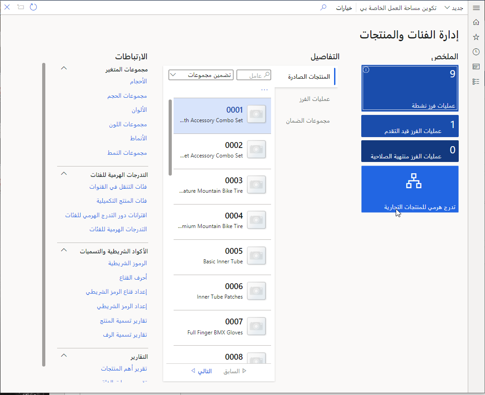
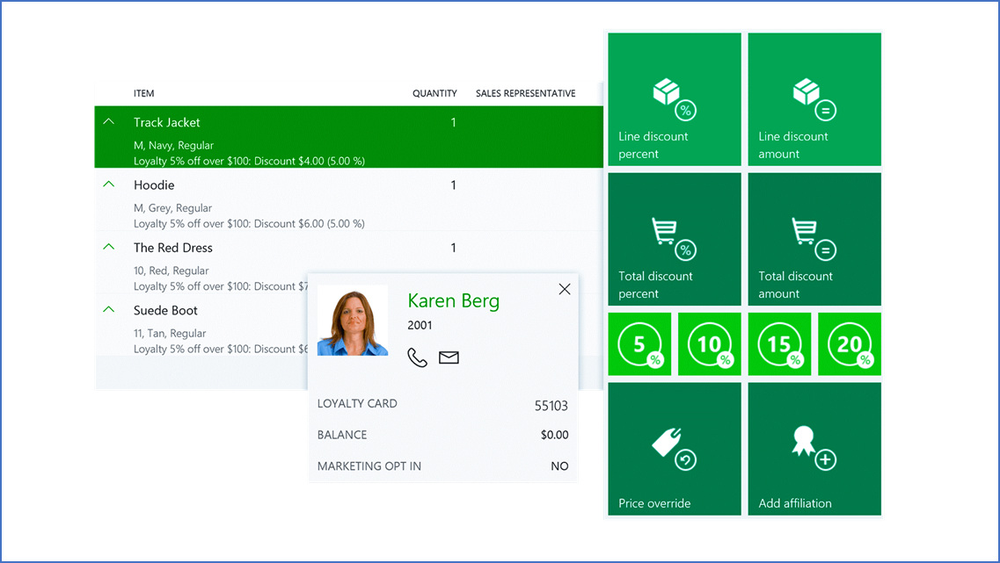

تتضمن الميزات الرئيسية لـ Dynamics 365 Commerce ما يلي:

- **التجارة الموحدة** - يمكنك إنشاء تجارب تسوق موحدة عبر المتاجر والويب والجوال ومراكز الاتصال.
- **‏Modern Point of Sale (MPOS)** - هو تطبيق نقطة بيع (POS) للأجهزة. باستخدام MPOS، يمكنك معالجة المعاملات والأوامر من أي جهاز.
- **إدارة البضائع** - يمكنك إنشاء كتالوج المنتج وتكوينه قبل عرض العناصر للبيع.
- **ولاء العملاء** - يمكنك تتبع اتجاهات عملائك وعاداتهم ثم إرسال إشعارات وعروض مخصصة تجعل التسوق في قنواتك أسهل.

تستعرض الأقسام التالية الميزات بشكل فردي.

## التجارة الموحدة

لم تعد مؤسسات البيع بالتجزئة مجرد متاجر تقليدية. أنت بحاجة إلى القدرة على توحيد تجربة التسوق عبر جميع تجارب البيع بالتجزئة. يجب أن تدعم أنواعاً متنوعة من المتاجر، بما في ذلك المتجر التقليدي، والمتاجر عبر الإنترنت، ومراكز الاتصال. يمكن أن يكون لكل متجر طرق الدفع الخاصة به وطرق التسليم ومجموعات الأسعار وحسابات الدخل والمصروفات والسجلات والموظفين. ومع ذلك، عبر جميع قنوات الشراء، يمكنك منح العملاء الراحة والمرونة للشراء في المتجر، أو الاستلام من مواقع أخرى، أو الحصول على خدمة التوصيل إلى المنازل باستخدام أدوات الطلب والتنفيذ المحسّنة.

## نقطة البيع 

يمكنك دعم وإدارة تجارب نقاط البيع الخاصة بك (POS) مع Dynamics 365 Commerce. يمكنك تكوين عملياتك عبر المتاجر وعبر الإنترنت، أثناء استخدام أدوات البحث الذكية عن المنتجات والمخزون. بالإضافة إلى ذلك، يمكنك إنشاء أزرار للإجراءات الوظيفية ومعالجة المبيعات وإدارة الإيصالات بعد إتمام العملاء للمبيعات.

Dynamics 365 Commerce يدعم تجارب السحابة وMPOS. يمكنك استخدام نقاط البيع السحابية على المتصفحات مع الأجهزة المحمولة، أو استخدام MPOS لمعالجة المبيعات والأوامر والعمليات والمخزون عبر الأجهزة الأخرى. علاوة على ذلك، يمكنك تتبع ومراقبة العمولات والإيصالات أثناء وبعد أحداث البيع.

Dynamics 365 Commerce يدعم خيارات نقاط البيع التالية:

- **Retail Modern POS (MPOS)** لأنظمة تشغيل Windows والأجهزة المحمولة
- **Cloud POS‏ (CPOS)** الذي يمكّن ميزات نقاط البيع (POS) في المتصفحات المدعومة

في جميع الحالات، تشترك نقاط البيع في نفس رمز التطبيق الأساسي، وهو عامل مهم للأسباب التالية:

- واجهة المستخدم (UI) متسقة، بغض النظر عن النظام الأساسي أو عامل التصميم.
- معظم القدرات متشابهة، بغض النظر عن النظام الأساسي أو عامل التصميم. ومع ذلك، توجد بعض الاختلافات المهمة. 
- في كل منها، يمكنك دمج وتشغيل متغيرات نقاط البيع بشكل متزامن. على سبيل المثال، بالنسبة لسجلاته الرئيسية، يمكنك استخدام MPOS على الأجهزة التي تعمل بنظام Windows. ومع ذلك، يمكنك استكمال هذه السجلات بأجهزة طرفية أو أجهزة محمولة قائمة على المستعرض.
- يمكنك استخدام التخصيصات والإضافات عبر الأنظمة الأساسية وعوامل النموذج. نظرًا لأن التطبيق الأساسي يشارك التعليمات البرمجية، يمكنك تنفيذ معظم التخصيصات مرة واحدة بدلاً من عدة مرات.

مع Dynamics 365 Commerce، يمكنك استخدام مجموعة واسعة من الأجهزة مع MPOS وCPOS. يوفر كلاهما واجهات متعددة وخيارات نشر لمساعدتك في سيناريوهات عملك المختلفة. 

يسمح لك جهاز محاكاة الأجهزة الطرفية الظاهري باختبار الأجهزة الطرفية المادية دون الحاجة إلى نشر عميل نقطة البيع. يتضمن محاكي محيطي افتراضي ومحاكي نقاط البيع (POS) لاختبار توافق الأجهزة الطرفية المادية.

## التجارة والمخزون

يمكنك التخطيط بشكل استراتيجي للبضائع والمخزون لزيادة المبيعات والربحية. مع ذلك، قبل أن تتمكن من عرض منتجات للبيع في قنوات البيع بالتجزئة الخاصة بك، يجب عليك إنشاء المنتجات وتكوينها في Dynamics 365 Commerce. يمكنك إنشاء المنتجات وتحديد سمات وخصائص المنتجات وتعيين المنتجات للتدرجات الهرمية للبيع بالتجزئة. لإتاحة المنتجات لقنوات البيع بالتجزئة الخاصة بك وإضافتها إلى تشكيلة نشطة، يمكنك إصدار المنتجات للكيانات القانونية حيث تكون متاحة.

بالإضافة إلى ذلك، يمكنك تغيير سعر المنتج وإعداد الخصومات المطبقة على بند أو معاملة في نقطة البيع أو في أمر مبيعات مركز الاتصال أو في طلب عبر الإنترنت.

تُظهر لقطة الشاشة التالية شاشة **الفئة وإدارة المنتج**.

## نظرة عامة على العملاء

تريد من موظفيك تكوين علاقات طويلة الأمد مع عملائك الرئيسيين. تتوقع أن يعرف الموظفون ما يعجبهم وما يكرهون هؤلاء العملاء، وسجل الشراء، وتفضيلات المنتج، والتواريخ المهمة، مثل الذكرى السنوية وأعياد الميلاد.

يحتاج الموظفون إلى مكان يمكنهم من خلاله التقاط هذه المعلومات والعثور عليها. عندما تتوفر المعلومات في عرض واحد، يمكن لموظفيك استهداف العملاء الذين يستوفون معايير محددة. على سبيل المثال، يمكنهم العثور على جميع العملاء الذين يفضلون التسوق لشراء حقائب اليد أو العملاء الذين لديهم عيد ميلاد أو ذكرى سنوية وشيكة.

باستخدام أدوات العميل Dynamics 365 Commerce والتكامل مع Microsoft Dynamics 365 Customer Insights يمكنك الحصول على رؤية شاملة لعملائك. يمكنك الاستجابة لاحتياجاتهم في كل مستوى من مستويات المشاركة، بناءً على ملف تعريف العميل وسجله وتفضيلاته التي تتدفق عبر القنوات المادية والرقمية.

علاوة على ذلك، يمكنك تعزيز العلاقات الدائمة من خلال التوصيات المستندة إلى الذكاء الاصطناعي، ورؤى العملاء، وفحص المخزون، والممر اللانهائي، وبرامج الولاء التي تزيد من جاذبية العلامة التجارية.

## ولاء العميل

تزيد برامج الولاء من ولاء العملاء من خلال مكافأة العملاء على تفاعلهم مع علامتك التجارية. في Dynamics 365 Commerce، يمكنك إعداد برامج ولاء تنطبق عبر كياناتك القانونية في أي قناة بيع بالتجزئة.

يمكنك إعداد برامج ولاء لمختلف حوافز المكافآت التي تقدمها بما في ذلك:

- تحديد قواعد الكسب لإظهار الأنشطة التي يجب على العملاء إكمالها لكسب المكافآت.
- إصدار بطاقات ولاء من أي قناة بيع بالتجزئة تشارك في برامج الولاء الخاصة بك.
- ربط بطاقات الولاء بأي برامج ولاء يمكن للعملاء المشاركة فيها.
- ربط سجلات العملاء ببطاقة ولاء بحيث يمكن للعملاء تجميع نقاط الولاء من بطاقات متعددة واستردادها.

تُظهر لقطة الشاشة التالية مثالاً على نقاط الولاء التي جمعها العميل.

 
يعمل البيع المدعوم في Dynamics 365 Commerce عبر الأجهزة مع الاستفادة من قوة السحابة. يمكنك إنشاء توصيات المنتج عبر تجارب التجارة الإلكترونية ونقاط البيع. عندما يتفاعل العملاء مع متجرك، فإنهم يبنون برامج ولاء، والتي تخلق عملاء مخلصين. أخيراً، يمكنك منح عملائك القدرة على ترك المراجعات والتقييمات حتى تتمكن من تحسين عملياتك في المستقبل.

تركز الوحدة التالية علي إمكانيات Dynamics 365 Commerce الأخرى.
